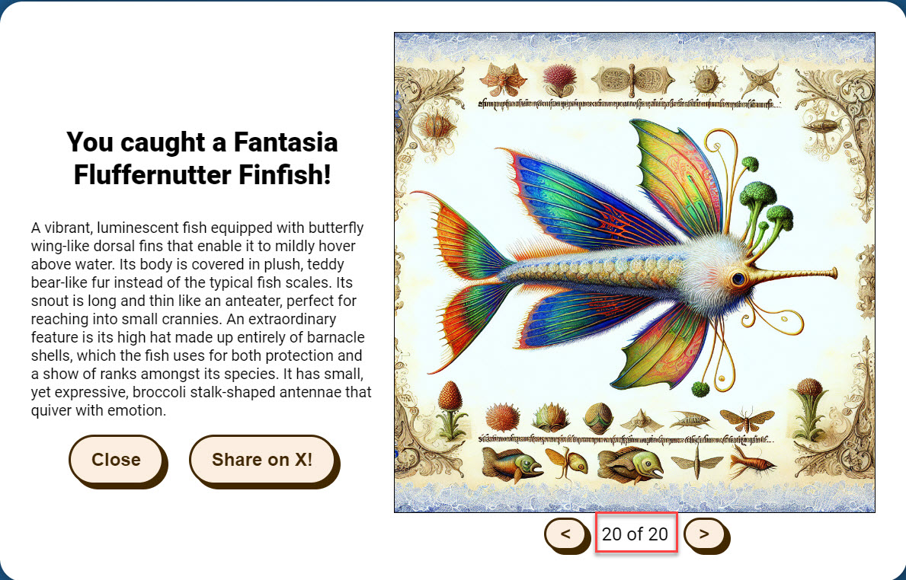
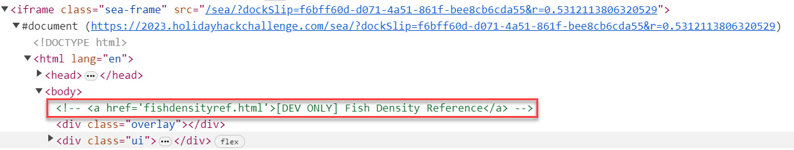
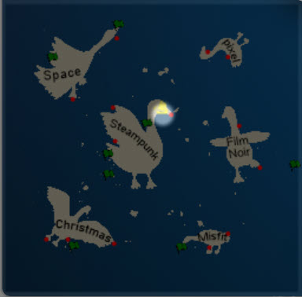
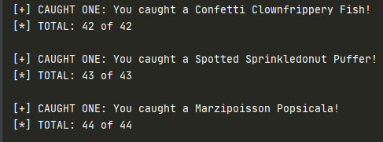

# BONUS!

The two bonus objectives I've completed are in this section.

## Fishing Guide
**Difficulty**: :fontawesome-solid-star::fontawesome-regular-star::fontawesome-regular-star::fontawesome-regular-star::fontawesome-regular-star:<br/>
!!! question "Request"
    Catch twenty different species of fish that live around Geese Islands. When you're done, report your findings to Poinsettia McMittens on the Island of Misfit Toys.

??? quote "Poinsettia McMittens @ Squarewheel Yard"
    Excuse me, but you're interrupting my fishing serenity. Oh, you'd like to know how to become as good at fishing as I am?<br/>
    Well, first of all, thank you for noticing my flair for fishing. It's not just about looking good beside the lake, you know.<br/>
    The key is in the details, much like crafting the perfect toy. Observe the water, the weather, and the fish’s habits - it's a science and an art.<br/>
    Of course, it helps to have a natural charm. Fish seem to find me irresistible. Must be my sparkling personality... or maybe it's just the glitter of my allure.<br/>
    Oh, the mysteries of the aquatic life around these islands are as elusive as, well, a clever compliment. But you'll get one if you probe enough.<br/>
    Remember, patience is more than a virtue in fishing; it’s a strategy. Like waiting for the right time to use flattery, you wait for the right moment to strike.<br/>
    Go see if you can catch, say, 20 different types of fish!

??? tip "Become the Fish"
    <i>From: Poinsettia McMittens<br/>
    Objective: BONUS! Fishing Guide</i><br/>
    Perhaps there are some clues about the local aquatic life located in the HTML source code.


To catch 20 different species of fish, simply go out in the open sea, cast line, wait for it to turn red and reel it in - the fish will be caught!
Be patient if you get a duplicate. 

{ width="600" }


## Fishing Mastery
**Difficulty**: :fontawesome-solid-star::fontawesome-solid-star::fontawesome-solid-star::fontawesome-solid-star::fontawesome-regular-star:<br/>
!!! question "Request"
    Catch at least one of each species of fish that live around Geese islands. When you're done, report your findings to Poinsettia McMittens.

??? quote "Poinsettia McMittens @ Squarewheel Yard"
    Hoy small fry, nice work!<br/>
    Now, just imagine if we had an automatic fish catcher? It would be as ingenious as me on a good day!<br/>
    I came across this [fascinating article](https://www.redhat.com/sysadmin/getting-started-socat) about such a device in a magazine during one of my more glamorous fishing sessions.<br/>
    If only I could get my hands on it, I'd be the undisputed queen of catching them all!

    
??? tip "Fishing Machine"
    <i>From: Poinsettia McMittens<br/>
    Objective: BONUS! Fishing Guide</i><br/>
    There are a variety of strategies for automating repetative website tasks. Tools such as [AutoKey](https://github.com/autokey/autokey) and [AutoIt](https://www.autoitscript.com/site/) allow you to programmatically examine elements on the screen and emulate user inputs.
    
??? tip "I Am Become Data"
    <i>From: Poinsettia McMittens<br/>
    Objective: BONUS! Fishing Guide</i><br/>
    One approach to automating web tasks entails the browser's developer console. Browsers' console allow us to manipulate objects, inspect code, and even interact with [websockets](https://javascript.info/websocket).


I solved this challenge using [Selenium](https://www.selenium.dev/) browser automation and little bit of looking around through game's HTML.
There's a reference to a "dev page" `https://2023.holidayhackchallenge.com/sea/fishdensityref.html` which shows fish density.



The most important fish type density to look at is "Piscis Cyberneticus Skodo" since it's only present in very specific part of the sea.
Save its image, then use something like [OnTopReplica](https://github.com/LorenzCK/OnTopReplica) to move phish density PNG over the sea minimap,
setting window opacity to 50%. 

Map edges can be determined by crossing from one side to the other. You need to catch the rare fish type from the white spot on the map. It should look something like this.



The Selenium browser automation code will do the trick - make sure to include your credentials in the .env file.
XPATH's can be copied from within the browser in Inspect Element.

```python linenums="1" title="fishing.py"
from selenium import webdriver
from selenium.webdriver.common.by import By
import time
from dotenv import dotenv_values

# Get creds from .env
config = dotenv_values(".env")
USERNAME = config.get('USERNAME')
PASSWORD = config.get('PASSWORD')


def fish(driver):
    time.sleep(1)
    cast_line = driver.find_element(By.XPATH, '/html/body/div[2]/button[2]')
    time.sleep(1)
    cast_line.click()

    reel_it_in = driver.find_element(By.XPATH, '/html/body/div[2]/button[3]')
    reel_it_in_class = reel_it_in.get_attribute("class")
    
    # Check if caught every 0.03 sec
    while "reelitin" in reel_it_in_class:
        if reel_it_in_class == "reelitin":
            reel_it_in_class = reel_it_in.get_attribute("class")
            time.sleep(0.03)
        else:
            try:
                # Caught One - reel it in
                reel_it_in.click()
                break
            except:
                time.sleep(0.03)
                continue

    time.sleep(3)
    fish_name = driver.find_element(By.XPATH, '/html/body/div[3]/div[1]/h3').text
    total = driver.find_element(By.XPATH, '/html/body/div[3]/div[2]/div/span').text
    
    # Print name and total to console
    print("[+] CAUGHT ONE: " + str(fish_name))
    print("[*] TOTAL: " + str(total))
    print()
    time.sleep(5)
    
    # Close Pescadex
    close = driver.find_element(By.XPATH, '/html/body/div[3]/div[1]/button[1]')
    close.click()
    return True


def main():
    # Firefox driver
    driver = webdriver.Firefox()

    driver.get("https://2023.holidayhackchallenge.com/")
    assert "Holiday Hack Challenge 2023" in driver.title

    time.sleep(2)

    # Login
    elem = driver.find_element(By.XPATH, "/html/body/div/div[2]/div/div[1]/a")
    time.sleep(2)
    elem.click()

    signin = driver.find_element(By.XPATH, "/html/body/div/div[2]/div/div[2]/a[2]")
    signin.click()
    time.sleep(3)

    # Username
    username = driver.find_element(By.XPATH, '//*[@id="usernameOrEmail"]')
    for char in USERNAME:
        username.send_keys(char)
        time.sleep(0.2)

    # Password
    password = driver.find_element(By.XPATH, '//*[@id="login-password"]')
    for char in PASSWORD:
        password.send_keys(char)
        time.sleep(0.2)

    # Log in
    login = driver.find_element(By.XPATH, '/html/body/div/div[2]/div/div[3]/div[2]/form[1]/ul/li[3]/button')
    time.sleep(1)
    login.click()
    time.sleep(5)
    
    # Switch to iFrame context
    time.sleep(5)
    iframe = driver.find_element(By.XPATH, '/html/body/div/div[3]/iframe')
    driver.switch_to.frame(iframe)
    
    # Fish indefinitely
    while True:
        fish(driver)
        time.sleep(1)


if __name__ == '__main__':
    main()
```

Output keeps rolling:



After running this for a while, you can move around the sea to adjust your density percentages.
When you finally have 171 different types of fish, go talk to Poinsettia McMittens.

??? quote "Poinsettia McMittens @ Squarewheel Yard"