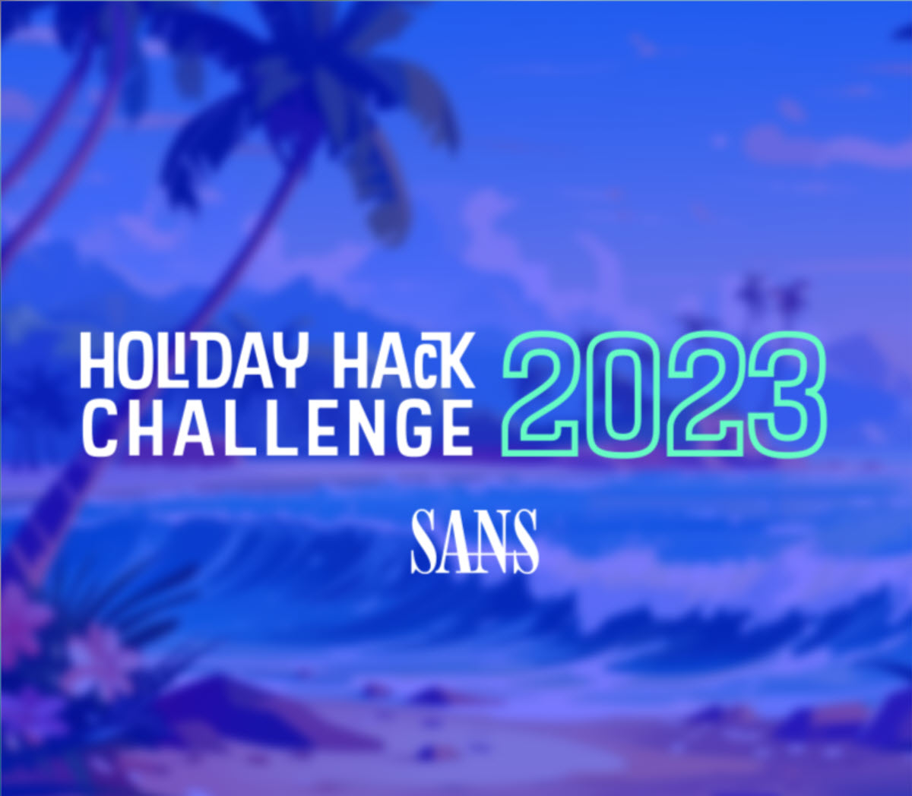
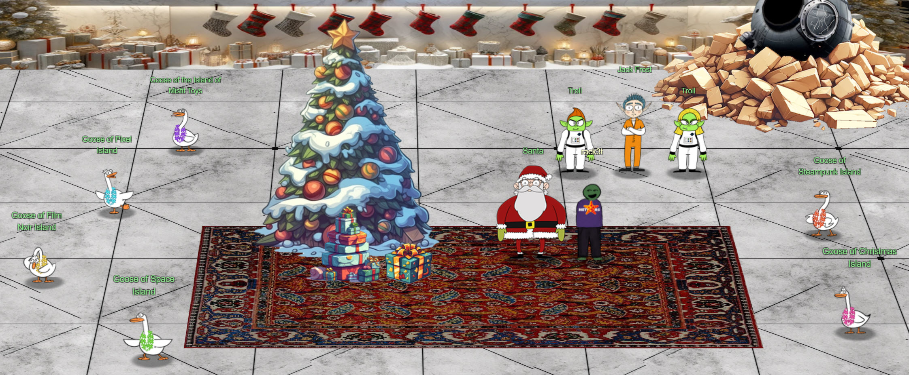

# Welcome

## Introduction

Welcome to the wild and wacky world of the [2023 SANS Holiday Hack Challenge](https://2023.holidayhackchallenge.com/) write-up! Imagine Santa traded his sleigh for a cybersecurity keyboard and elves started coding instead of making toys. Yep, that's the vibe!

This annual bash, courtesy of the brainy folks at SANS Institute, is like a holiday party for hackers. But instead of sharing eggnog recipes, we're diving deep into festive-themed puzzles that would make even Rudolph scratch his antlers in confusion.

In this report, we're spilling the digital cocoa on what went down. Expect tales of epic hacks, brain-teasing challenges, and maybe a reindeer or two trying to figure out a firewall. It's all fun, games, and a sprinkle of tech magic.

So, buckle up, grab your elf hat (or your favorite tech gadget), and let's unwrap the adventures of the 2023 SANS Holiday Hack Challenge! 🎅🔒🎉

!!! note "100-page submission limit"
    Each year there's a huge number of write-ups that need to be reviewed by the Counter Hack team. To find a good middle ground between preventing information overload and creating a write-up that can stand on its own as a learning resource, some parts, like the *navigation tip* below, are collapsed by default. Skipping over these will not take away from understanding the overall solution, but feel free to expand them to get some additional information.

??? tip "Navigation tip"
    Even with less than 100 pages, there's still quite a bit of information to read through. To make things a little easier, you can use ++"P"++ or ++","++ to go to the previous section, ++"N"++ or ++"."++ to navigate to the next section, and ++"S"++, ++"F"++, or ++"/"++ to open up the search dialog.

    **TL;DR** if you keep pressing ++"N"++ or ++"."++ from this point forward, you'll hit all the content in the right order! :smile:

## Answers

!!! success "1. Holiday Hack Orientation - :fontawesome-solid-star::fontawesome-regular-star::fontawesome-regular-star::fontawesome-regular-star::fontawesome-regular-star:"
    Follow [Jingle Ringford's instructions](./objectives/o1.md) to get your bearings at Geese Islands.

!!! success "2. Insert Objective 2 Title - :fontawesome-solid-star::fontawesome-solid-star::fontawesome-regular-star::fontawesome-regular-star::fontawesome-regular-star:"
    Insert [your answer](./objectives/o2.md) here.

!!! success "3. Insert Objective 3 Title - :fontawesome-solid-star::fontawesome-solid-star::fontawesome-solid-star::fontawesome-regular-star::fontawesome-regular-star:"
    Insert [your answer](./objectives/o3.md) here.

!!! success "4. Insert Objective 4 Title - :fontawesome-solid-star::fontawesome-solid-star::fontawesome-solid-star::fontawesome-solid-star::fontawesome-regular-star:"
    Insert [your answer](./objectives/o4.md) here.

!!! success "5. Insert Objective 5 Title - :fontawesome-solid-star::fontawesome-solid-star::fontawesome-solid-star::fontawesome-solid-star::fontawesome-solid-star::fontawesome-solid-star:"
    Insert [your answer](./objectives/o5.md) here.

## Conclusion

!!! Abstract "Story"
    Just sit right back and you’ll hear a tale, 
    A tale of a yuletide trip 
    That started from a tropic port, 
    Aboard this tiny ship 
    Santa and his helpful elves 
    To Geese Islands did go 
    Continuing their merry work 
    O'er sand instead of snow 
    New this year: a shiny tool 
    The elves logged in with glee 
    What makes short work of many tasks? 
    It's ChatNPT. It's ChatNPT 
    From images to APIs 
    This AI made elves glad 
    But motivations were unknown 
    So was it good or bad? 
    Could it be that NPT 
    Was not from off-the-shelf? 
    Though we'll forgive and trust again 
    We'd found a naughty elf 
    This fancy AI tool of ours 
    With all our work remained 
    Not good or bad, our online friend 
    Just did as it was trained 
    Surely someone's taint must be 
    Upon our AI crutch 
    Yes indeed, this bold new world 
    Bore Jack Frost's icy touch 
    Though all's returned to steady state 
    There's one thing that we know 
    We'll all be needed once again 
    When Santa's back on snow 

