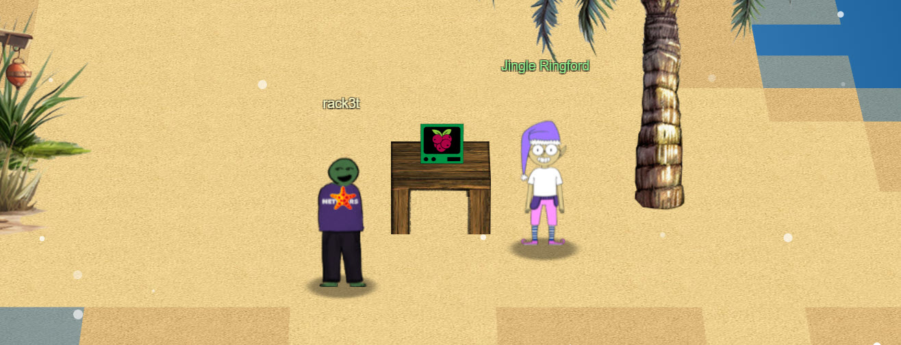
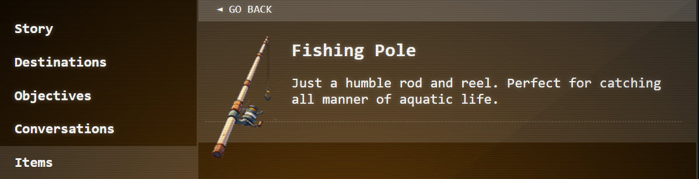
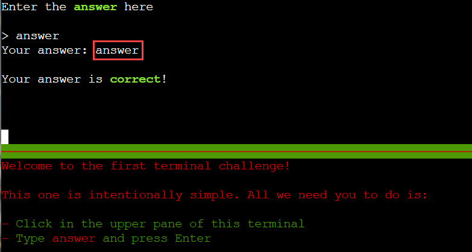

# Holiday Hack Orientation

**Difficulty**: :fontawesome-solid-star::fontawesome-regular-star::fontawesome-regular-star::fontawesome-regular-star::fontawesome-regular-star: 
**Direct link**: [Orientation terminal](https://hhc23-wetty.holidayhackchallenge.com?&challenge=orientation&username=rack3t&id=83532dea-b64f-497e-a2cf-ffdbe3ce81c2&area=staging&location=12,14&tokens=&dna=ATATATTAATATATATATATATATATATATATCGATATGCATATATATATATGCATATATATATATATATATATATTAGCATATATATATATATGCATATATATATATGCATATATATTA)

## Objective

!!! question "Request"
    Talk to Jingle Ringford on Christmas Island and get your bearings at Geese Islands

??? quote "Jingle Ringford @ Orientation"
    Welcome to the Geese Islands and the 2023 SANS Holiday Hack Challenge! 
    I'm Jingle Ringford, one of Santa's many elves. 
    Santa asked me to meet you here and give you a short orientation to this festive event. 
    Before you head back to your boat, I'll ask you to accomplish a few simple tasks. 
    First things first, here's your badge! It's that starfish in the middle of your avatar. 
    Great - now you're official! 
    Click on the badge on your avatar. That's where you will see your Objectives, Hints, and Conversations for the Holiday Hack Challenge. 
    We've also got handy links to some awesome talks and more there for you! 

## Solution
For the first challenge, simply click on the starfish in the middle of your avatar and look through the available menus.

!!! quote "Jingle Ringford  @ Orientation"
    Next, pick up that fishing pole over there in the sand. That will come in handy when you're sailing around the islands. 
    
Now just click on the Fishing Pole by the sea and it becomes available in the inventory. 
Indeed this should be handy later on, we are at sea after all. ;)

Now check back with JR.

!!! quote "Jingle Ringford @ Orientation"
    Fantastic! 
    OK, one last thing. Click on the <b>Cranberry Pi Terminal</b> and follow the on-screen instructions. 

To solve this, click the terminal and type out requested "answer". Simple enough.

!!! success "Answer"
    answer
    
## Response
!!! quote "Jingle Ringford  @ Orientation"
    Perfect! Your orientation is now complete! 
    Head back to your boat or click on the anchor icon on the left of the screen to set sail for Frosty's Beach where Santa's waiting for you. I've updated your boat's compass to guide the way. 
    As you sail to each island, talk to the goose of that island to receive a colorful lei festooning the masts on your ship. 
    Safe travels my friend and remember, relax, enjoy the sun, and most importantly, have FUN! 

Let's get going! All aboard, sailing to Frosty's Beach...