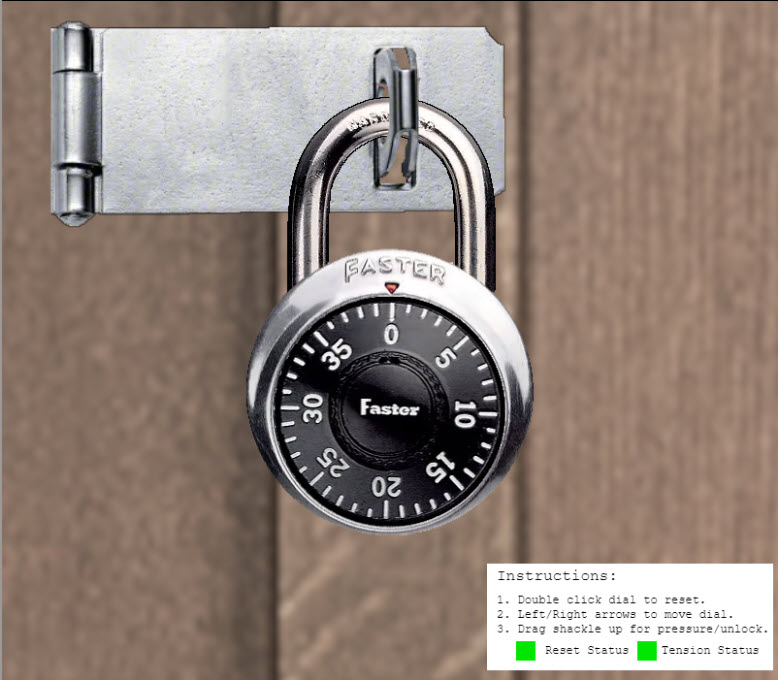
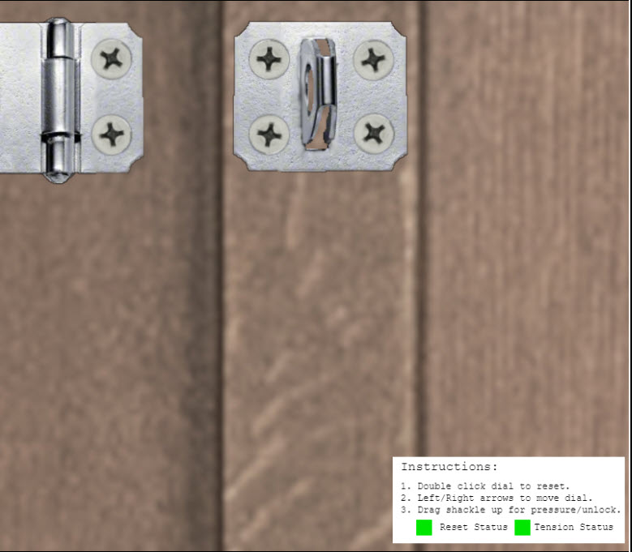

# Faster Lock Combination

**Difficulty**: :fontawesome-solid-star::fontawesome-solid-star::fontawesome-regular-star::fontawesome-regular-star::fontawesome-regular-star: 
**Direct link**: [Faster Lock Combination terminal](https://paddlelockdecode.com?&challenge=fasterlock&username=rack3t&id=eba63663-e81c-47a4-b9ac-8524fc9c1ad7&area=spi-brassbouyport&location=12,22&tokens=&dna=ATATATTAATATATATATATATATATATATATCGATATGCATATATATATATGCATATATATATATATATATATATTAGCATATATATATATATGCATATATATATATGCATATATATTA)

## Objective

!!! question "Request"
    Over on Steampunk Island, Bow Ninecandle is having trouble opening a padlock. Do some research and see if you can help open it!

??? quote "Bow Ninecandle @ Brass Bouy Port"
    Hey there! I'm Bow Ninecandle, and I've got a bit of a... 'pressing' situation. 
    You see, I need to get into the lavatory, but here's the twist: it's secured with a combination padlock. 
    Talk about bad timing, right? I could really use your help to figure this out before things get... well, urgent. 
    I'm sure there are some clever tricks and tips floating around [the web](https://www.youtube.com/watch?v=27rE5ZvWLU0) that can help us crack this code without too much of a flush... I mean fuss. 
    Remember, we're aiming for quick and easy solutions here - nothing too complex. 
    Once we've gathered a few possible combinations, let's team up and try them out. 
    I'm crossing my legs - I mean fingers - hoping we can unlock this door soon. 
    After all, everyone knows that the key to holiday happiness is an accessible lavatory! 
    Let's dive into this challenge and hopefully, we won't have to 'hold it' for too long! Ready to help me out? 

## Solution
This challenge is about lock picking the old school high school locker.

{ width="600" }

Watching the [video tutorial](https://www.youtube.com/watch?v=27rE5ZvWLU0) is a must! From this video, you learn that there are 3 main steps to cracking the combination.  
<b>Step 1: Finding the sticky number</b> 
Reset the lock, put tension on the locker (brown) and rotate until it starts to seize up. Do this multiple times until you are hitting the same number over and over. 
My sticky number is 28.  

<b>Step 2: Finding the guess numbers</b> 
These 2 numbers lie between 0 and 11. Apply heavy tension (red) and start turing from going one number at at time from 0 to 11. The two numbers you want to find in this range
sit in between numbers. 
For my lock, the two guess numbers are 4 and 7.  

<b>Step 3: The Math</b> 
PART A: Finding the First Digit 
28 (sticky) + 5 = 33 (first digit)  

PART B: Finding the Third Digit 
33 (first digit) / 4 = 8 with remainder of 1. 
Guess numbers: 4 and 7 
4 14 24 34 
7 17 27 37 
Dividing each number by 4 to match the same remainder of 1 as above leaves me 17 and 37. 
After refinement, my third digit is 17 (because it's looser)  

PART C: Finding the Second Digit (8 possibilities) 
Cross out numbers within 2 of third digit (17) 
3 11 <s>19</s> 27 35 
7 <s>15</s> 23 31 39  

Possible combinations for my lock are: 
33 - 3/11/27/35/7/23/31/39 - 17

!!! success "Answer"
    33 - 23 - 17 
    { width="600" }
    
    
## Response
!!! quote "Bow Ninecandle @ Brass Bouy Port"
    Oh, thank heavens! You're a lifesaver! With your knack for cracking codes, we've just turned a potential 'loo catastrophe' into a holiday triumph!

Portable shed cracked open, catastrophe averted!
