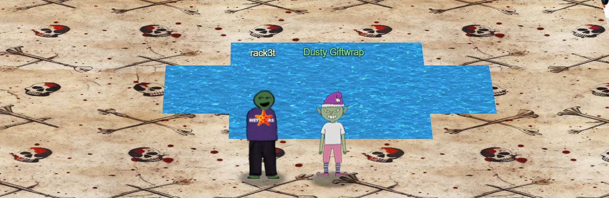
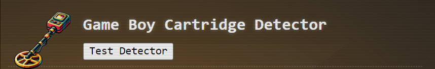
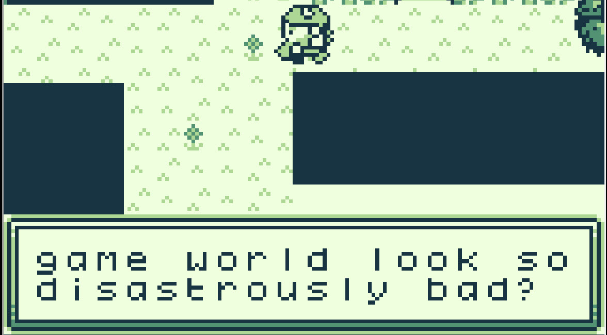
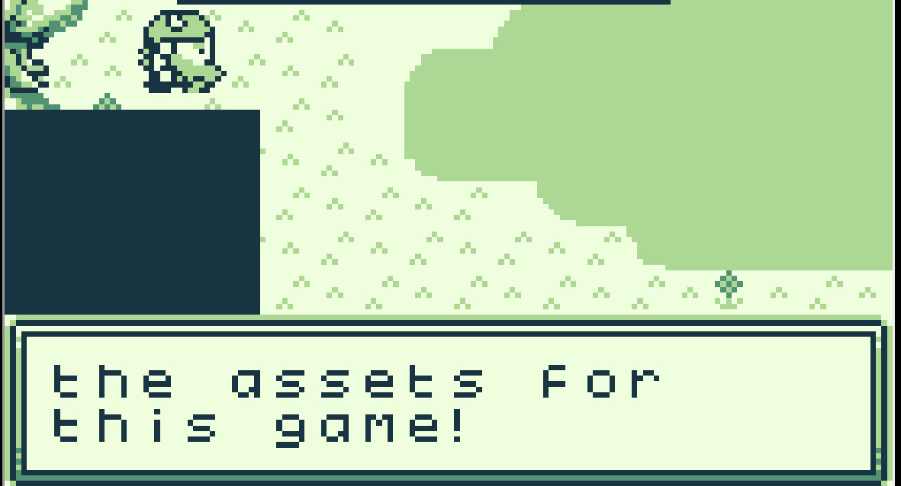
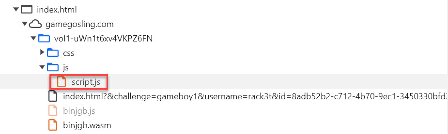
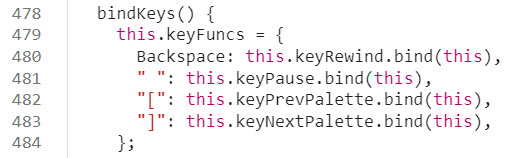
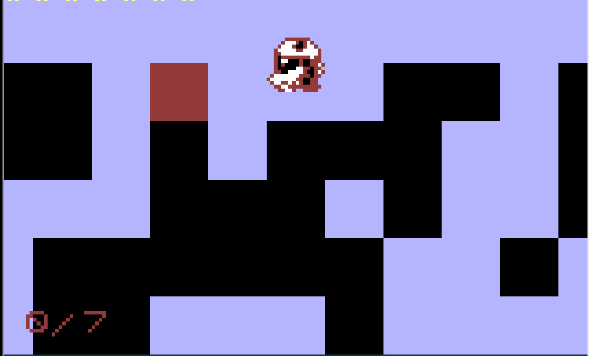
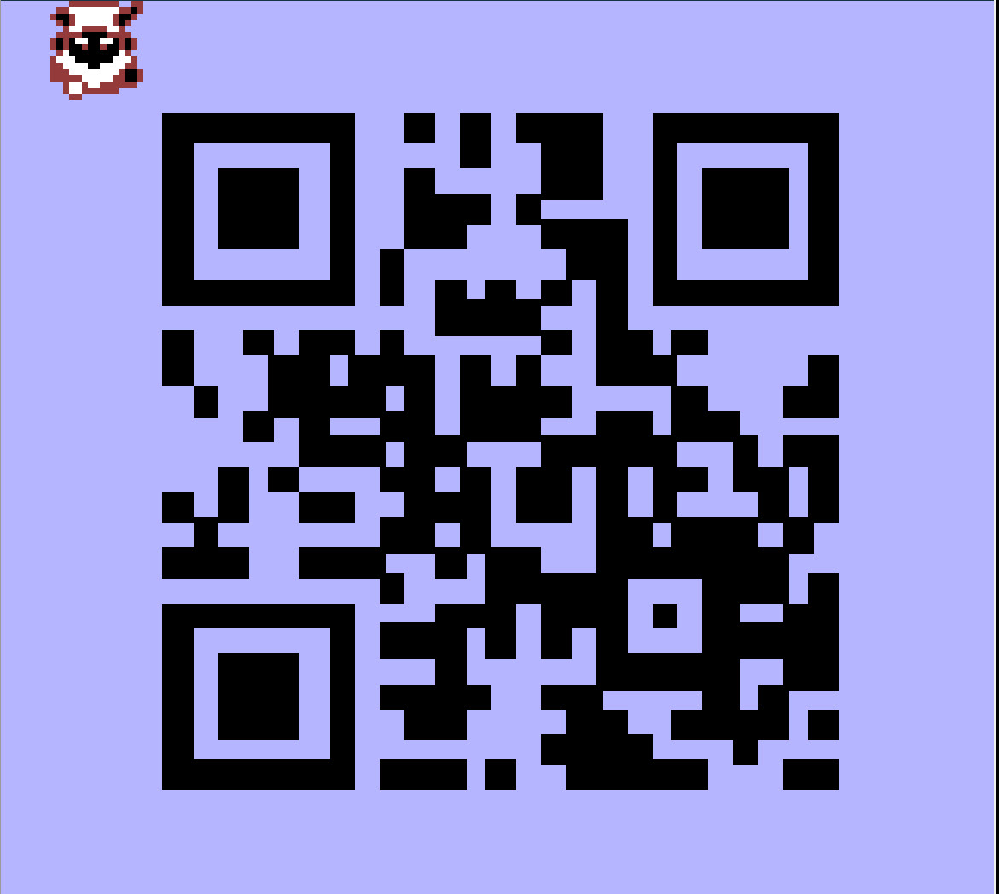

# Game Cartridges: Vol 1

**Difficulty**: :fontawesome-solid-star::fontawesome-regular-star::fontawesome-regular-star::fontawesome-regular-star::fontawesome-regular-star: 
**Direct link**: [Game Cartridges: Vol 1 game](https://gamegosling.com/vol1-uWn1t6xv4VKPZ6FN/index.html?&challenge=gameboy1&username=rack3t&id=73518532-3621-49b9-aeca-b4f3d5240ece&area=imt-tarnishedtrove&location=32,27&tokens=&dna=ATATATTAATATATATATATATATATATATATCGATATGCATATATATATATGCATATATATATATATATATATATTAGCATATATATATATATGCATATATATATATGCATATATATTA)

## Objective

!!! question "Request"
    Find the first Gamegosling cartridge and beat the game

??? quote "Angel Candysalt @ Rusty Quay"
    There are 3 buried treasures in total, each in its own uncharted area around Geese Islands. 
    I've been getting lost in this maze for hours now with no luck, and my feet are starting to get sore. 
    Maybe you'll be able to find the way through. Here, use my Gameboy Cartridge Detector. Go into your items and test it to make sure it's still working. 
    When you get close to the treasure, it'll start sounding off. The closer you get, the louder the sound. 
    No need to activate or fiddle with it. It just works! 
    At least it's obvious where this one is. See that shiny spot over to the right? That's gotta be where it is! If only I had a bird's eye view. 
    But how to get there? Up? Down? Left? Right? Oh well, that's your problem now! 
    Come back if you can find your way to it, and I'll tell you some secrets I've heard about this one. 

??? quote "Dusty Giftwrap @ Tarnished Trove"
    Arrr, matey, shiver me timbers! There be buried treasure herrrrre. 
    Just kidding, I'm not really a pirate, I was just hoping it would make finding the treasure easier. 
    I guess you heard about the fabled buried treasure, too? I didn't expect to see anyone else here. This uncharted islet was hard to find. 
    I bet one of these creepy toys has the treasure, and I'm sure not going anywhere near them! 
    If you find the treasure, come back and show me, and I'll tell you what I was able to research about it. 
    Good luck!

??? quote "Dusty Giftwrap @ Tarnished Trove"
    Whoa, you found it! 
    It's a... video game cartridge? Coooooollll... I mean, arrrrrr.... 
    So, here's what my research uncovered. Not sure what it all means, maybe you can make sense of it. 
    You have all three? I think that makes you ruler of the pirates!

## Hints
??? tip "Gameboy 1"
    <i>From: Dusty Giftwrap 
    Objective: Game Cartridges: Vol 1</i> 
    Listen for the gameboy cartridge detector's proximity sound that activates when near buried treasure. It may be worth checking around the strange toys in the Tarnished Trove.

??? tip "Gameboy 1"
    <i>From: Dusty Giftwrap 
    Objective: Game Cartridges: Vol 1</i> 
    1) Giving things a little push never hurts. 2) Out of sight but not out of ear-shot 3) You think you fixed the QR code? Did you scan it and see where it leads?

The Game Boy Cartridge Detector comes in handy for finding games:
{ width="600" }

## Solution
This challenge starts off a 3-part series of GameBoy hacking. After playing the game once normally, the goal is clear - you need to put together a QR code
by moving individual blocks into their designated locations one by one. There are a couple of hints along the way.
One mentions the game looking disastrously bad:

{ width="600" }

And the other one said something along the lines of "if I find the developer who skipped out on assets for this game!" 😂

{ width="600" }

Thanks for the observations, let's see the source code using Chrome Dev Tools.
The most interesting file relevant to the game is script.js which contains game assignments.

{ width="600" }

Some of the most interesting assignments are found here - undocumented game keys which will be useful.
The palette can be changed with "]" and "[" as well as backspace can be used to rewind. This is very helpful considering
that you need to move 7 blocks to correct positions and you can normally only move blocks forward and if you mess up, you 
have to start over.

{ width="600" }

The different palette is also super helpful - you can find one that automatically shows movable blocks without playing music.

{ width="600" }

Ok now that game dynamics are improved, all 7 blocks just have to be move to their spots.
Once they are all in place, scan the QR code, which leads to [website with the flag](https://8bitelf.com/).

{ width="600" }

!!! success "Answer"
    santaconfusedgivingplanetsqrcode
    

Game 1 of 3 complete!

