# Game Cartridges: Vol 2

**Difficulty**: :fontawesome-solid-star::fontawesome-solid-star::fontawesome-solid-star::fontawesome-regular-star::fontawesome-regular-star: 
**Direct link**: [Game Cartridges: Vol 2 game](https://gamegosling.com/vol2-akHB27gg6pN0/index.html?&challenge=gameboy2&username=rack3t&id=59a8f62a-79cc-4d6e-857c-1276db79e823&area=pi-driftbitgrotto&location=13,20&tokens=&dna=ATATATTAATATATATATATATATATATATATCGATATGCATATATATATATGCATATATATATATATATATATATTAGCATATATATATATATGCATATATATATATGCATATATATTA)

## Objective

!!! question "Request"
    Find the second Gamegosling cartridge and beat the game

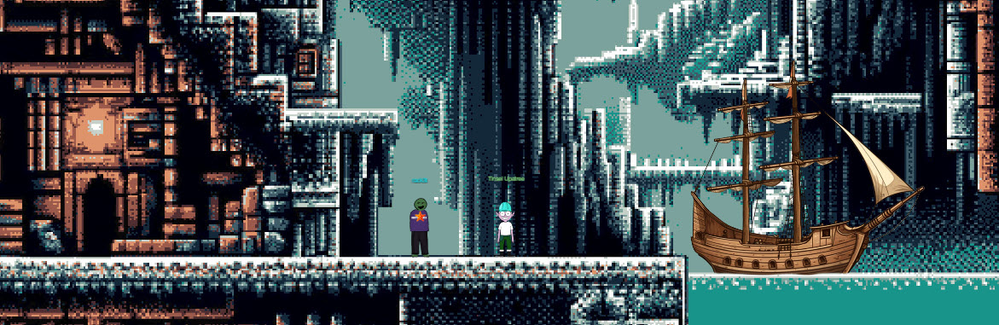

??? quote "Tinsel Upatree @ Driftbit Grotto"
    I can't believe I was actually able to find this underground cavern! 
    I discovered what looked liike an old pirate map in the attic of one of those huts in Rainraster Cliffs, and it actually led somewhere! 
    But now that I've seen where it leads, I think this might've been a bad idea. This place is scary! Maybe you want to take it from here? 
    I'm sure that cartridge is right nearby. Start walking around! 
    Once you run into it, check back with me and I'll tell you what I know about winning. 
    Good luck! 
    Whoa, you found it! 
    What version is it? 
    Did you know that many games had multiple versions released? Word is: volume 2 has 2 versions! 

## Hints
??? tip "Gameboy 2"
    <i>From: Tinsel Upatree 
    Objective: Game Cartridges: Vol 2</i> 
    Try poking around Pixel Island. There really aren't many places you can go here, so try stepping everywhere and see what you get!
    
??? tip "Gameboy 2"
    <i>From: Tinsel Upatree 
    Objective: Game Cartridges: Vol 2</i> 
    1) This feels the same, but different! 2) If it feels like you are going crazy, you probably are! Or maybe, just maybe, you've not yet figured out where the hidden ROM is hiding. 3) I think I may need to get a DIFFerent perspective. 4) I wonder if someone can give me a few pointers to swap.

    
## Solution
Tinsel Upatree mentions that volume 2 had 2 versions. First, play the game normally while observing network traffic in Chrome Dev Tools looking for the game.
`game0` game file found so there has to be another one at this location.
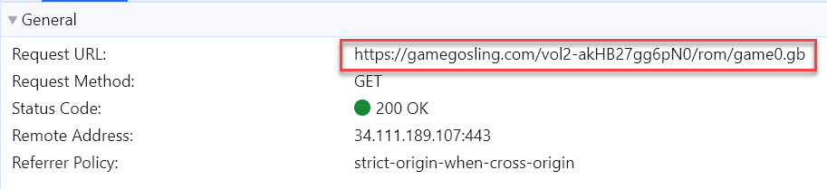

Download both game files located at `https://gamegosling.com/vol2-akHB27gg6pN0/rom/`, 2nd version is simply named `game1.gb`.

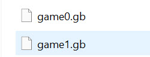

Now play the game to get an idea for plot. The main problem is the guard guarding the entrance to the other side doesn't let you pass, mentioning something about the need for magic.

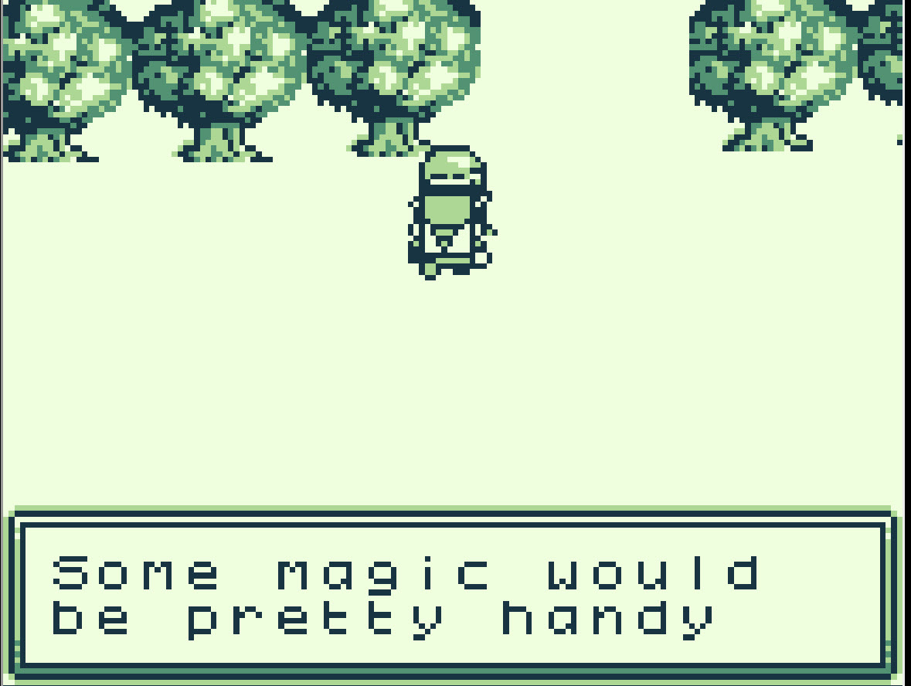{ width="600" }

To play the 2nd version, filename variable can be manipulated in game's JavaScript (using JS console) or both games can be loaded using a more advanced emulator - [visualboyadvance-m](https://github.com/visualboyadvance-m/visualboyadvance-m).

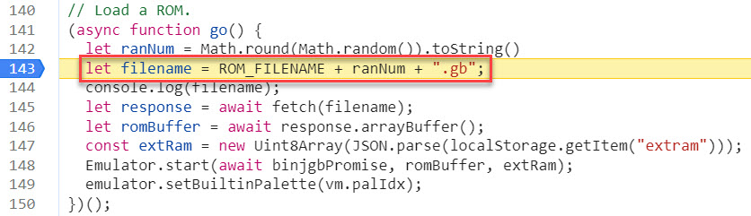

Let's install the better emulator and load up the 2nd version of the game.

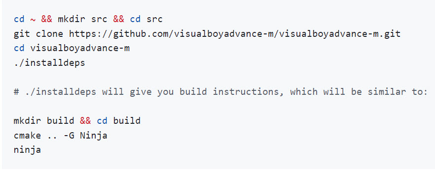

Once you play the other version normally, it quickly becomes apparent that second version is mirrored image of the first.
When trying to go through the entrance, blocked exit simply pushes you back up instead of down.
To beat this challenge, you have to think about what's going on conceptually - both versions are essentially the same game with only exception,
second room with entrance is inverted. 

`visualboyadvance-m` gives an option to save state - this should be helpful because RAM between games is interchangeable.
Save the first game state to file.

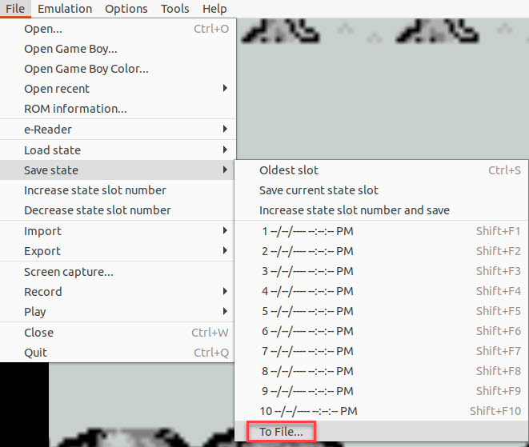

Now play the other game and load this save. The dynamic of the game is made to push you to the other side since the game is mirrored but the save changes location of the 
needed destination. We are now through!

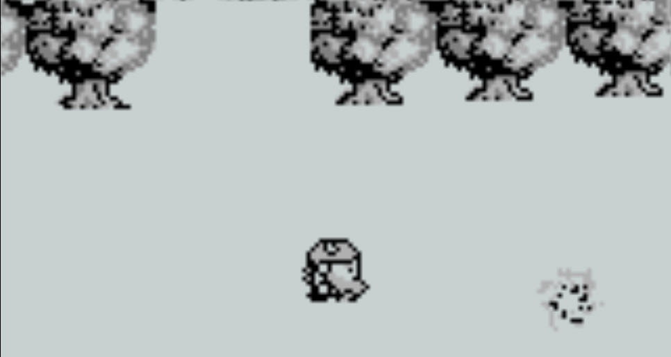{ width="600" }

All that's left is to listen to the radio broadcasting morse code signals and translate them.

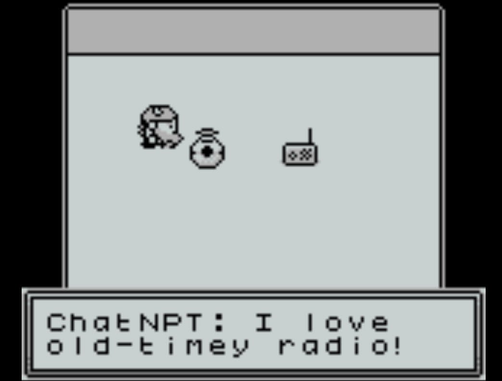{ width="600" }

`visualboyadvance-m` provides a nice feature for sound recording - use it to store morse code into a sound file.
Stop after a minute or so.

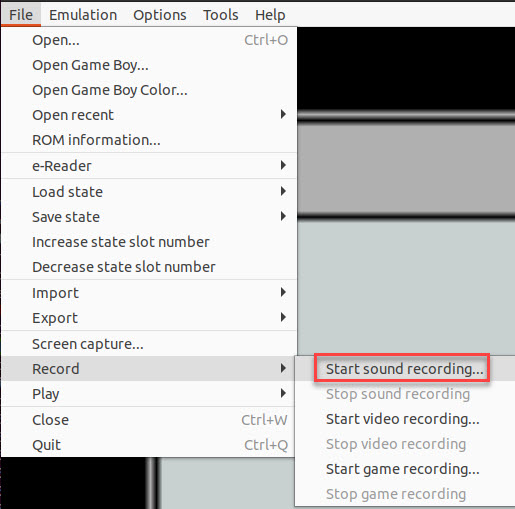

Use the [online converter](https://morsecode.world/international/decoder/audio-decoder-adaptive.html) to decode the message - "GL0RY":

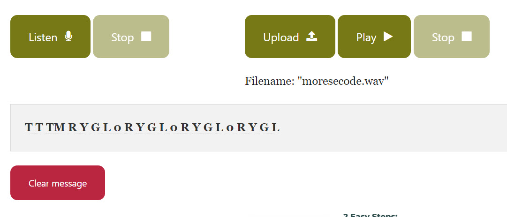

!!! success "Answer"
    GL0RY
    
Game 2 of 3 complete!

