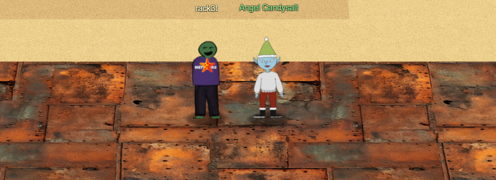
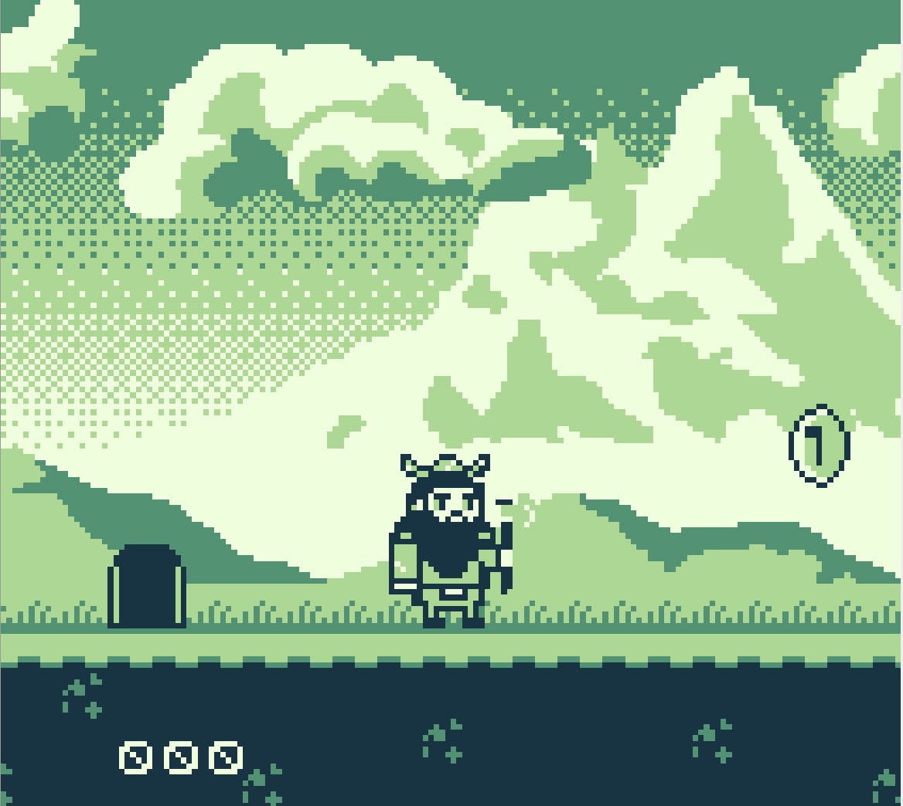
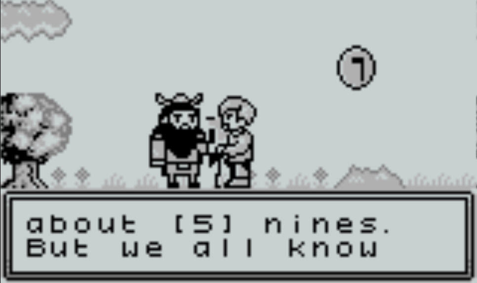
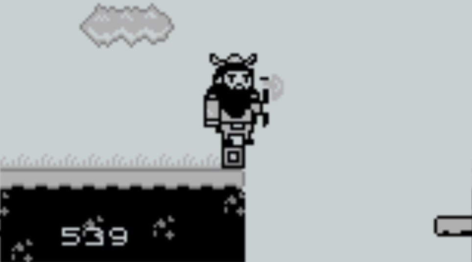
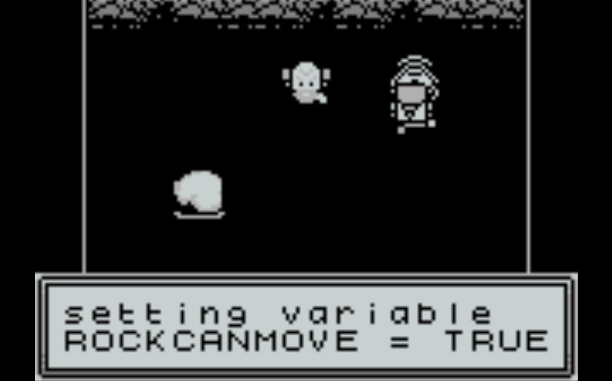
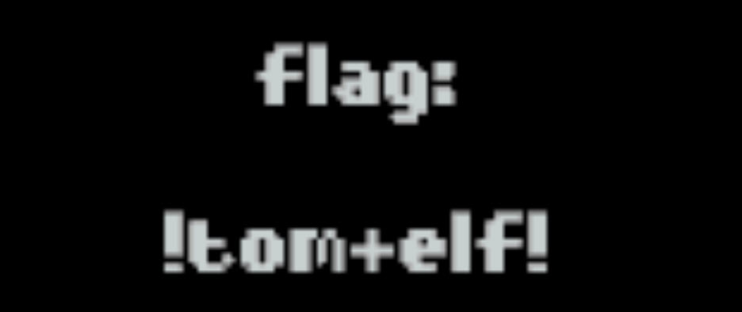

# Game Cartridges: Vol 3

**Difficulty**: :fontawesome-solid-star::fontawesome-solid-star::fontawesome-solid-star::fontawesome-regular-star::fontawesome-regular-star: 
**Direct link**: [Game Cartridges: Vol 3 game](https://gamegosling.com/vol3-7bNwQKGBFNGQT1/index.html?&challenge=gameboy3&username=rack3t&id=d3c1781d-f73c-4ac2-bea2-cf9dda4344c3&area=pi-driftbitgrotto&location=13,20&tokens=&dna=ATATATTAATATATATATATATATATATATATCGATATGCATATATATATATGCATATATATATATATATATATATTAGCATATATATATATATGCATATATATATATGCATATATATTA)

## Objective

!!! question "Request"
    Find the third Gamegosling cartridge and beat the game

??? quote "Angel Candysalt @ Rusty Quay"
    The name's Angel Candysalt, the great treasure hunter! 
    A euphemism? No, why do people always ask me that?? 
    Anyways, I came here to nab the treasure hidden in this ship graveyard, only to discover it's protected by this rusted maze. 
    That must be why all these old ships are here. Their crew came to find the treasure, only to get lost in the labrynth.

## Hints
??? tip "Gameboy 3"
    <i>From: Angel Candysalt 
    Objective: Game Cartridges: Vol 3</i> 
    1) This one is a bit long, it never hurts to save your progress! 2) 8bit systems have much smaller registers than you’re used to. 3) Isn’t this great?!? The coins are OVERFLOWing in their abundance.

## Solution
This game can be solved by playing the game but a very specific number of coins have to be collected. The main problem in the game is that once you reach 999 coins, it goes back to 001 and this very specific 
number is needed so the jump to proceed can be possible. The coins provide +1, +10, or +100 to the score.

Download the game from `https://gamegosling.com/vol3-7bNwQKGBFNGQT1/rom/game.gb` (observed via Chrome Dev Tools Network) and load it on [visualboyadvance-m](https://github.com/visualboyadvance-m/visualboyadvance-m).
Although, `visualboyadvance-m` does allow game memory manipulation and there are [good write-ups](http://gameboy.mongenel.com/dmg/asmmemmap.html) about GameBoy memory layout and such, this will 
not be needed for our solution.

{ width="600" }

`visualboyadvance-m` also allows saving of the game so it's easier to play.
After lots of tinkering, the main hint that helps solve this game comes from the man on last level, he says:
"Back in my SysAdmin days marketing always loved talking about [5] nines it was more like [3] nines". Interpreting this as 
numbers are [5] [3] and [9].

{ width="600" }

Sure enough, having exactly 539 coins creates the platform on the other side that allows us to make the jump. Problem solved!

{ width="600" }

Once the jump is made and we are on the other side, talk to man, then ChatNPT which will allow rock to move.

{ width="600" }

Then move the rock and game is won!!🫡

{ width="600" }

!!! success "Answer"
    !tom+elf!

Game 3 of 3 complete!