# KQL Kraken Hunt

**Difficulty**: :fontawesome-solid-star::fontawesome-solid-star::fontawesome-regular-star::fontawesome-regular-star::fontawesome-regular-star: 
**Direct link**: [KQL Kraken Hunt terminal](https://detective.kusto.io/sans2023)

## Objective

!!! question "Request"
    Use Azure Data Explorer to [uncover misdeeds](https://detective.kusto.io/sans2023) in Santa's IT enterprise. Go to Film Noir Island and talk to Tangle Coalbox for more information.

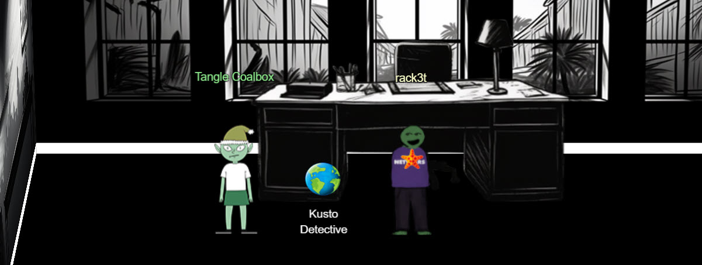

??? quote "Tangle Coalbox @ Gumshoe Alley PI Office"
    Greetings, rookie. Tangle Coalbox of Kusto Detective Agency here. 
    I've got a network infection case on Film Noir Island that needs your expertise. 
    Seems like someone clicked a phishing link within a client's organization, and trouble's brewing. 
    I'm swamped with cases, so I need an extra pair of hands. You up for the challenge? 
    You'll be utilizing the Azure Data Explorer and those KQL skills of yours to investigate this incident. 
    Before you start, you'll need to [create a free cluster](https://dataexplorer.azure.com/publicfreecluster). 
    Keep your eyes peeled for suspicious activity, IP addresses, and patterns that'll help us crack this case wide open. 
    Remember, kid, time is of the essence. The sooner we can resolve this issue, the better. 
    If you run into any problems, just give me a holler, I've got your back. 
    Good hunting, and let's bring this cyber criminal to justice. 
    Once you've got the intel we need, report back and we'll plan our next move. Stay sharp, rookie.

## Hints
??? tip "KQL Tutorial"
    <i>From: Tangle Coalbox 
    Objective: KQL Kraken Hunt</i> 
    Once you get into the [Kusto trainer](https://detective.kusto.io/sans2023), click the blue Train me for the case button to get familiar with KQL.

??? tip "File Creation"
    <i>From: Tangle Coalbox 
    Objective: KQL Kraken Hunt</i> 
    Looking for a file that was created on a victim system? Don't forget the FileCreationEvents table.

??? tip "Outbound Connections"
    <i>From: Tangle Coalbox 
    Objective: KQL Kraken Hunt</i> 
    Do you need to find something that happened via a process? Pay attention to the ProcessEvents table!

## Solution
First, [create a free cluster](https://dataexplorer.azure.com/publicfreecluster) - you will need to login to your Microsoft account.
Once cluster is created, import the data from your [Kusto Inbox](https://detective.kusto.io/inbox) by copy-pasting the command.

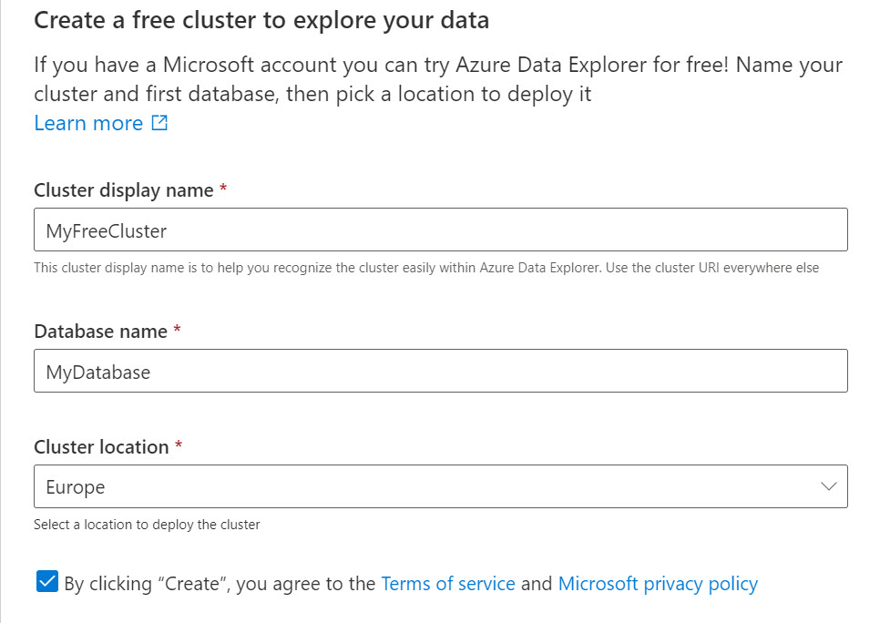{ width="600" }

Once you are setup with the cluster and imported data, go to query and check out your new database, it should look something like this:

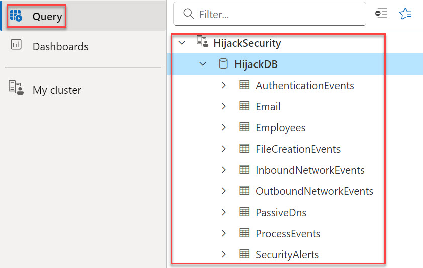{ width="600" }

Now onto the questions. Instructions for cluster KQL can be found [here](https://detective.kusto.io/faq?index=1).

### Onboarding
!!! question "Question"
    If you've been here before, click that log-in button to access your account. But if you're new and don't have a free Kusto cluster or KQL database, fear not! Follow the instructions in the [FAQ section](https://detective.kusto.io/faq?index=1) to create one and join the detective party. Your shiny new cluster will be your go-to investigative tool, and its URL will be your secret agent identity. 
    Here's a little puzzle to warm you up with KQL and feel the pulse of the collected data. The Geese Islands network boasts a robust team putting in some serious hustle, and you can unmistakably witness their dedication mirrored in the tasks they bring to life. The delightful keyboard clicks in the morning, truly something to love, don't you agree? Now, presenting a snappy challenge: figure out the number of Craftsperson Elf's in the organization that are working from laptops. 
    To create new tables and load the data into them, RUN the script in the large box below. 
    Then come back here, click on the 'Train Me for the case' button located at the top right to cozy up with the data you just generated, and acquaint yourself with KQL operators. Let the party begin! 📧🚂

We are looking for employees who are Craftsperson Elf and working from laptops. 

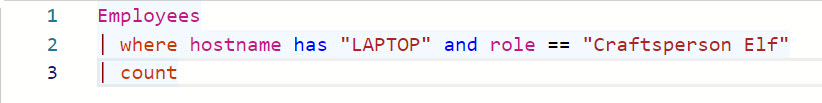{ width="600" }

!!! success "Answer"
    How many Craftperson Elf's are working from laptops? <b>25</b>

### Case 1
!!! question "Question"
    An urgent alert has just come in, 'A user clicked through to a potentially malicious URL involving one user.' This message hints at a possible security incident, leaving us with critical questions about the user's intentions, the nature of the threat, and the potential risks to Santa's operations. Your mission is to lead our security operations team, investigate the incident, uncover the motives behind email, assess the potential threats, and safeguard the operations from the looming cyber threat. 
    The clock is ticking, and the stakes are high - are you up for this exhilarating challenge? Your skills will be put to the test, and the future of Geese Island's digital security hangs in the balance. Good luck! 
    The alert says the user clicked the malicious link 'http://madelvesnorthpole.org/published/search/MonthlyInvoiceForReindeerFood.docx' 

Here we are looking for a the phishing email with the malicious link (`http://madelvesnorthpole.org/published/search/MonthlyInvoiceForReindeerFood.docx`). All questions can be answered using one query.

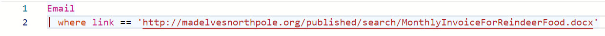{ width="600" }

!!! success "Answer"
    What is the email address of the employee who received this phishing email? <b>alabaster_snowball@santaworkshopgeeseislands.org</b> 
    What is the email address that was used to send this spear phishing email? <b>cwombley@gmail.com</b> 
    What was the subject line used in the spear phishing email? <b>[EXTERNAL] Invoice foir reindeer food past due</b> 

###  Case 2
!!! question "Question"
    Nicely done! You found evidence of the spear phishing email targeting someone in our organization. Now, we need to learn more about who the victim is! 
    If the victim is someone important, our organization could be doomed! Hurry up, let's find out more about who was impacted!

For this question, we are looking through Employees table and using recipient's email address as identifier.

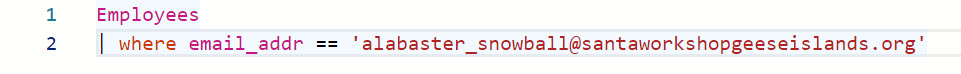{ width="600" }

!!! success "Answer"
    What is the role of our victim in the organization? <b>Head Elf</b> 
    What is the hostname of the victim's machine? <b>Y1US-DESKTOP</b> 
    What is the source IP linked to the victim? <b>10.10.0.4</b> 

###  Case 3
!!! question "Question"
    The victim is Alabaster Snowball? Oh no... that's not good at all! Can you try to find what else the attackers might have done after they sent Alabaster the phishing email? 
    Use our various security log datasources to uncover more details about what happened to Alabaster.

First, we need to look through outgoing network events to get the timestamp.

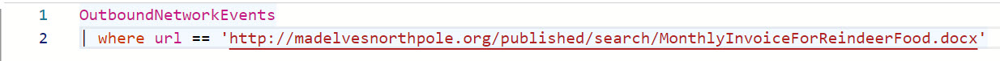

Second, we can look through file creation events to find which file was created around `2023-12-02T10:12:42Z`.

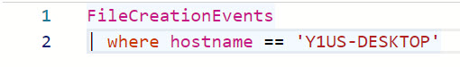

!!! success "Answer"
    What time did Alabaster click on the malicious link? Make sure to copy the exact timestamp from the logs! <b>2023-12-02T10:12:42Z</b> 
    What file is dropped to Alabaster's machine shortly after he downloads the malicious file? <b>giftwrap.exe</b> 

###  Case 4
!!! question "Question"
    Well, that's not good. It looks like Alabaster clicked on the link and downloaded a suspicious file. I don't know exactly what giftwrap.exe does, but it seems bad. 
    Can you take a closer look at endpoint data from Alabaster's machine? We need to figure out exactly what happened here. Word of this hack is starting to spread to the other elves, so work quickly and quietly! 

For this question, we are dealing with process events because this table show full process command line. All questions can be answered with one query:

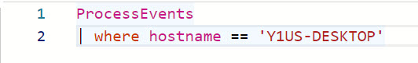

The reverse tunnel looks like this - typical reverse SSH tunnel with custom executable:

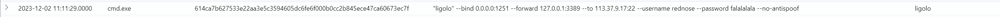

Network shares enumeration is the `net share` command, while lateral movement commands looks like the following and signifies that attacker already has admin credentials:

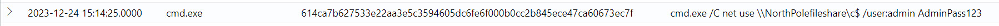

!!! success "Answer"
    The attacker created an reverse tunnel connection with the compromised machine. What IP was the connection forwarded to? <b>113.37.9.17</b> 
    What is the timestamp when the attackers enumerated network shares on the machine? <b>2023-12-02T16:51:44Z</b> 
    What was the hostname of the system the attacker moved laterally to? <b>NorthPolefileshare</b>
    

###  Case 5
!!! question "Question"
    Wow, you're unstoppable! Great work finding the malicious activity on Alabaster's machine. I've been looking a bit myself and... I'm stuck. The messages seem to be garbled. Do you think you can try to decode them and find out what's happening? 
    Look around for encoded commands. Use your skills to decode them and find the true meaning of the attacker's intent! Some of these might be extra tricky and require extra steps to fully decode! Good luck! 
    If you need some extra help with base64 encoding and decoding, click on the 'Train me for this case' button at the top-right of your screen. 

All questions in this case can be answered with one query:
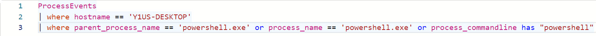

To find the first malicious encoded PowerShell command, we can use Notepad++ to easily decode commands. Important here to make sure it is actually attacker's and not
normal admin activity such as executing `Invoke-WmiMethod` as part of software updates.

All the malicious PowerShell commands are identified here:
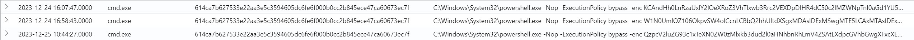

The stolen file from file share is need to be reversed after base64 decoded.

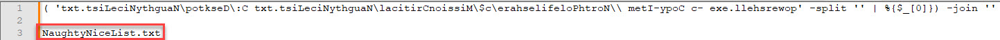

For the domain, we use PowerShell to get the answer. Assign decoded command to a variable (`$s`), then print it out.

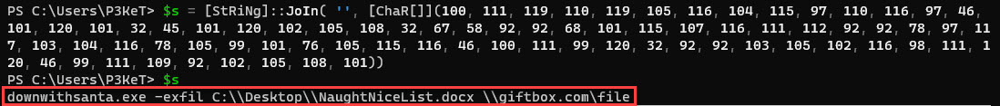

!!! success "Answer"
    When was the attacker's first base64 encoded PowerShell command executed on Alabaster's machine? <b>2023-12-24T16:07:47Z</b> 
    What was the name of the file the attacker copied from the fileshare? (This might require some additional decoding) <b>NaughtyNiceList.txt</b> 
    The attacker has likely exfiltrated data from the file share. What domain name was the data exfiltrated to? <b>giftbox.com</b> 
    

###  Case 6
!!! question "Question"
    Wow! You decoded those secret messages with easy! You're a rockstar. It seems like we're getting near the end of this investigation, but we need your help with one more thing... 
    We know that the attackers stole Santa's naughty or nice list. What else happened? Can you find the final malicious command the attacker ran?

The same query from Case 5 can be used to answer questions in Case 6. Then decode the base64 command and answer the last two questions.

!!! success "Answer"
    What is the name of the executable the attackers used in the final malicious command? <b>downwithsanta.exe</b> 
    What was the command line flag used alongside this executable? <b>--wipeall</b>

The final query can be ran on the KQL query shell to get the final answer. WIN!
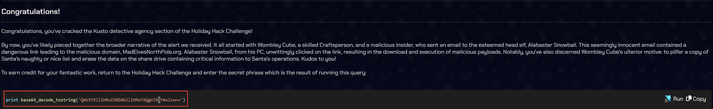

!!! success "Answer"
    Beware the Cube that Wombles
    
## Response
!!! quote "Tangle Coalbox  @ Gumshoe Alley PI Office"
    I had my doubts, but you've proven your worth. 
    That phishing scheme won't trouble our client's organization anymore, thanks to your keen eye and investigatory prowess. 
    So long, Gumshoe, and be careful out there. 
    
Have no doubts, Tangle!