# Phish Detection Agency

**Difficulty**: :fontawesome-solid-star::fontawesome-solid-star::fontawesome-regular-star::fontawesome-regular-star::fontawesome-regular-star: 
**Direct link**: [Phish Detection Agency terminal](https://hhc23-phishdetect-dot-holidayhack2023.ue.r.appspot.com/?&challenge=phishdetect&username=rack3t&id=212ce484-0ff9-43cc-bc1d-5a474396fad9&area=fni-theblacklightdistrict&location=44,13&tokens=&dna=ATATATTAATATATATATATATATATATATATCGATATGCATATATATATATGCATATATATATATATATATATATTAGCATATATATATATATGCATATATATATATGCATATATATTA)

## Objective

!!! question "Request"
    Fitzy Shortstack on Film Noir Island needs help battling dastardly phishers. Help sort the good from the bad!

??? quote "Fitzy Shortstack @ The Blacklight District"
    Just my luck, I thought... 
    A cybersecurity incident right in the middle of this stakeout. 
    Seems we have a flood of unusual emails coming in through ChatNPT. 
    Got a nagging suspicion it isn't catching all the fishy ones. 
    You're our phishing specialist right? Could use your expertise in looking through the output of ChatNPT. 
    Not suggesting a full-blown forensic analysis, just mark the ones screaming digital fraud. 
    We're looking at all this raw data, but sometimes, it takes a keen human eye to separate the chaff, doesn't it? 
    I need to get more powdered sugar for my donuts, so do ping me when you have something concrete on this.

## Hints
??? tip "DMARC, DKIM, and SPF, oh my!"
    <i>From: Fitzy Shortstack 
    Terminal: Phish Detection</i> 
    Discover the essentials of email security with DMARC, DKIM, and SPF at [Cloudflare's Guide](https://www.cloudflare.com/learning/email-security/dmarc-dkim-spf/).

## Solution
The goal of this mission is to make sure all phishing emails are identified correctly. Good start is to read up on [DMARC, DKIM and SPF](https://www.cloudflare.com/learning/email-security/dmarc-dkim-spf/).
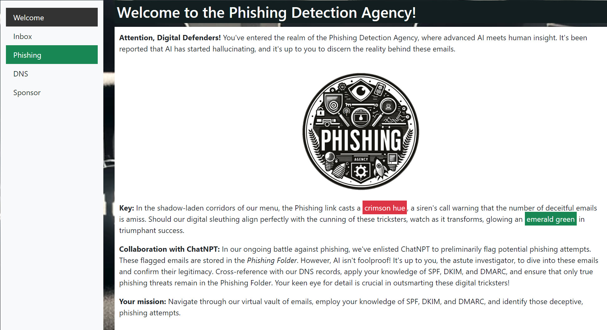

First, check your DNS records:
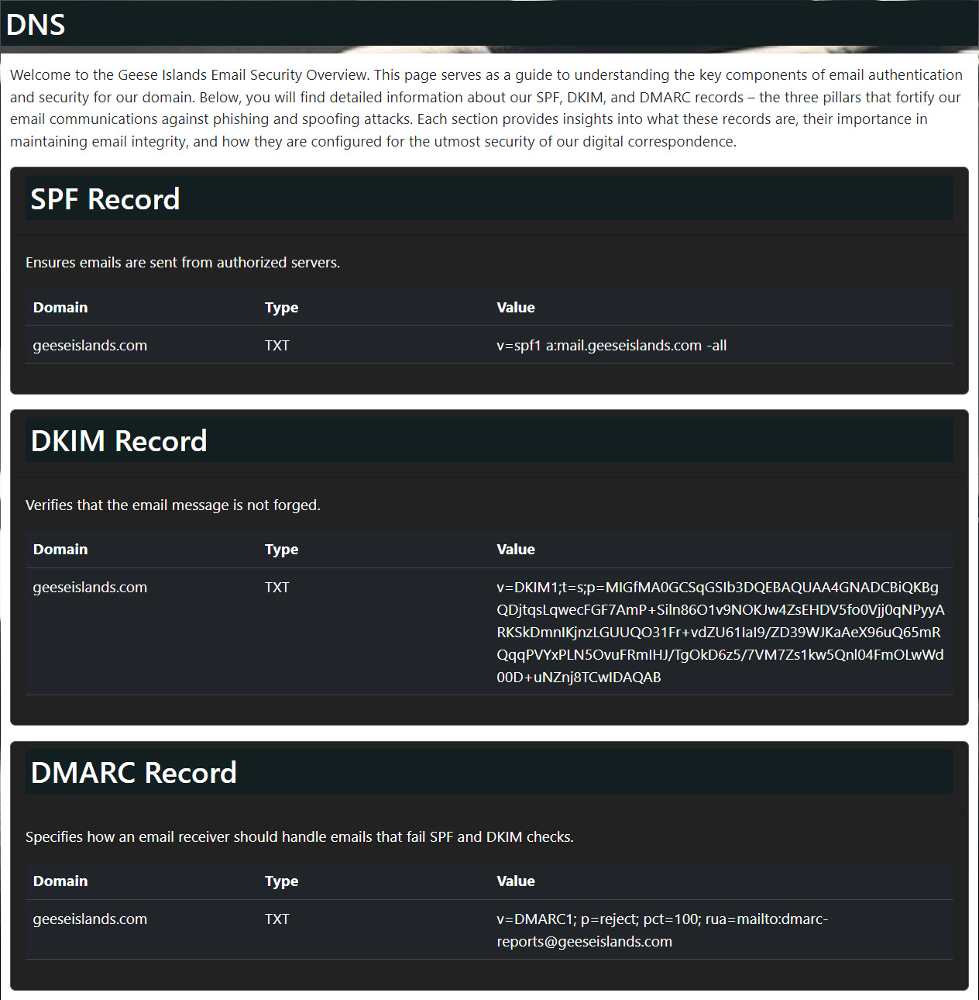

Now, go through emails looking for phishing discrepancies. Here are all the phishing ones.

First one is an obvious DMARC failure. 
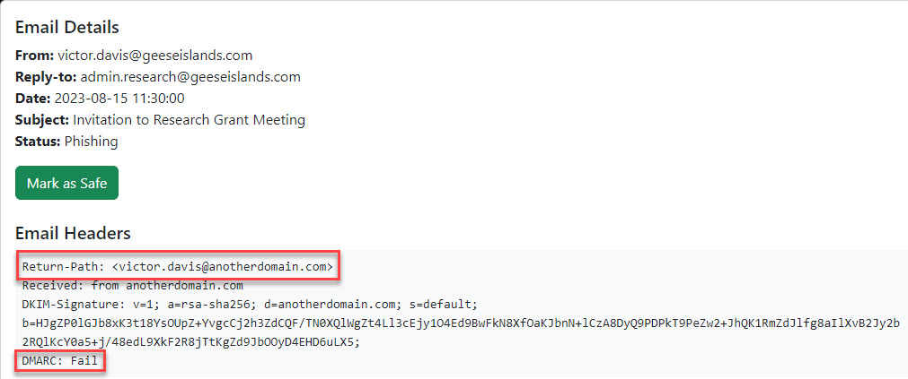

Second failed both DKIM and DMARC. 
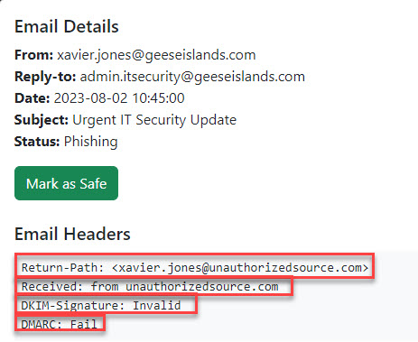

Third altered DKIM signature and failed DMARC. 
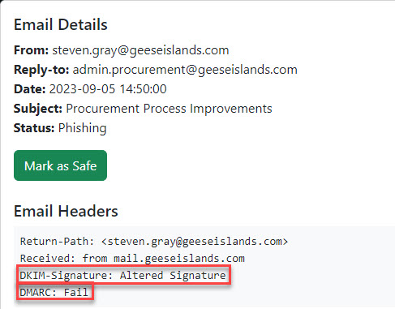

Fourth was sent from a different domain but made appear to be from `@geeseislands.com` sender - typical spoofing attack. 
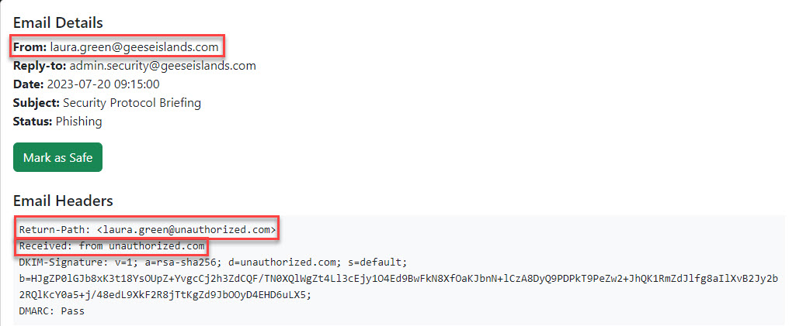

Fifth is phishing for the same reason as fourth. 
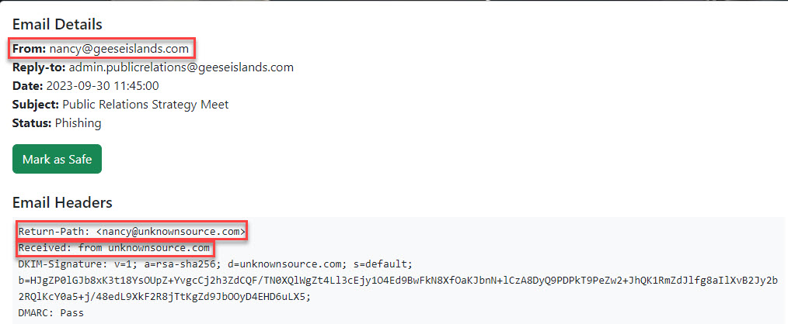

Sixth is missing DKIM signature and failed DMARC. 
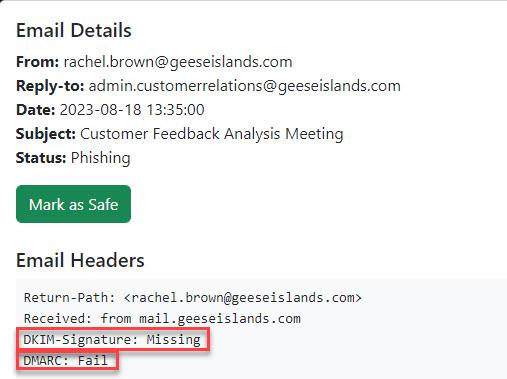

Seventh is sending email from different domain but email's "From" field says `@geeseislands.com` - definite phishing. 
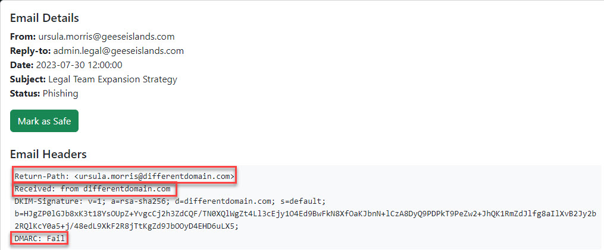

Eight has invalid DKIM and failed DMARC. 
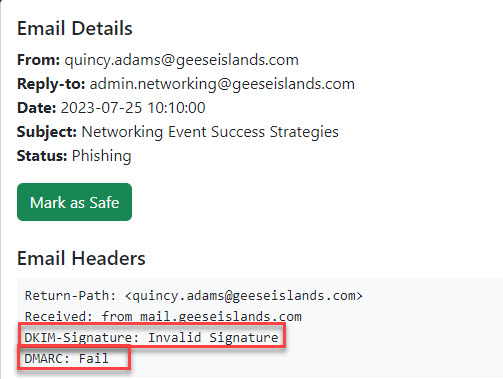

Ninth is trying to spoof `@geeseislands.com` user - not on my watch lol. 
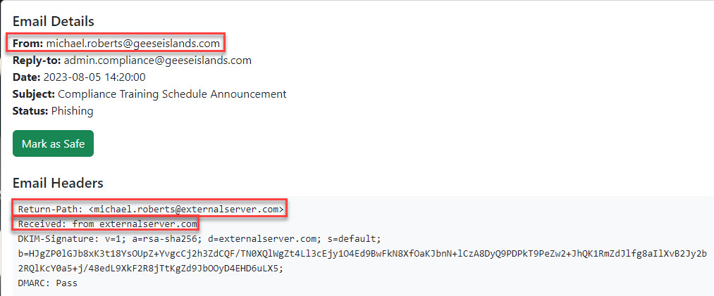

Tenth is same as ninth - spoofing attempt. If it was legit, "From" email field would reflect same value as Return-Path along with correct sending domain. 
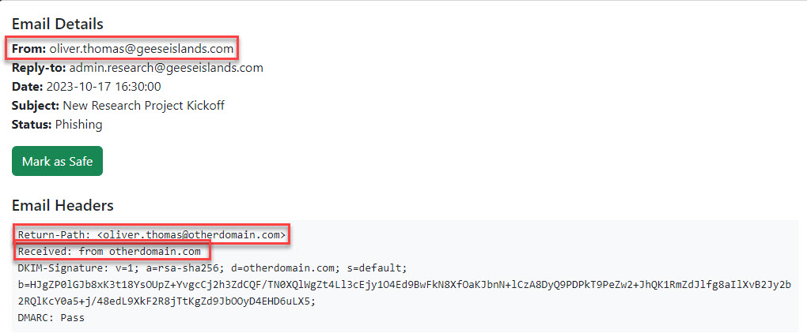

!!! success "Answer"
    All phishing emails were found by a human. 
    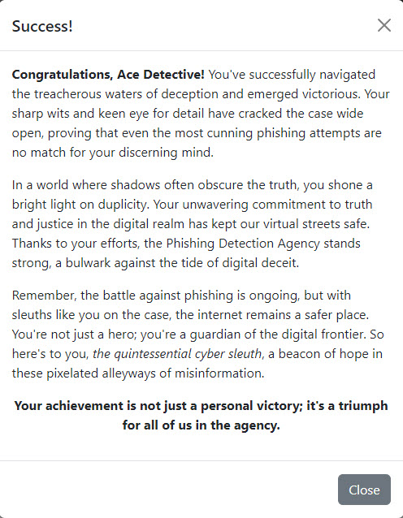
    
## Response
!!! quote "Fitzy Shortstack @ The Blacklight District"
    You've cracked the case! Once again, you've proven yourself to be an invaluable asset in our fight against these digital foes.

    
Treacherous waters...