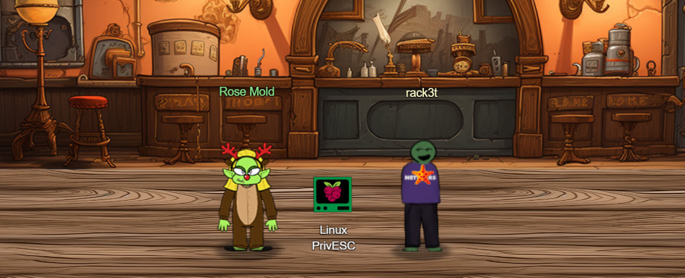
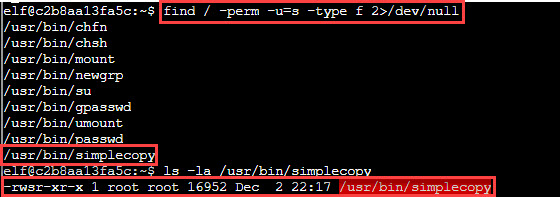
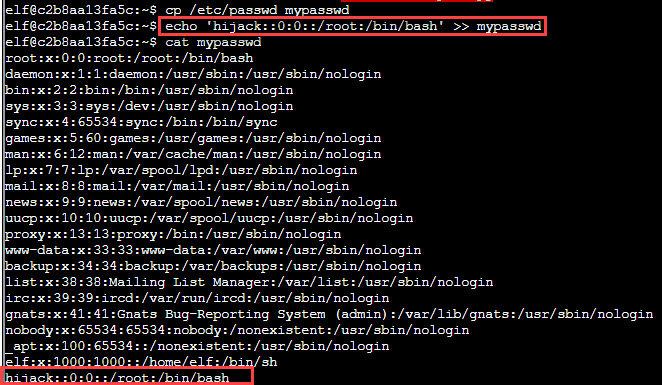
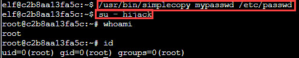
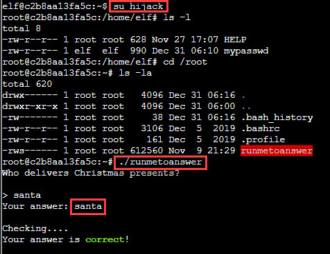

# Linux PrivEsc

**Difficulty**: :fontawesome-solid-star::fontawesome-solid-star::fontawesome-solid-star::fontawesome-regular-star::fontawesome-regular-star: 
**Direct link**: [Linux PrivEsc terminal](https://hhc23-wetty.holidayhackchallenge.com?&challenge=linuxpriv&username=rack3t&id=26ca7f49-32c4-47f7-9541-5dc848359c68&area=imt-ostrichsaloon&location=7,3&tokens=&dna=ATATATTAATATATATATATATATATATATATCGATATGCATATATATATATGCATATATATATATATATATATATTAGCATATATATATATATGCATATATATATATGCATATATATTA)

## Objective

!!! question "Request"
    Rosemold is in Ostrich Saloon on the Island of Misfit Toys. Give her a hand with escalation for a tip about hidden islands.

??? quote "Rose Mold @ Ostrich Saloon"
    What am I doing in this saloon? The better question is: what planet are you from? 
    Yes, I’m a troll from the Planet Frost. I decided to stay on Earth after Holiday Hack 2021 and live among the elves because I made such dear friends here. 
    Whatever. Do you know much about privilege escalation techniques on Linux? 
    You're asking why? How about I'll tell you why after you help me. 
    And you might have to use that big brain of yours to get creative, bub.

## Hints
??? tip "Linux Privilege Escalation Techniques"
    <i>From: Rose Mold 
    Terminal: Linux PrivESC</i> 
    There's [various ways](https://payatu.com/blog/a-guide-to-linux-privilege-escalation/) to escalate privileges on a Linux system.
    
??? tip "Linux Command Injection"
    <i>From: Rose Mold
    Terminal: Linux PrivESC</i> 
    Use the privileged binary to overwriting a file to escalate privileges could be a solution, but there's an easier method if you pass it a crafty argument.

## Solution
[Guide](https://payatu.com/blog/a-guide-to-linux-privilege-escalation/) in Rose Mold's hint is pretty good and it's a good idea to read it all the way through if you are unfamiliar with privilege escalation
techniques. After some initial system recon, you can check the system for SUID executables. The `find` command searches for all files with SUID bit set `-u=s` for a user. All findings seem normal except for one - 
`simplecopy`. As you can see it's owned by `root` and has `s` bit set - this means anyone running this exe will run it as `root`.

We can abuse it to overwrite `/etc/passwd` file. First copy `/etc/passwd` to local directory calling this temp file `mypasswd`.
Now, add another entry for made-up user `hijack` with ID 0 (`root`) and append to your temp file. You can see this user added at the bottom.

Now all that's left is used the SUID copier to copy your `mypasswd` file to the `/etc/passwd` and login as the new user.
You can then check the user with `whoami` and `id`. 

Using `su` with `-` imports environmental variables for `hijack` which is not ideal for this game. I `exit`ed and `su hijack` maintaining the same environment variables.
Running the `runmetoanswer` and answer the simple question. 😜

!!! success "Answer"
    santa
    
## Response
!!! quote "Rose Mold @ Ostrich Saloon"
    Yup, I knew you knew. You just have that vibe. 
    To answer your question of why from earlier... Nunya! 
    But, I will tell you something better, about some information I... found. 
    There's a hidden, uncharted area somewhere along the coast of this island, and there may be more around the other islands. 
    The area is supposed to have something on it that's totes worth, but I hear all the bad vibe toys chill there. 
    That's all I got. K byyeeeee. 
    Ugh... n00bs...
   
??? tip "Uncharted"
    <i>From: Rose Mold</i> 
    Not all the areas around Geese Islands have been mapped, and may contain wonderous treasures. Go exploring, hunt for treasure, and find the pirate's booty!
    
Trading Linux PrivEsc for a tip about treasure? That's a fair deal!
