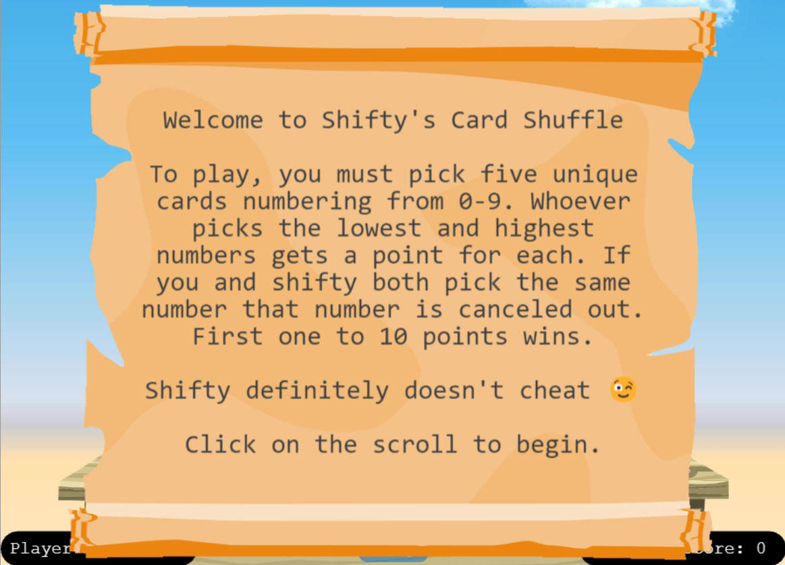
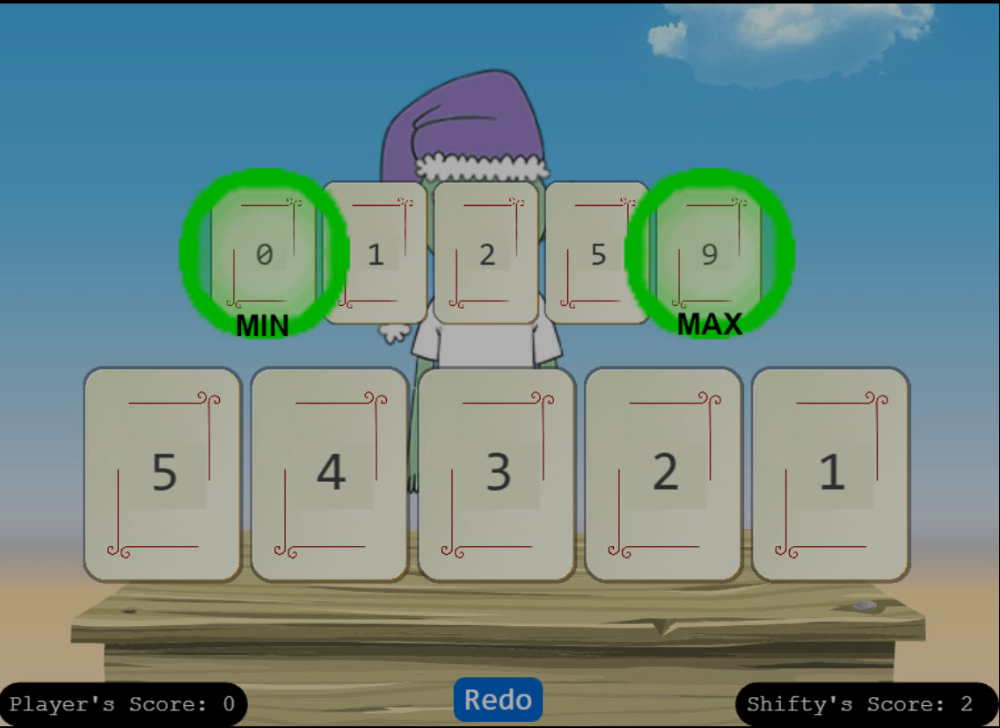
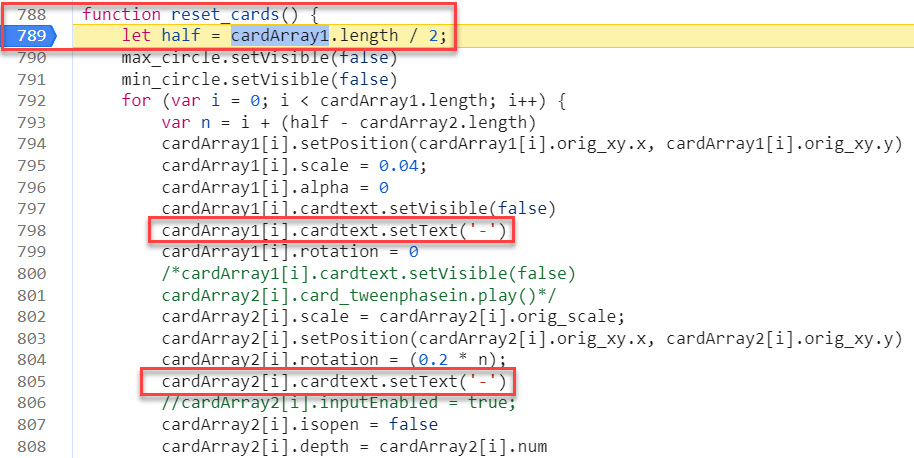
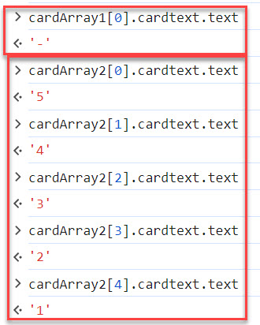
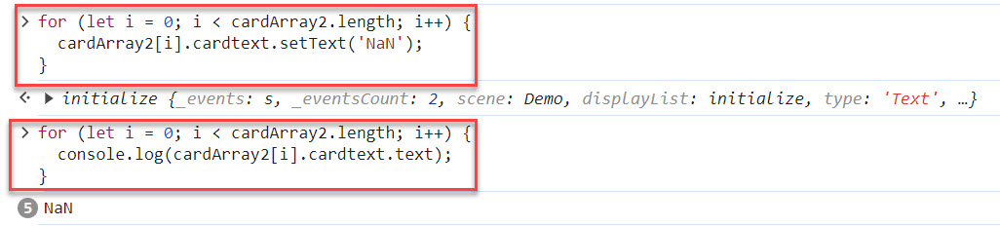
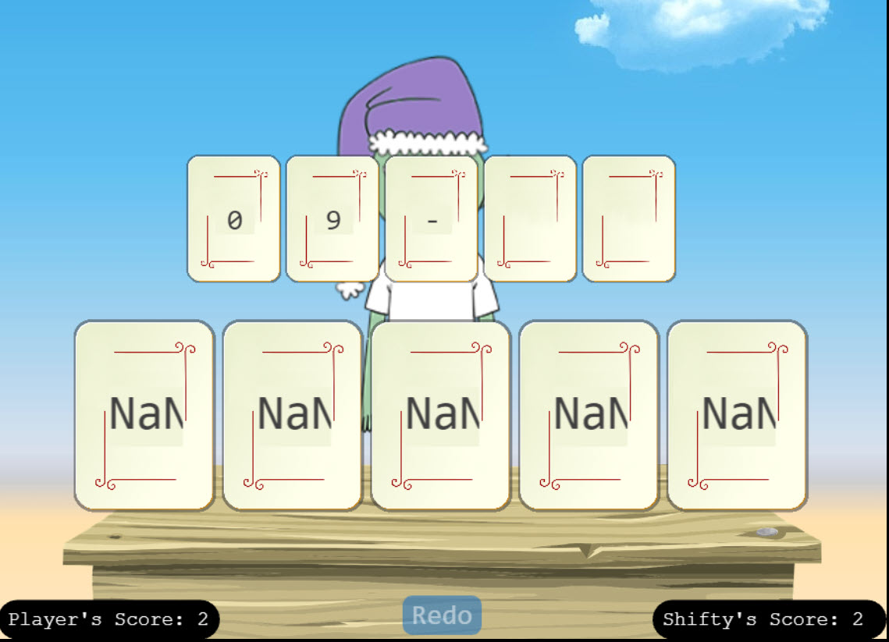

# Na'an

**Difficulty**: :fontawesome-solid-star::fontawesome-solid-star::fontawesome-regular-star::fontawesome-regular-star::fontawesome-regular-star:<br/>
**Direct link**: [Na'an terminal](https://nannannannannannan.com?&challenge=naan&username=rack3t&id=89be8525-55e0-4cb4-a673-944f2fe2c8b2&area=fni-chiaroscurocity&location=31,32&tokens=&dna=ATATATTAATATATATATATATATATATATATCGATATGCATATATATATATGCATATATATATATATATATATATTAGCATATATATATATATGCATATATATATATGCATATATATTA)

## Objective

!!! question "Request"
    Shifty McShuffles is hustling cards on Film Noir Island. Outwit that meddling elf and win!


??? quote "Goose of Film Noir Island @ Chiaroscuro City"
    mmooooOOOO

??? quote "Shifty McShuffles @ Chiaroscuro City"
    Hey there, stranger! Fancy a game of cards? Luck's on your side today, I can feel it.<br/>
    Step right up, test your wit! These cards could be your ticket to fortune.<br/>
    Trust me, I've got a good eye for winners, and you've got the look of luck about you.<br/>
    Plus, I'd wager you've never played this game before, as this isn't any ordinary deck of cards. It's made with [Python](https://www.tenable.com/blog/python-nan-injection).<br/>
    The name of the game is to bamboozle the dealer.<br/>
    So whad'ya think? Are you clever enough?
    

## Hints
??? tip "The Upper Hand"
    <i>From: Shifty McShuffles<br/>
    Terminal: Na'an</i><br/>
    Shifty said his deck of cards is made with Python. Surely there's a [weakness](https://www.tenwable.com/blog/python-nan-injection) to give you the upper hand in his game.

??? tip "Stump the Chump"
    <i>From: Shifty McShuffles<br/>
    Terminal: Na'an</i><br/>
    Try to outsmart Shifty by sending him an error he may not understand.


## Solution
To start solving this challenge, let's read up on [Python NaN Injection](https://www.tenable.com/blog/python-nan-injection) from Shifty's hint.
One of the most importants parts in the article is this:
!!! note
    A variable can be injected with a string called NaN (which stands for Not a Number) and when it encounters another variable, it can consume it. For instance, a numeric integer like the number 1 can be added to a float that contains a NaN and the output will be a NaN. NaN then becomes extremely greedy.

Now the card game itself - we need to beat Shifty at his Card Shuffle game, who's a habitual cheater. 
Ok we can cheat too to even the playing field. 😉



First play the game normally to observe functionality and (obviously) lost the first hand.



Everything is pointing towards us needing to exploit this Python's NaN vulnerability. Let's start looking through game's code.
Set breakpoint at the `reset_cards` function call (line 789).
You can walk through some of this initial `cardArray` assignments using F9 - Step in the debugger.
The most interesting assignments are these `cardArray`'s `.cardtext.setText('-')` obviously setting the values back to null.



Let's resume execution to let the game reset values. Ok now just set your card numbers 1 - 5 and drop into JS console.
Make sure Console's context is set to `nannannannannannan.com` websit and check both `cardArray`s to see which one is yours - this clearly show that ours is `cardArray2`.



Now we can loop through our array setting all values to string 'NaN' to confuse backend Python application.
Create a simple loop in JS console for setting all card values in our array to 'NaN', then confirm they are set.



Play your cards and sure enough we win 2 points.



Follow the same process setting all our card values to 'NaN' until we reach 10 points and game won!


!!! success "Answer"
    ```javascript linenums="1" title="loop.js"
    for (let i = 0; i < cardArray2.length; i++) {
        cardArray2[i].cardtext.setText('NaN');
    }
    ```
    
## Response
!!! quote "Shifty McShuffles @ Chiaroscuro City"
    Well, you sure are more clever than most of the tourists that show up here.<br/>
    I couldn't swindle ya, but don't go telling everyone how you beat me!<br/>
    An elf's gotta put food on the table somehow, and I'm doing the best I can with what I got.<br/>
    

Sounds like Shifty has been running his "Card Shuffle" operation on tourists for a while. 😂