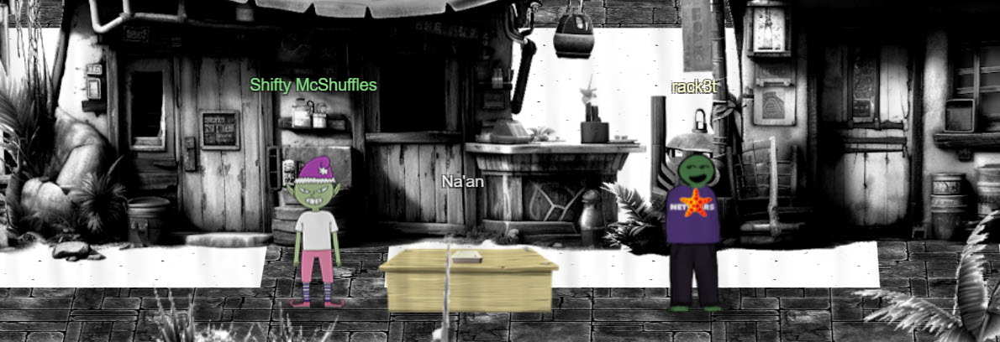

# Na'an

**Difficulty**: :fontawesome-solid-star::fontawesome-solid-star::fontawesome-regular-star::fontawesome-regular-star::fontawesome-regular-star: 
**Direct link**: [Na'an terminal](https://nannannannannannan.com?&challenge=naan&username=rack3t&id=89be8525-55e0-4cb4-a673-944f2fe2c8b2&area=fni-chiaroscurocity&location=31,32&tokens=&dna=ATATATTAATATATATATATATATATATATATCGATATGCATATATATATATGCATATATATATATATATATATATTAGCATATATATATATATGCATATATATATATGCATATATATTA)

## Objective

!!! question "Request"
    Shifty McShuffles is hustling cards on Film Noir Island. Outwit that meddling elf and win!

??? quote "Goose of Film Noir Island @ Chiaroscuro City"
    mmooooOOOO

??? quote "Shifty McShuffles @ Chiaroscuro City"
    Hey there, stranger! Fancy a game of cards? Luck's on your side today, I can feel it. 
    Step right up, test your wit! These cards could be your ticket to fortune. 
    Trust me, I've got a good eye for winners, and you've got the look of luck about you. 
    Plus, I'd wager you've never played this game before, as this isn't any ordinary deck of cards. It's made with [Python](https://www.tenable.com/blog/python-nan-injection). 
    The name of the game is to bamboozle the dealer. 
    So whad'ya think? Are you clever enough?
    

## Hints
??? tip "The Upper Hand"
    <i>From: Shifty McShuffles 
    Terminal: Na'an</i> 
    Shifty said his deck of cards is made with Python. Surely there's a [weakness](https://www.tenable.com/blog/python-nan-injection) to give you the upper hand in his game.

??? tip "Stump the Chump"
    <i>From: Shifty McShuffles 
    Terminal: Na'an</i> 
    Try to outsmart Shifty by sending him an error he may not understand.

## Solution

!!! success "Answer"
    
    
## Response
!!! quote "Shifty McShuffles @ Chiaroscuro City"
    

