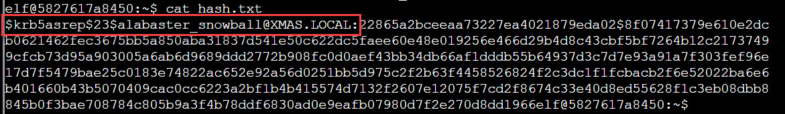
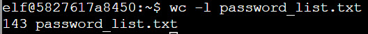
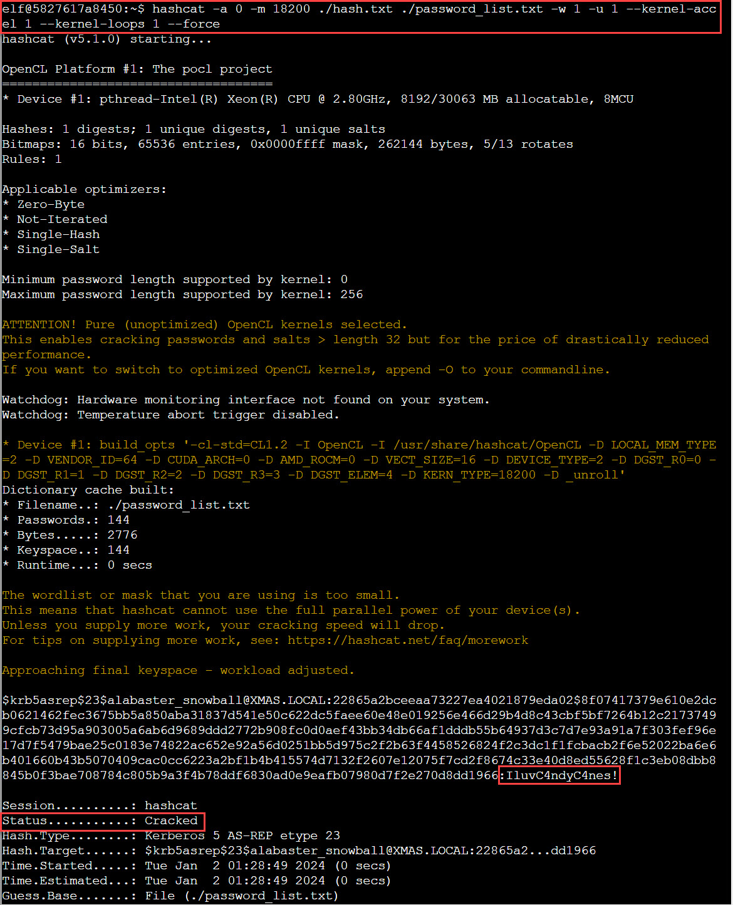
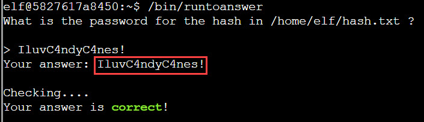

# Hashcat

**Difficulty**: :fontawesome-solid-star::fontawesome-solid-star::fontawesome-regular-star::fontawesome-regular-star::fontawesome-regular-star: 
**Direct link**: [Orientation terminal](https://hhc23-wetty.holidayhackchallenge.com?&challenge=orientation&username=rack3t&id=83532dea-b64f-497e-a2cf-ffdbe3ce81c2&area=staging&location=12,14&tokens=&dna=ATATATTAATATATATATATATATATATATATCGATATGCATATATATATATGCATATATATATATATATATATATTAGCATATATATATATATGCATATATATATATGCATATATATTA)

## Objective

!!! question "Request"
    Eve Snowshoes is trying to recover a password. Head to the Island of Misfit Toys and take a crack at it!
    

??? quote "Eve Snowshoes @ Scaredy Kite Heights"
    Greetings, fellow adventurer! Welcome to Scaredy-Kite Heights, the trailhead of the trek through the mountains on the way to the wonderful Squarewheel Yard! 
    I'm Eve Snowshoes, resident tech hobbyist, and I hear Alabaster is in quite the predicament. 
    Our dear Alabaster forgot his password. He's been racking his jingle bells of memory with no luck. 
    I've been trying to handle this password recovery thing parallel to this hashcat business myself but it seems like I am missing some tricks. 
    So, what do you say, chief, ready to get your hands on some hashcat action and help a distraught elf out? 

## Solution
??? abstract "HELP"
    In a realm of bytes and digital cheer,  
    The festive season brings a challenge near. 
    Santa's code has twists that may enthrall, 
    It's up to you to decode them all.  
    Hidden deep in the snow is a kerberos token, 
    Its type and form, in whispers, spoken. 
    From reindeers' leaps to the elfish toast, 
    Might the secret be in an ASREP roast?  
    `hashcat`, your reindeer, so spry and true, 
    Will leap through hashes, bringing answers to you. 
    But heed this advice to temper your pace, 
    `-w 1 -u 1 --kernel-accel 1 --kernel-loops 1`, just in case.  
    For within this quest, speed isn't the key, 
    Patience and thought will set the answers free. 
    So include these flags, let your command be slow, 
    And watch as the right solutions begin to show.  
    For hints on the hash, when you feel quite adrift, 
    This festive link, your spirits, will lift: 
    [https://hashcat.net/wiki/doku.php?id=example_hashes](https://hashcat.net/wiki/doku.php?id=example_hashes)  
    And when in doubt of `hashcat`'s might, 
    The CLI docs will guide you right: 
    [https://hashcat.net/wiki/doku.php?id=hashcat](https://hashcat.net/wiki/doku.php?id=hashcat)  
    Once you've cracked it, with joy and glee so raw, 
    Run `/bin/runtoanswer`, without a flaw. 
    Submit the password for Alabaster Snowball, 
    Only then can you claim the prize, the best of all.  
    So light up your terminal, with commands so grand, 
    Crack the code, with `hashcat` in hand! 
    Merry Cracking to each, by the pixelated moon's light, 
    May your hashes be merry, and your codes so right!  
    * Determine the hash type in hash.txt and perform a wordlist cracking attempt to find which password is correct and submit it to /bin/runtoanswer .*

This objective needs us to crack the Kerberos hash using `hashcat`. First check out the hash - the important part here is that
it's `$krb5asrep$` which is "Kerberos 5, etype 23, AS-REP" hash type [to be exact](https://hashcat.net/wiki/doku.php?id=example_hashes).

We also have the password file that contains 143 entries.

Run the command: `hashcat -a 0 -m 18200 ./hash.txt ./password_list.txt -w 1 -u 1 --kernel-accel 1 --kernel-loops 1 --force` and it's cracked!

Let's breakdown the command: 
`-a 0` is attack mode "straight", meaning dictionary-based 
`-m 18200` specifies the hash type (Kerberos 5, etype 23, AS-REP) 
`./hash` first positional parameter is the hash 
`./password_list.txt` second is the password list 
`-w 1` specifies the workload profile (low performance with minimal desktop impact) 
`-u 1` is for manual workload tuning, setting innerloop step size to 1 
`--kernel-accel 1` is for manual workload tuning, setting outerloop step size to 1 
`--kernel-loops 1` is for manual workload tuning, setting innerloop step size to 1(same as `-u`) 
`--force` is to ignore warnings 

Now submit the answer and win!

!!! success "Answer"
    IluvC4ndyC4nes!
    
## Response
!!! quote "Eve Snowshoes @ Scaredy Kite Heights"
    Aha! Success! Alabaster will undoubtedly be grateful for our assistance. 
    Onward to our next adventure, comrade! Feel free to explore this whimsical world of gears and steam!

    
Good time to explore the world of gears and steam...