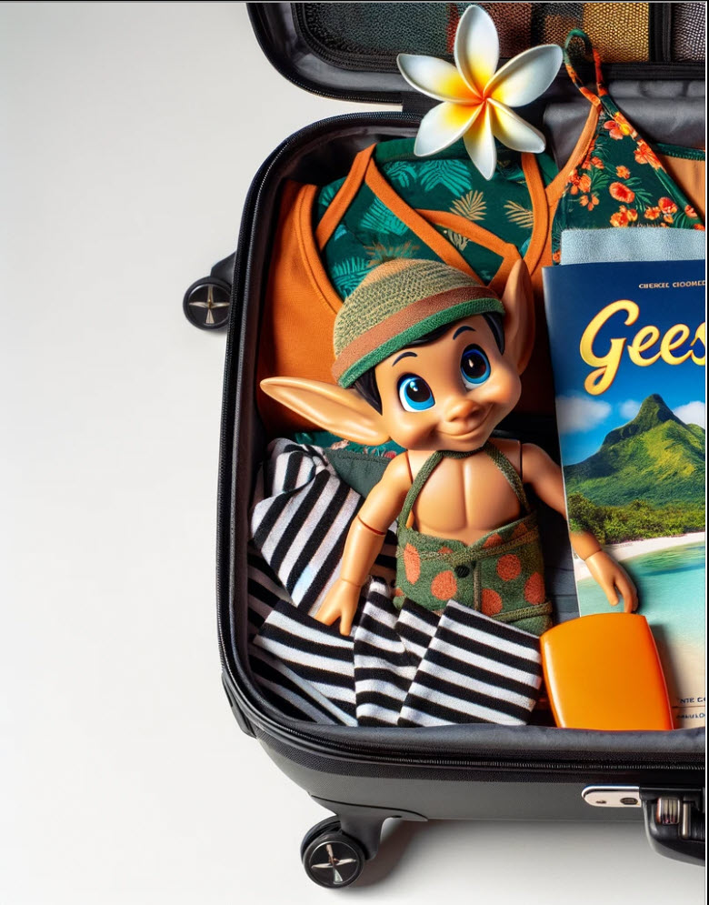

# Luggage Lock

**Difficulty**: :fontawesome-solid-star::fontawesome-regular-star::fontawesome-regular-star::fontawesome-regular-star::fontawesome-regular-star: 
**Direct link**: [Luggage Lock terminal](https://lockdecode.com/?&challenge=lockdecode&username=rack3t&id=96664788-74aa-42ca-866d-bf5b1b52c9f2&area=imt-squarewheelyard&location=34,31&tokens=&dna=ATATATTAATATATATATATATATATATATATCGATATGCATATATATATATGCATATATATATATATATATATATTAGCATATATATATATATGCATATATATATATGCATATATATTA)

## Objective

!!! question "Request"
    Help Garland Candlesticks on the Island of Misfit Toys get back into his luggage by finding the correct position for all four dials

??? quote "Goose of the Island of Misfit Toys @ Squarewheel Yard"
    Beep beep

??? quote "Garland Candlesticks @ Squarewheel Yard"
    Hey there, I'm Garland Candlesticks! I could really use your help with something. 
    You see, I have this important pamphlet in my luggage, but I just can't remember the combination to open it! 
    Chris Elgee gave a talk recently that might help me with this problem. Did you attend that? 
    I seem to recall Chris mentioning a technique to figure out the combinations... 
    I have faith in you! We'll get that luggage open in no time. 
    This pamphlet is crucial for me, so I can't thank you enough for your assistance. 
    Once we retrieve it, I promise to treat you to a frosty snack on me! 

## Hints
??? tip "Lock Talk"
    <i>From: Garland Candlesticks 
    Terminal: Luggage Lock Decode</i> 
    Check out Chris Elgee's [talk](https://www.youtube.com/watch?v=ycM1hBSEyog) regarding his and his wife's luggage. Sounds weird but interesting!

## Solution
Let's attend [KringleCon](https://www.youtube.com/watch?v=ycM1hBSEyog) for this challenge.
The way to get this lock opened is to put some (not too much) pressure on the lock (click 2-3 times), spin one dial until it get stuck,
then move one to the next dial until that one get stuck. When all 4 dials are stuck, press the rest of the way on the lock and it should open.
That's all there's to it!

!!! success "Answer"
    5 - 1 - 7 - 4 
    
 
 
## Response
!!! quote "Garland Candlesticks @ Squarewheel Yard"
    Wow, you did it! I knew you could crack the code. Thank you so much!
    
