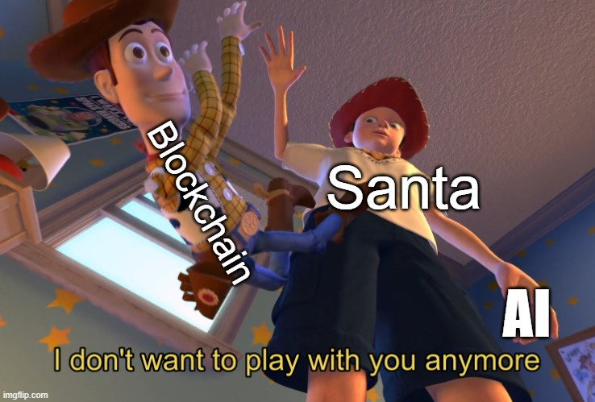
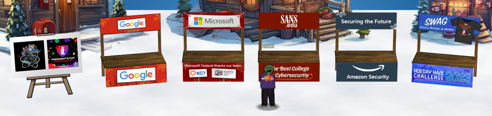
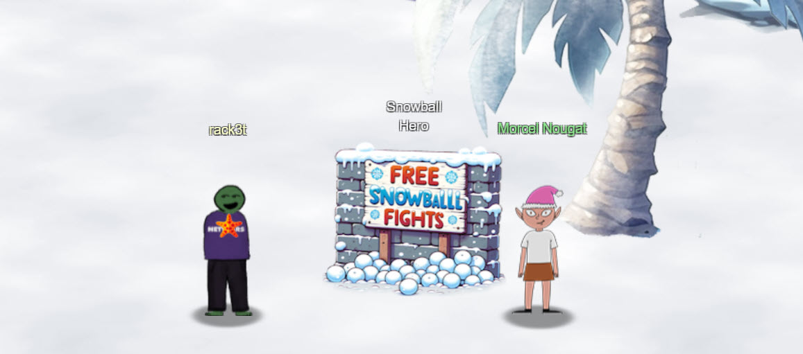
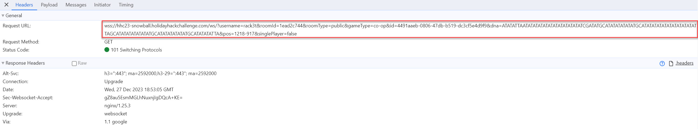
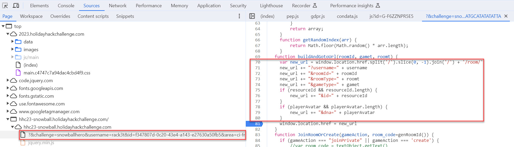
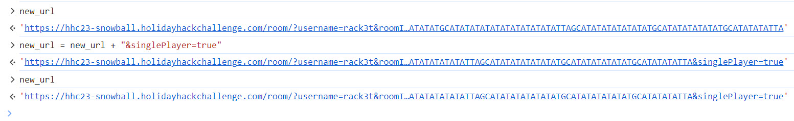
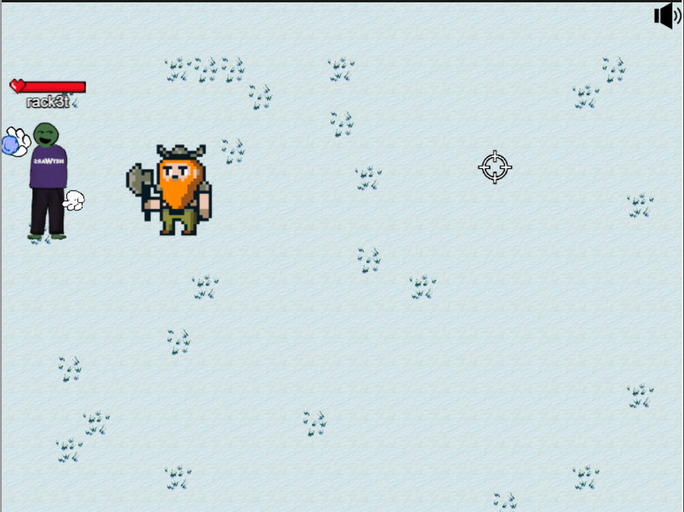
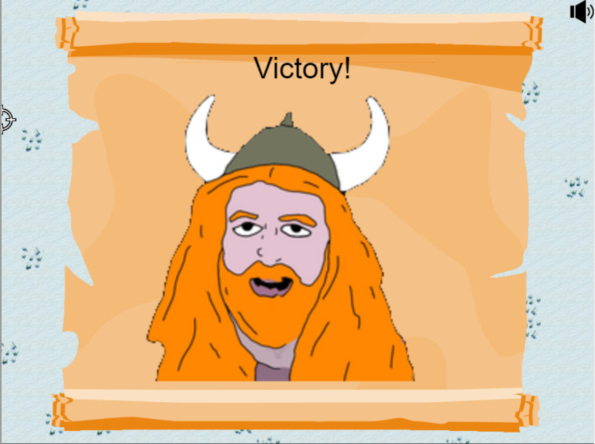

# Snowball Fight

**Difficulty**: :fontawesome-solid-star::fontawesome-solid-star::fontawesome-regular-star::fontawesome-regular-star::fontawesome-regular-star: 
**Direct link**: [Snowball Hero terminal](https://hhc23-snowball.holidayhackchallenge.com?&challenge=snowballhero&username=rack3t&id=4491aaeb-0806-47db-b519-dc3cf5e4d9f9&area=ci-frostysbeach&location=30,13&tokens=&dna=ATATATTAATATATATATATATATATATATATCGATATGCATATATATATATGCATATATATATATATATATATATTAGCATATATATATATATGCATATATATATATGCATATATATTA)

## Objective

!!! question "Request"
    Visit Christmas Island and talk to Morcel Nougat about this great new game. <b>Team up with another player</b> and show Morcel how to win against Santa!

??? quote "Goose of Christmas Island @ Frosty's Beach"
    Honk honk

??? quote "Santa @ Frosty's Beach"
    Welcome to the Geese Islands, fellow traveler! This one is called Christmas Island. Nooo ho ho, not that Christmas Island. 
    After countless years of shivering and shaking through each holiday season, I thought to myself, "Why not trade the snowflakes for sunbeams, just once?" 
    Oh, the North Pole has its charm, but the bones do yearn for a bit of warmth now and then. 
    The notion was suggested by my good friend, Chat North Pole Technology, or as we like to call it, 'ChatNPT'. That's the one we use, but there's a whole slew of other AI platforms. You should try them out! 
    It came to me describing palm trees and gentle waves, saying, "Santa, let your holidays take flight to Geese Islands, where the warmth isn't just a setting." 
    "There, every day is a sunny scene straight out of a vintage film reel." 
    I chuckled at the thought, my belly shaking like a bowl full of jelly. 
    But the AI persisted, "Winter's best kept secret: the balmy breezes of Geese Islands!" 
    And I must confess, the sound of that did stroke my beard with curiosity. 
    So, I called a meeting with the elves, the reindeer, and Mrs. Claus, of course.The elves were all a-buzz with the idea of crafting toys with a view of the ocean! 
    Thus, we packed up our sleighs and ChatNPT charted a course for the Geese Islands, a tropical paradise just north of the equator.. 
    And I must say, there's something quite magical about a Christmas carol sung to the strum of a ukulele. 
    After all, the magic of the holidays isn't in the snow or the cold, but in the love and the care that we put into each and every gift. 
    So here's to trying new things, to following the sunshine, and to the Geese Islands, where the holiday cheer is sun-kissed and the Christmas spirit is as warm as the tropical breeze. 
    And it's all thanks to a little nudge from ChatNPT. 
    Now, why not start off your vacation with a snowball fight with Morcel, or check out my surf shack on the other end of the beach? 
    However you decide to relax, be sure to soak in all the whimsical beauty of these magical islands, and enjoy the activities to the fullest! 

## Hints

??? tip "Synthesis is the True Ending"
    <i>From: Santa</i> 
    The AI revolution has begun. Some of the most prominent and useful tools born from the advent of powerful AI include [ChatGPT](https://chat.openai.com/auth/login), [PlayHT](https://play.ht/), [Midjourney](https://www.midjourney.com/home?callbackUrl=%2Fexplore), [Dall-E 3](https://openai.com/dall-e-3), [Bing AI](https://www.bing.com/search?form=MY0291&OCID=MY0291&q=Bing+AI&showconv=1), and [Bard](https://bard.google.com/?utm_source=sem&utm_medium=paid-media&utm_campaign=q4enUS_sem7&gclid=Cj0KCQiAgqGrBhDtARIsAM5s0_mJZWSITeLgVbaMSfn_6hubm-ydPDgylkxdJHHbNT1Wjy3dpUd3aVMaAgdsEALw_wcB), and [Grok](https://grok.x.ai/).

??? tip "Snowball Super Hero"
    <i>From: Morcel Nougat</i> 
    <i>Terminal: Snowball Hero</i> 
    Its easiest to grab a friend play with and beat Santa but tinkering with client-side variables can grant you all kinds of snowball fight super powers. You could even take on Santa and the elves solo!
    
??? tip "Consoling iFrames"
    <i>From: Morcel Nougat</i> 
    <i>Terminal: Snowball Hero</i> 
    Have an iframe in your document? Be sure to [select the right context](https://gist.github.com/chrisjd20/93771da596ca5e49043f148a845c469f) before meddling with JavaScript.
    

Based on Santa's story and the first hint, it is clear what will be the theme of this year's Holiday Hack Challenge.
{ width="500" }

Walking past Santa, this seems like the most appropriate time to check out vendor booths. 
    

??? "Vendor Booths"
    [HHC2023 Swag](https://my-store-d53a6c.creator-spring.com/) 
    [Amazon Security](https://www.aboutamazon.com/news/workplace/amazon-apprenticeship-job-training-programs) 
    [SANS.edu](https://www.sans.edu/) 
    [Microsoft](https://learn.microsoft.com/en-us/training/browse/?subjects=security&resource_type=learning%20path&roles=security-operations-analyst) including [KC7](https://kc7cyber.com/) and [Kusto Detective Agency](https://detective.kusto.io/) 
    [Google](https://www.youtube.com/watch?v=-6ZbrfSRWKc) 
    [President's Cup Cybersecurity Competition](https://www.cisa.gov/presidents-cup-cybersecurity-competition) 
    [Hack Space Con](https://www.hackspacecon.com/) 
    

??? quote "Morcel Nougat @ Frosty's Beach"
    Hey there, I'm Morcel Nougat, elf extraordinaire! 
    You won't believe this, but we're on a magical tropical island called Christmas Island, and it even has snow! 
    I'm so glad ChatNPT suggested we come here this year! 
    Santa, some elves, and I are having a snowball fight, and we'd love you to join us. Santa's really good, so trust me when I say it's way more fun when played with other people. 
    But hey, if you can figure out a way to play solo by tinkering with client side variables or parameters to go solo mode, go for it! 
    There's also ways to make the elves' snowballs do no damage, and all kinds of other shenanigans, but you didn't hear that from me. 
    Just remember, it's all about having fun and sharing the joy of the holiday season with each other. 
    So, are you in? We'd really love your company in this epic snowball battle!
    
## Solution
To solve this challenge, first play the game normally (Random Match Making) observing network traffic using Chrome Dev Tools. Static content aside, the following request stands out. This URL has an interesting parameter "singlePlayer" which is set to false (singlePlayer=false). 

Next, read through the game's JavaScript file in Dev Tools' Sources tab and find where URL with its parameters is being built. As this URL is built, window's location is then assigned to it.
Close and restart the game but don't start matchmaking yet - stay in lobby. Set a breakpoint at this assignment (line 81) so you could manipulate the URL.

Now start Random Match Making - your action will pause as the JS breakpoint is hit. You can now print the URL to the console and modify it to set singlePlayer to true.

Now that URL is modified, resume script execution. Powerful "Elf the Dwarf" appears as my partner, holding none other than snowball shotgun with big sprrrreeead. At this point victory is imminent and all that's needed is to shoot every elf and Santa.

{ width="500" }

!!! success "Answer"
    Elf the Dwarf saves the day! 
    { width="500" }

## Response
!!! quote "Morcel Nougat @ Frosty's Beach"
    You're like a snowball fighting ninja! A real-life legend. Can I have your autograph!?
    
Next up we need to pay a visit to Ginger Breddie in Santa's Shack...