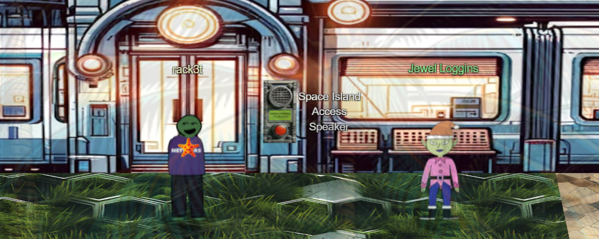
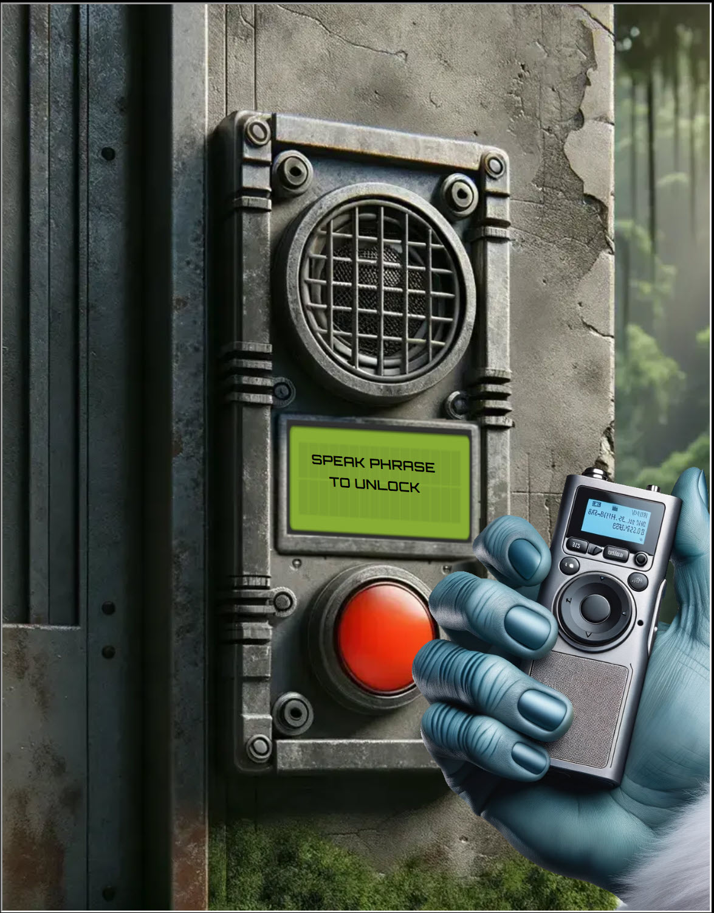
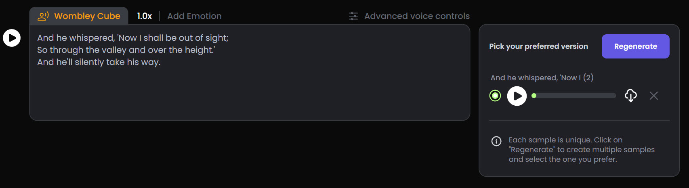
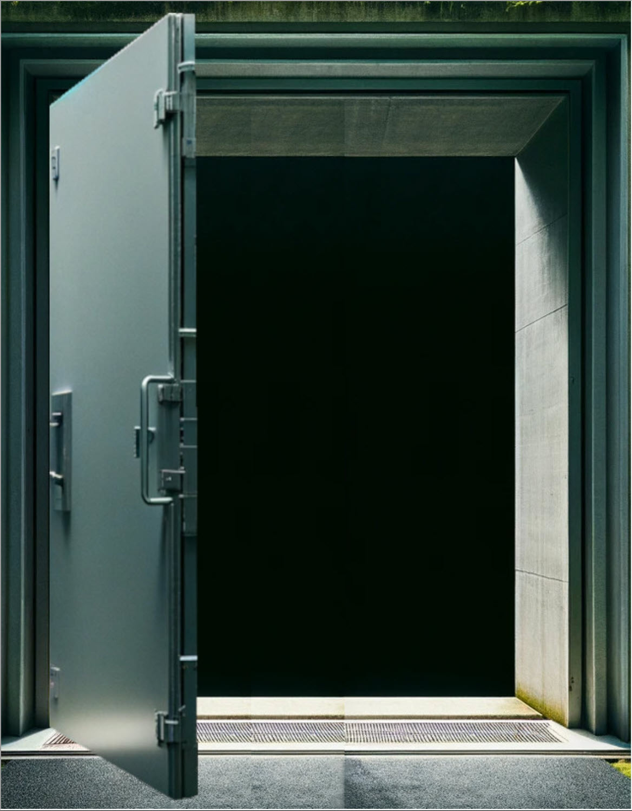

# Space Island Door Access Speaker

**Difficulty**: :fontawesome-solid-star::fontawesome-solid-star::fontawesome-solid-star::fontawesome-regular-star::fontawesome-regular-star: 
**Direct link**: [Space Island Door Access Speaker](https://islanddoor.space?&challenge=accessspeaker&username=rack3t&id=cce54aac-4a48-48d7-b4e7-b14b05fd3ced&area=si-spaceportpoint&location=35,-9&tokens=&dna=ATATATTAATATATATATATATATATATATATCGATATGCATATATATATATGCATATATATATATATATATATATTAGCATATATATATATATGCATATATATATATGCATATATATTA)

## Objective

!!! question "Request"
    There's a door that needs opening on Space Island! Talk to Jewel Loggins there for more information.

??? quote "Goose of Space Island @ Spaceport Point"
    GRUNT

??? quote "Jewel Loggins @ Spaceport Point"
    What, you know the passphrase!? Let me try it! 
    Nope, didn't work. Knowing Wombley, the passphrase isn't the only requirement. He's all about that MFA! 
    Oh yeah, multi-factor authentication! The passphrase for something he knows, and his voice for something he is! 
    That's it! You need to be Wombley. You need his voice. Now, how are you gonna get that? 
    Since only us elves can get a subscription to use ChatNPT, try searching for another AI tool that can simulate voices. I'm sure there's one out there.

## Hints
??? tip "MFA: Something You Are"
    <i>From: Jewel Loggins 
    Terminal: Space Island Access Speaker</i> 
    It seems the Access Speaker is programmed to only accept Wombley's voice. Maybe you could get a sample of his voice and use an AI tool to simulate Wombley speaking the passphrase.

## Solution
The challenge is to say the right phrase into the speaker as Wombley - this is his MFA to open the door.
{ width="600" }

We actually know the phrase to enter the Satellite Ground Station (SGS) from beating [Active Directory](../objectives/o8.md).
Ok now we need Wombley's voice - let's go talk to him.

!!! quote "Wombley Cube @Chiaroscuro City"
    Wombley Cube here, welcome to Chiaroscuro City! 
    Have you heard about my latest project? 
    I've been so inspired by these wonderful islands I've decided to write a short story! 
    The title? It's "The Enchanted Voyage of Santa and his Elves to the Geese Islands." Sounds exciting, right? 
    Here, have this [audiobook](https://www.holidayhackchallenge.com/2023/wombleycube_the_enchanted_voyage.mp3.zip) copy and enjoy the adventure at your convenience, my friend! 
    Consider it a welcome gift from yours truly, to make your holiday even more delightful. 
    Trust me, this captivating tale of fiction is going to take you on a magical journey you won't forget. 
    Oh, and I promise it will provide some great entertainment while you explore the rest of Geese Islands! 

Wombley gives us his audiobook - let's use some AI magic to copy his voice.
Use [PlayHT](https://play.ht/) service to generate his voice - upload `wombleycube_the_enchanted_voyage.wav` file and have the engine say the access phrase:

Download the generated file and take it to the speaker. And just like that door is opened!

!!! success "Answer"
    And he whispered, 'Now I shall be out of sight; 
    So through the valley and over the height.' 
    And he'll silently take his way. 
    { width="600" }
    
## Response
!!! quote "Jingle Ringford  @ Spaceport Point"
    Are you like a master spy or something? I've only seen stuff like that in the movies! 
    It sure is scary what you can do with AI, huh? I sure hope ChatNPT has better guardrails in place.
    
You should definitely not use this trick to prank your friends and family.