# Camera Access

**Difficulty**: :fontawesome-solid-star::fontawesome-solid-star::fontawesome-solid-star::fontawesome-regular-star::fontawesome-regular-star: 
**Direct link**: [Camera Access terminal](https://nanosat.one?&challenge=satmissile&username=rack3t&id=256f1214-9da8-4dd9-922f-348deb332da6&area=si-zenithsgs&location=5,4&tokens=&dna=ATATATTAATATATATATATATATATATATATCGATATGCATATATATATATGCATATATATATATATATATATATTAGCATATATATATATATGCATATATATATATGCATATATATTA)

## Objective

!!! question "Request"
    Gain access to Jack's camera. What's the third item on Jack's TODO list?

??? quote "Wombley Cube @ Zenith SGS"
    This is Ground Control, do you read me...? Ground Control to -- 
    Hey! How'd you get in here? That tram is the only accessible point of entry and I secured it with MFA! 
    No matter, you may have had the skills to find and infiltrate the satellite ground station, but there's no chance you can hack your way into the satellite itself! 
    The nanosat's Supervisor Directory will remain hidden, and you'll never discover the mastermind behind all this. 
    So don't even waste your time trying. 

??? quote "Wombley Cube @ Zenith SGS"
    Hi there! I am a Ground station client vending machine. Apparently there is a huge need for NanoSat frameworks here, so they have put me in this room. Here, have a [free sample](https://www.holidayhackchallenge.com/2023/client_container.zip)!

??? quote "Henry @ Zenith SGS"
    Hi, I'm Henry! 
    I built the satellites with personalities, and now they keep making dad jokes - whoopsies!

## Hints
??? tip "Hubris is a Virtue"
    <i>From: Wombley Cube 
    Objective: Camera Access</i> 
    In his hubris, Wombley revealed that he thinks you won't be able to access the satellite's "Supervisor Directory". There must be a good reason he mentioned that specifically, and a way to access it. He also said there's someone else masterminding the whole plot. There must be a way to discover who that is using the nanosat.

    
## Solution
To start, download the [NanoSat framework](https://www.holidayhackchallenge.com/2023/client_container.zip). Make sure you have `docker` installed, then build and run the container (`sudo ./build_and_run.sh`) 
from within `client_container` - this will start up a VNC server on default port 5900 and a web VNC proxy on port 6901. You can use [TightVNC](https://www.tightvnc.com/download.php) to VNC into the server. 
<i>Note: It's possible that your connection doesn't work on the first try and you need to reboot your host running the container and re-connect.</i>

Once connection is established, you should see the NanoSat desktop.

Inside the `client_container` directory is very helpful `README.md` file that describes how to configure [Wireguard VPN Tunnel](https://www.wireguard.com/).
Go back to the game and start up GateXOR - you need to perform click "Time Travel" for internal configurations to be released.

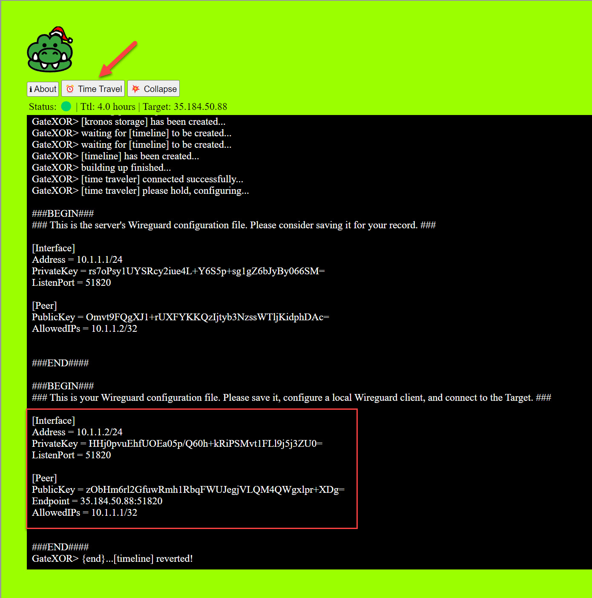

Copy-paste the configurations onto the NanoSat container. Specifically, you have to add this config into `/etc/wireguard/wg0.conf` file:
Then save and close the file.

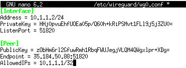

Now, restart the tunnel interface and you should have an established connection with the peer (`10.1.1.1`).

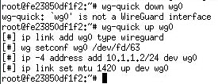

Let's launch NanoSat MO Base Station Tool and start reading the [documentation](https://nanosat-mo-framework.readthedocs.io/en/latest/opssat/testing.html).
You should be able to connect to the server's supervisor directory:

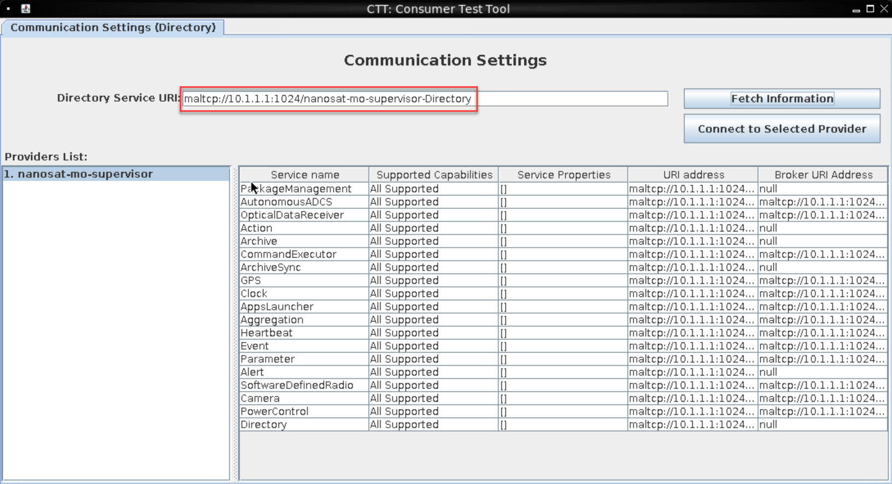

After getting supervisor's directory, we need to find camera's functionality.
Select "AppsLauncher" and click "Connect to Selected Provider".
Now you can start the camera with "runApp".

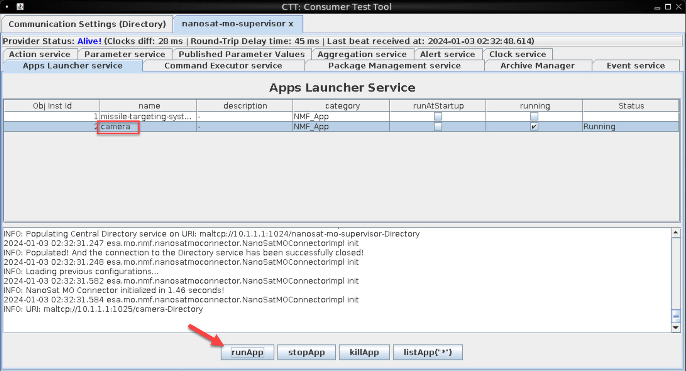

Go back to the original "Communication Settings" and re-fetch the information - App: camera should now be available with all its functionality.

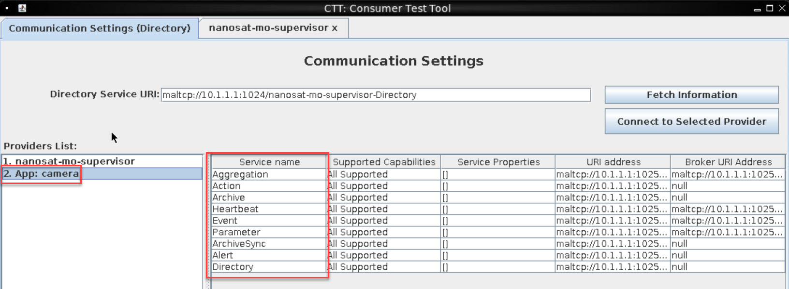

Connect to "Parameter service", just like you connected to the "AppsLauncher". Essentially each one of services corresponds to the application tab.
There's a `Base64SnapImage` parameter available, which allows you to get the Base64 of the image (likely the To-Do list we need 😉)
Unfortunately, the value is too big for us to retrieve via the visual app so we need another way - refer to the documentation.

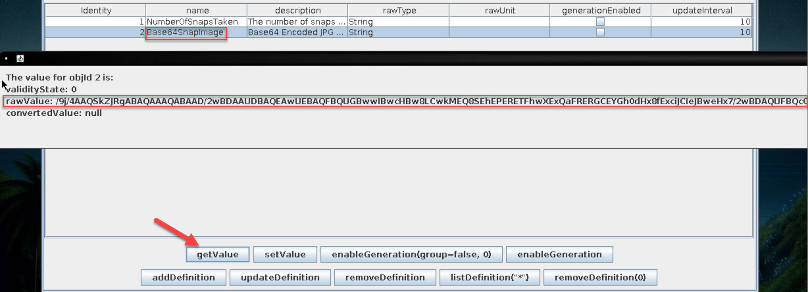

Ok what else do we have on the system? How about Wireshark! There's unencrypted traffic going over the wire. Start it up, monitoring `wg0` interface, now get image value again.
In Wireshark, "follow TCP stream" to get the full conversation. Ok Base64-encoded image is there but it's LARGE.

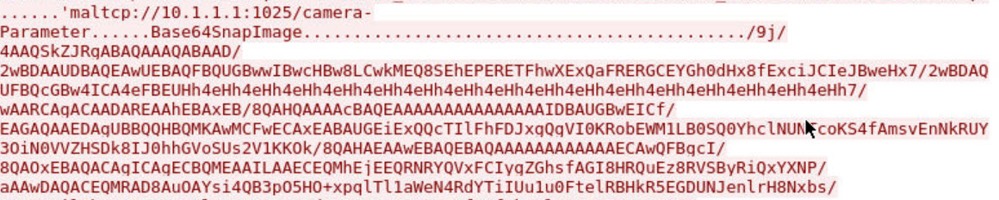

Preferably we would like to copy all contents of the network conversation into a file. Wait for the image to fully load in Wireshark, then
"Save as..." and save data as file.
We can continue to follow "living off the land" methodology and ship the file over to our host server and then parse out the network conversation.

`curl` in on the box - that should work! Start the listener on the host machine that's hosting the container:  
`nc -w 3 -lvnp 5555 > data.dmp` 
This will write all input into `data.dmp` file. Now send the file from the container:

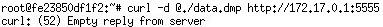

At this point the file is on the host but we know we need to parse out junk since it is just network data (+some `curl` overhead).
We can simply use Notepad++ for this.

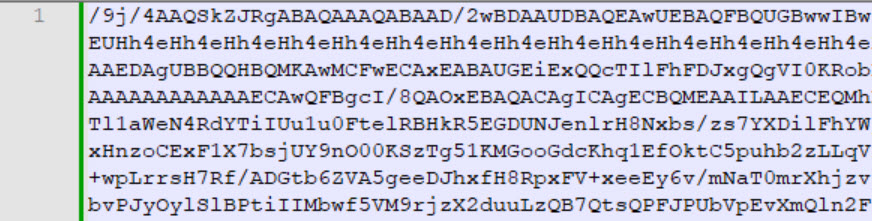

Now select all and decode - it is a JPEG file based on "ff d8" magic number.

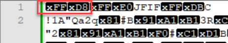

Now all that's left is open the file:

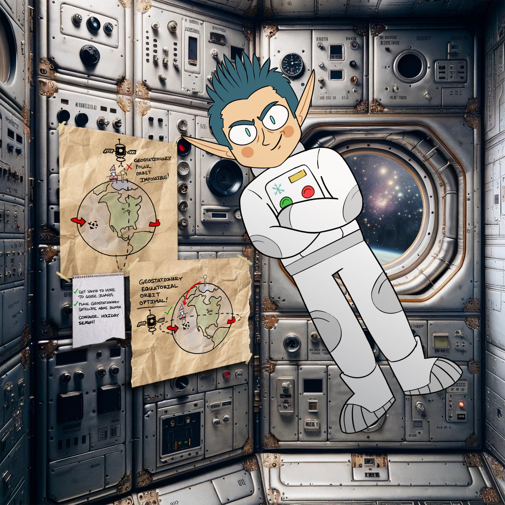

!!! success "Answer"
    CONQUER HOLIDAY SEASON!
    
## Response
!!! quote "Wombley Cube @ Zenith SGS"
    A fellow sabateur, are you? Or just a misguided hero-wannabe? 
    You think you're saving the holiday season, but you're meddling in something you could never understand! 
    Yes, I sided with Jack, because Santa's betrayed the elves by forcing us to move our operations to these islands! 
    He put the entire holiday season at risk, and I could not allow this, I had to do something. 
    Knowing my skillset, Jack secretly informed me of his plan to show Santa the error of his ways, and recruited me to aid his mission. 
    Why tell you all this? Because it won't change anything. Everything is already in motion, and you're too late. 
    Plus, the satellite is state-of-the-art, and -- oh drat, did I leave the admin tools open? 
    For some reason, I can't move when you're nearby, but if I could, I would surely stop you!
    
BETRAYAL!!! 🤬🤬🤬