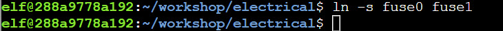

# Linux 101

**Difficulty**: :fontawesome-solid-star::fontawesome-regular-star::fontawesome-regular-star::fontawesome-regular-star::fontawesome-regular-star: 
**Direct link**: [Linux 101 terminal](https://hhc23-wetty.holidayhackchallenge.com?&challenge=linux101&username=rack3t&id=696b938a-aedb-4792-a38b-1a989d33048e&area=ci-santassurfshack&location=7,8&tokens=&dna=ATATATTAATATATATATATATATATATATATCGATATGCATATATATATATGCATATATATATATATATATATATTAGCATATATATATATATGCATATATATATATGCATATATATTA)

## Objective

!!! question "Request"
    Visit Ginger Breddie in Santa's Shack on Christmas Island to help him with some basic Linux tasks. It's in the southwest corner of Frosty's Beach.

??? quote "Ginger Breddie @ Santa's Surf Shack"
    Hey, welcome to Santa's Surf Shack on tropical Christmas Island! I'm just hanging ten here, taking it easy while brushing up on my Linux skills. 
    You ever tried getting into Linux? It's a super cool way to play around with computers. 
    Can you believe ChatNPT suggested this trip to the Geese Islands this year? I'm so thrilled! 
    Kudos to ChatNPT, eh? The sunshine, the waves, and my surfboard – simply loving it! 
    So, what do you have planned? Care to join me in a Linux session? 
    
    
## Solution

??? abstract "Welcome message"
    The North Pole 🎁 Present Maker: 
    All the presents on this system have been stolen by trolls. Capture trolls by following instructions here and 🎁's will appear in the green bar below. Run the command "hintme" to receive a hint.
    

### Question 1
!!! question "Question"
    Perform a directory listing of your home directory to find a troll and retrieve a present!
    
To list directories in Linux, it's simply `ls`.

!!! success "Answer"
    ls

### Question 2
!!! question "Question"
    Now find the troll inside the troll.
    
To find the troll, simply read the troll file with `cat`.

!!! success "Answer"
    cat troll_19315479765589239
    

### Question 3
!!! question "Question"
    Great, now remove the troll in your home directory.
    
To remove file, run `rm` on it.

!!! success "Answer"
    rm troll_19315479765589239
    

### Question 4
!!! question "Question"
    Print the present working directory using a command.
    
To get the current working directory, run `pwd`.

!!! success "Answer"
    pwd

### Question 5
!!! question "Question"
    Good job but it looks like another troll hid itself in your home directory. Find the hidden troll!

To list hidden files/folders, use `ls -a` which will list ALL files/folders. `-l` switch makes it look nicer but not required.

!!! success "Answer"
    ls -a

### Question 6
!!! question "Question"
    Excellent, now find the troll in your command history.
    
Run `history` to get history of commands and pipe its output to input of `grep` which will search for `-i` (case-insensitive) word `troll`.
    

!!! success "Answer"
    history | grep -i troll
    

### Question 7
!!! question "Question"
    Find the troll in your environment variables.
    
 Command `env` outputs all environment variables for the current user - pipe its output to grep to find the troll.
 

!!! success "Answer"
    env | grep -i troll
    

### Question 8
!!! question "Question"
    Next, head into the workshop.

Simply `cd` to change directory

!!! success "Answer"
    cd workshop

### Question 9
!!! question "Question"
    A troll is hiding in one of the workshop toolboxes. Use "grep" while ignoring case to find which toolbox the troll is in.

Run `grep -i troll *` to read all files in current directory, searching for the case-insensitive word troll.

!!! success "Answer"
    grep -i troll *

### Question 10
!!! question "Question"
    A troll is blocking the present_engine from starting. Run the present_engine binary to retrieve this troll.

First, we need to find the present_engine file using `find / -name present_engine 2>/dev/null` which looks for all files with this name while dropping all error messages for cleaner output (stderr in this case is lack of permissions for some files/directories).
Once the file is found in the current directory, it cannot be ran (permission denied) - this is due to missing execution bit.
Set the execution bit using `chmod +x` and rerun the file FTW.

    
!!! success "Answer"
    find / -name present_engine 2>/dev/null 
    chmod +x /home/elf/workshop/present_engine 
    /home/elf/workshop/present_engine 

### Question 11
!!! question "Question"
    Trolls have blown the fuses in /home/elf/workshop/electrical. cd into electrical and rename blown_fuse0 to fuse0.

To rename files, use `mv` .

!!! success "Answer"
    cd /home/elf/workshop/electrical 
    mv blown_fuse0 fuse0 

### Question 12
!!! question "Question"
    Now, make a symbolic link (symlink) named fuse1 that points to fuse0

Use `ln -s` to create a symbolic link - source filename is first while destination is next.

!!! success "Answer"
    ln -s fuse0 fuse1

### Question 13
!!! question "Question"
    Make a copy of fuse1 named fuse2.

To copy, use `cp`.

!!! success "Answer"
    cp fuse1 fuse2

### Question 14
!!! question "Question"
    We need to make sure trolls don't come back. Add the characters "TROLL_REPELLENT" into the file fuse2.

Use `echo` to output text, appending (`>>`) it to the file.
    

!!! success "Answer"
    echo "TROLL_REPELLENT" >> fuse2
    

### Question 15
!!! question "Question"
    Find the troll somewhere in /opt/troll_den.

Since challenge mentions "somewhere," we can use case-insensitive `-iname` switch for the `find` command, as well as wildcards (*) to include filenames that contain troll in their filename.
    
 
    
!!! success "Answer"
    find /opt/troll_den -iname *troll*

### Question 16
!!! question "Question"
    Find the file somewhere in /opt/troll_den that is owned by the user troll.
    
To find file base on owner, use `-user` switch.

    

!!! success "Answer"
    find /opt/troll_den -user troll 2>/dev/null
    
    
### Question 17
!!! question "Question"
    Find the file created by trolls that is greater than 108 kilobytes and less than 110 kilobytes located somewhere in /opt/troll_den.

Find a file (`-type f`) that is over 108KB (`-size +108l`) but less than 110KB (`-size -110k`).

    
!!! success "Answer"
    find /opt/troll_den -type f -size +108k -size -110k
    
    
### Question 18
!!! question "Question"
    List running processes to find another troll.
    
`top` can be used to monitor running processes.

!!! success "Answer"
    top
    

### Question 19
!!! question "Question"
    The 14516_troll process is listening on a TCP port. Use a command to have the only listening port display to the screen.

To get listening processes use `netstat` with `-ntlp` switches to not resolve names, TCP-only, listening, and programs/PID respectfully.

!!! success "Answer"
    netstat -ntlp

    
### Question 20
!!! question "Question"
    The service listening on port 54321 is an HTTP server. Interact with this server to retrieve the last troll.

Since this is an HTTP server, `curl` can be used to make a basic request to the localhost on specified port.

    
!!! success "Answer"
    curl http://127.0.0.1:54321
    

### Question 21
!!! question "Question"
    Your final task is to stop the 14516_troll process to collect the remaining presents.

To list all running processes, `ps -aux` can be used and from there, use `kill` to kill the process PID in question.

!!! success "Answer"
    kill 28128

Challenge Completed! 

## Response
!!! quote "Ginger Breddie @ Santa's Surf Shack"
    Wow, if your surfing skills are as good as your Linux skills, you could be winning competitions!

    
Off to explore the rest of Christmas Island...