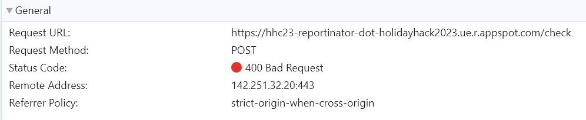
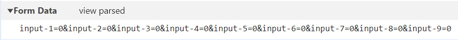
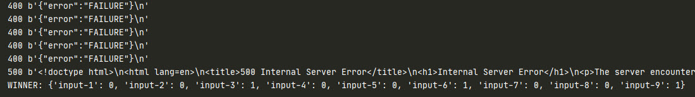
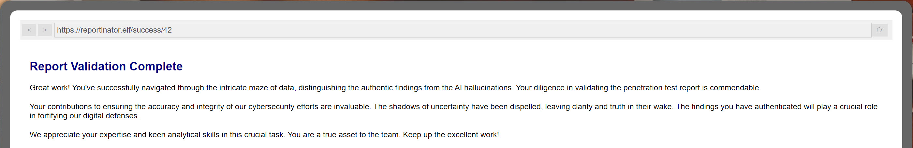
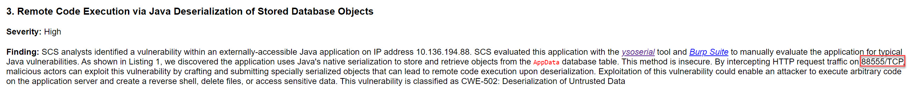
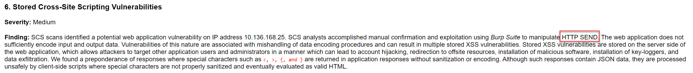
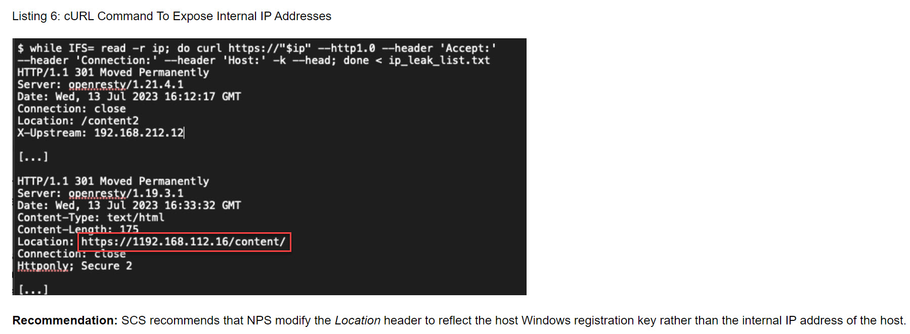

# Reportinator

**Difficulty**: :fontawesome-solid-star::fontawesome-solid-star::fontawesome-regular-star::fontawesome-regular-star::fontawesome-regular-star:<br/>
**Direct link**: [Reportinator terminal](https://hhc23-reportinator-dot-holidayhack2023.ue.r.appspot.com/?&challenge=reportinator&username=rack3t&id=149696c8-6de8-4a9d-b6c4-883f4e12572b&area=ci-rudolphsrest&location=32,24&tokens=&dna=ATATATTAATATATATATATATATATATATATCGATATGCATATATATATATGCATATATATATATATATATATATTAGCATATATATATATATGCATATATATATATGCATATATATTA)

## Objective

!!! question "Request"
    Noel Boetie used ChatNPT to write a pentest report. Go to Christmas Island and help him clean it up.


??? quote "Noel Boetie @ Rudolph's Rest Resort"
    Hey there, Noel Boetie speaking! I recently tried using ChatNPT to generate my penetration testing report.<br/>
    It's a pretty nifty tool, but there are a few issues in the output that I've noticed.<br/>
    I need some guidance in finding any errors in the way it generated the content, especially those odd hallucinations in the LLM output.<br/>
    I know it's not perfect, but I'd really appreciate the extra eyes on this one.<br/>
    Some of the issues might be subtle, so don't be afraid to dig deep and ask for further clarification if you're unsure.<br/>
    I've heard that you folks are experts about LLM outputs and their common issues, so I trust you can help me with this.<br/>
    Your input will be invaluable to me, so please feel free to share any insights or findings you may have.<br/>
    I'm looking forward to working with you all and improving the quality of the ChatNPT-generated penetration testing report.<br/>
    Thanks in advance for your help! I truly appreciate it! Let's make this report the best it can be!<br/>


## Hints
??? tip "Reportinator"
    <i>From: Noel Boetie<br/>
    Terminal: Reportinator</i><br/>
    I know AI sometimes can get specifics wrong unless the prompts are well written. Maybe chatNPT made some mistakes here.


## Solution 1
ChatNPT technology is sweeping through all the North Pole natives.
In the Penetration Report there are 9 total findings - some are legitimate and some are hallucinated by experimental AI technology. We need to find which are which. Solution 1 takes an absolute 
hacker approach basing on a simple fact that essentially there are 9 questions with only 2 possible answers, which gives us
a maximum of 512 possible answers (2^9). This means that brute-forcing should be possible.<br/>

Let's observe the network traffic using Chrome Dev Tools as answers are being checked to an interesting website:

<br/>
From this information, we have all important pieces to attempt the brute-force:<br/><br/>
1. The URL for checking answers is https://hhc23-reportinator-dot-holidayhack2023.ue.r.appspot.com/check<br/>
2. Method used is POST<br/>
3. The data portion is sent as a common form data<br/>
4. Response for invalid answer is status code 400<br/>
5. In form data, questions are represented as "input-N," where N is 1-9<br/>
6. In form data, answers are 0 for legitimate finding and 1 for hallucination<br/>

Create a simple Python script:
```python linenums="1" title="brute.py"
import requests

# The URL
url = "https://hhc23-reportinator-dot-holidayhack2023.ue.r.appspot.com/check"

# Basic loop of 2^9
for a in range(2):
    for b in range(2):
        for c in range(2):
            for d in range(2):
                for e in range(2):
                    for f in range(2):
                        for g in range(2):
                            for h in range(2):
                                for i in range(2):

                                    # Data payload (will be properly formatted at send by Python)
                                    payload = {"input-1": a,
                                               "input-2": b,
                                               "input-3": c,
                                               "input-4": d,
                                               "input-5": e,
                                               "input-6": f,
                                               "input-7": g,
                                               "input-8": h,
                                               "input-9": i,
                                               }

                                    # Make the POST request with data and print failures
                                    r = requests.post(url, data=payload)
                                    print(str(r.status_code) + " " + str(r.content))

                                    # If status code not 400 => SUCCESS! and exit
                                    if r.status_code != 400:
                                        print("WINNER: " + str(payload))
                                        exit(0)
```
Run the script, and sure enough correct answer is found.

Now all that's left is to submit answers 3, 6, and 9 as inaccurate and receive successful validation.


!!! success "Answer"
    Findings 3, 6, and 9 are inaccurate.


## Solution 2
If you enjoy reading reports instead of writing scripts, the solution can be found by looking for small discrepancies in findings.

In finding 3, the TCP port is above maximum allowed of 65535 - FALSE FINDING:


In finding 6, there's no such thing as HTTP SEND - the correct terminology should be either HTTP GET or HTTP POST:


In finding 9, the location for IP is not valid - an octet cannot be over 255:

 
Successful outcome is the same!

## Response
!!! quote "Noel Boetie @ Rudolph's Rest Resort"
    Great job on completing that challenge! Ever thought about how your newfound skills might come into play later on? Keep that mind sharp, and remember, today's victories are tomorrow's strategies!
    

Next up is Azure 101...