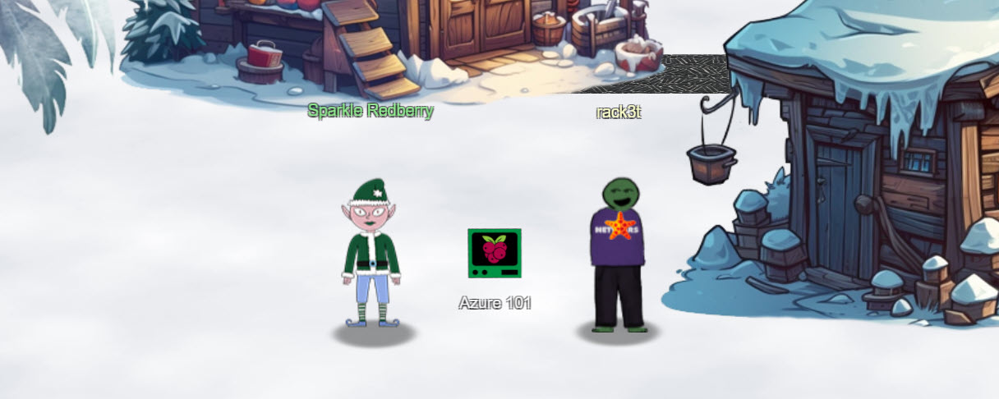
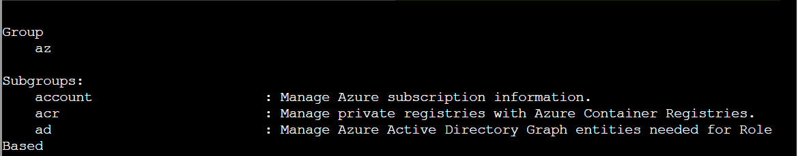
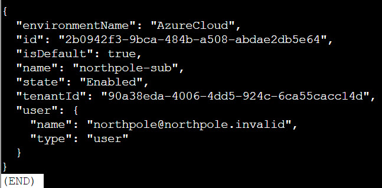
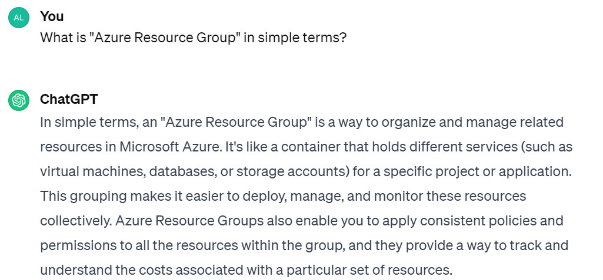
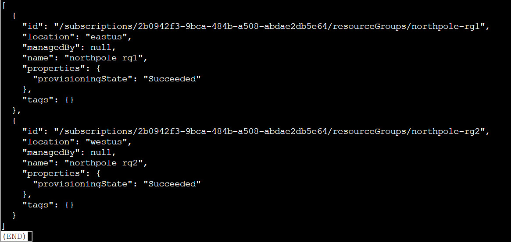
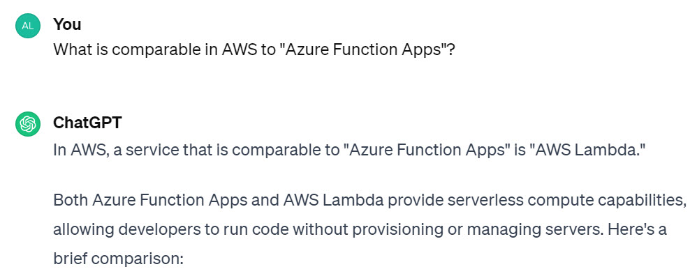
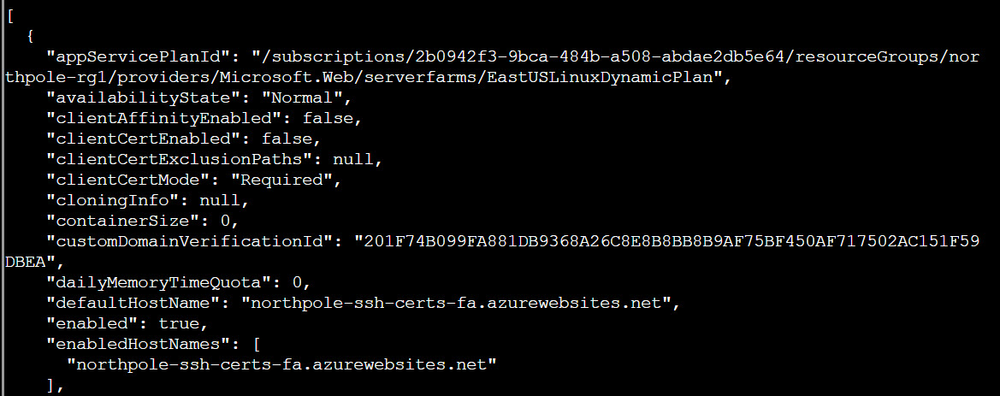
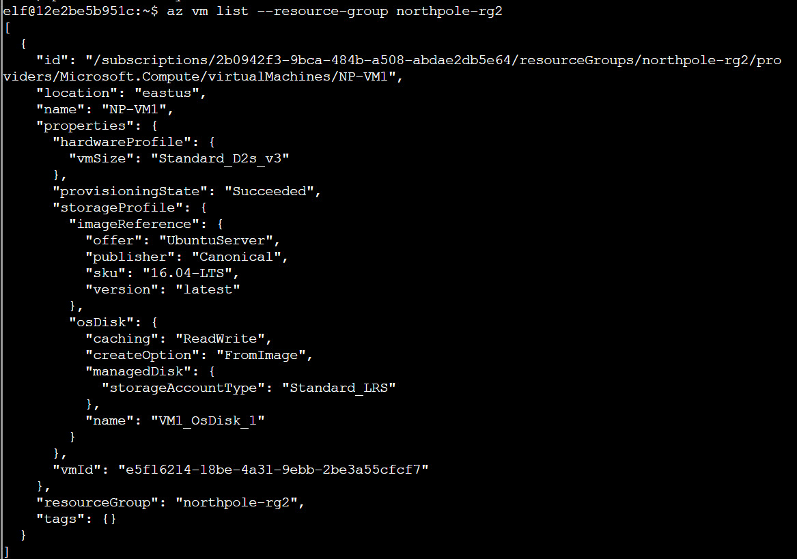
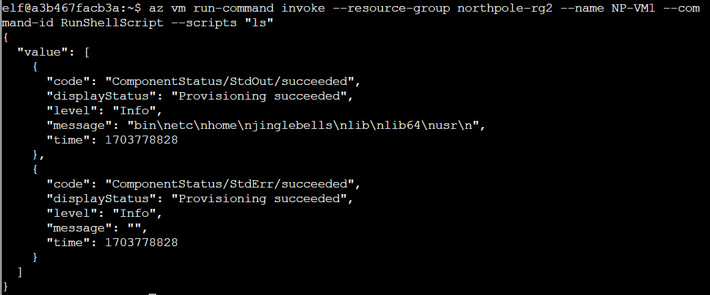
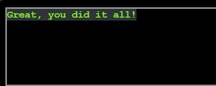

# Azure 101

**Difficulty**: :fontawesome-solid-star::fontawesome-solid-star::fontawesome-regular-star::fontawesome-regular-star::fontawesome-regular-star: 
**Direct link**: [Azure 101 terminal](https://hhc23-wetty.holidayhackchallenge.com?&challenge=azure101&username=rack3t&id=91d53cb8-a0dd-4d8e-9bb8-83e2232f8e14&area=ci-rudolphsrest&location=11,27&tokens=azure101&dna=ATATATTAATATATATATATATATATATATATCGATATGCATATATATATATGCATATATATATATATATATATATTAGCATATATATATATATGCATATATATATATGCATATATATTA)

## Objective

!!! question "Request"
    Help Sparkle Redberry with some Azure command line skills. Find the elf and the terminal on Christmas Island.

??? quote "Sparkle Redberry @ Rudolph's Rest Resort"
    Hey, Sparkle Redberry here! So, I've been trying to learn about Azure and the Azure CLI and it's driving me nuts. 
    Alabaster Snowball decided to use Azure to host some of his fancy new IT stuff on Geese Islands, and now us elves have to learn it too. 
    Anyway, I know it's important and everyone says it's not as difficult as it seems, but honestly it still feels like quite a challenge for me. 
    Alabaster sent us this Azure CLI reference as well. It's super handy, he said. Honestly, it just confuses me even more. 
    If you can spare a moment, would you mind giving me a hand with this terminal? I'd be really grateful! Pretty please, with holly leaves on top! 

## Hints

??? tip "Azure CLI Reference"
    <i>From: Sparkle Redberry 
    Terminal: Azure 101</i> 
    The Azure CLI tools come with a builtin help system, but Microsoft also provides this [handy cheatsheet](https://learn.microsoft.com/en-us/cli/azure/reference-index?view=azure-cli-latest).

    
## Solution

This challenge is all about getting familiar with [Azure's az CLI](https://learn.microsoft.com/en-us/cli/azure/reference-index?view=azure-cli-latest) and doing a lil' recon on Geese Islands' IT infrastructure. 😉

### Question 1
!!! question "Question"
    You may not know this but the Azure cli help messages are very easy to access. First, try typing: 
    $ az help | less

It's nice to know `help` is always available in addition to documentation.

!!! success "Answer"
    az help | less

### Question 2
!!! question "Question"
    Next, you've already been configured with credentials. Use 'az' and your 'account' to 'show' your current details and make sure to pipe to less ( | less )

The [az account show](https://learn.microsoft.com/en-us/cli/azure/account?view=azure-cli-latest#az-account-show) gets the details of a subscription.
Important to note here, the account is part of Azure Cloud and its name is "northpole-sub".

!!! success "Answer"
    az account show | less
    

### Question 3
!!! question "Question"
    Excellent! Now get a list of resource groups in Azure. 
    For more information: 
    https://learn.microsoft.com/en-us/cli/azure/group?view=azure-cli-latest 

The [az group list](https://learn.microsoft.com/en-us/cli/azure/group?view=azure-cli-latest#az-group-list) lists resource groups.
Notable here is that this account has 2 resource groups: "northpole-rg1" and "northpole-rg2".
ChatGPT is helpful for gentle introduction to Azure's terminology, should it be needed.

!!! success "Answer"
    az group list | less

### Question 4
!!! question "Question"
    Ok, now use one of the resource groups to get a list of function apps. For more information: 
    https://learn.microsoft.com/en-us/cli/azure/functionapp?view=azure-cli-latest 
    Note: Some of the information returned from this command relates to other cloud assets used by Santa and his elves. 

The [az functionapp list](https://learn.microsoft.com/en-us/cli/azure/functionapp?view=azure-cli-latest#az-functionapp-list) lists function apps and requires you to pass a resource group as a parameter for this question.
If you are more familiar working with AWS, ChatGPT can make a simple comparison to Azure's terminology. 
Interesting finding here is that there are no function apps in northpole-rg2 resource group but northpole-rg1 contains one with hostname "northpole-ssh-certs-fa.azurewebsites.net" and interesting tags
of "/api/create-cert?code=candy-cane-twirl" and "northpole-ssh-certs". It is of type "Microsoft.Web/sites", so a web app and it's currently running.

!!! success "Answer"
    az functionapp list --resource-group northpole-rg1 | less

### Question 5
!!! question "Question"
    Find a way to list the only VM in one of the resource groups you have access to. 
    For more information: 
    https://learn.microsoft.com/en-us/cli/azure/vm?view=azure-cli-latest 

The [az vm list](https://learn.microsoft.com/en-us/cli/azure/vm?view=azure-cli-latest#az-vm-list) lists details of virtual machines. It also requires a resource group to be passed as a parameter for this question.
In our case, the infrastructure is starting to make sense - while northpole-rg1 resource group contains the function app, northpole-rg2 has the VM.
Notable aspects of the VM is that it's Ubuntu Server 16.04 and named "NP-VM1".

!!! success "Answer"
    az vm list --resource-group northpole-rg2

### Question 6
!!! question "Question"
    Find a way to invoke a run-command against the only Virtual Machine (VM) so you can RunShellScript and get a directory listing to reveal a file on the Azure VM. 
    For more information: 
    https://learn.microsoft.com/en-us/cli/azure/vm/run-command?view=azure-cli-latest#az-vm-run-command-invoke 

The [az vm run-command invoke](https://learn.microsoft.com/en-us/cli/azure/vm/run-command?view=azure-cli-latest#az-vm-run-command-invoke) executes a specific command on a VM.
You need to pass the resource group, VM name, command ID (required), and the command. Arguments to the command can be passed via `--parameters` switch.
One potentially interesting detail from the VM is that there's a user named "jinglebells".
    

    
!!! success "Answer"
    az vm run-command invoke --resource-group northpole-rg2 --name NP-VM1 --command-id RunShellScript --scripts "ls"
    

## Response
!!! quote "Sparkle Redberry @ Rudolph's Rest Resort"
    Wow, you did it!
    It makes quite a bit more sense to me now. Thank you so much! 
    That Azure Function App [URL](https://northpole-ssh-certs-fa.azurewebsites.net/api/create-cert?code=candy-cane-twirl) you came across in the terminal looked interesting. 
    It might be part of that new project Alabaster has been working on with the help of ChatNPT. 
    Let me tell you, since he started using ChatNPT he's been introducing a lot of amazing innovation across the islands. 
    Knowing Alabaster, he'll be delighted to tell you all about it! I think I last saw him on Pixel island. 
    By the way, as part of the Azure documentation he sent the elves, Alabaster also noted that if Azure CLI tools aren't available in an Azure VM we should use the [Azure REST API](https://learn.microsoft.com/en-us/entra/identity/managed-identities-azure-resources/how-to-use-vm-token) instead. 
    I'm not really sure what that means, but I guess I know what I'll be studying up on next. 
    Next up we need to pay a visit to Ginger Breddie in Santa's Shack... 
    
Sparkle Redberry shared some interesting insights - Alabaster is working on the function app running in this Azure environment and should Azure CLI not be available, 
it's possible to use REST API instead. Good to know...