# Certificate SSHenanigans

**Difficulty**: :fontawesome-solid-star::fontawesome-solid-star::fontawesome-solid-star::fontawesome-solid-star::fontawesome-solid-star: 
**Direct link**: [Function App](https://northpole-ssh-certs-fa.azurewebsites.net/api/create-cert?code=candy-cane-twirl) 
**Target server**: ssh-server-vm.santaworkshopgeeseislands.org

## Objective

!!! question "Request"
    Go to Pixel Island and review Alabaster Snowball's new SSH certificate configuration and Azure [Function App](https://northpole-ssh-certs-fa.azurewebsites.net/api/create-cert?code=candy-cane-twirl). What type of cookie cache is Alabaster planning to implement?

??? quote "Goose of Pixel Island @ Rainraster Cliffs"
    hisssss

??? quote "Alabaster Snowball @ Rainraster Cliffs"
    Hello there! Alabaster Snowball at your service. 
    I could use your help with my fancy new Azure server at <b>ssh-server-vm.santaworkshopgeeseislands.org</b>. 
    ChatNPT suggested I upgrade the host to use SSH certificates, such a great idea! 
    It even generated ready-to-deploy code for an [Azure Function App](https://northpole-ssh-certs-fa.azurewebsites.net/api/create-cert?code=candy-cane-twirl) so elves can request their own certificates. What a timesaver! 
    I'm a little wary though. I'd appreciate it if you could take a peek and confirm everything's secure before I deploy this configuration to all the Geese Islands servers. 
    Generate yourself a certificate and use the monitor account to access the host. See if you can grab my TODO list. 
    If you haven't heard of SSH certificates, Thomas Bouve gave an introductory talk and demo on that topic recently. 
    Oh, and if you need to peek at the Function App code, there's a handy [Azure REST API endpoint](https://learn.microsoft.com/en-us/rest/api/appservice/web-apps/get-source-control?view=rest-appservice-2022-03-01) which will give you details about how the Function App is deployed. 

## Hints
??? tip "SSH Certificates Talk"
    <i>From: Alabaster Snowball 
    Objective: Certificate SSHenanigans</i> 
    Check out Thomas Bouve's [talk and demo](https://www.youtube.com/watch?v=4S0Rniyidt4) to learn all about how you can upgrade your SSH server configuration to leverage SSH certificates.

??? tip "Azure Function App Source Code"
    <i>From: Alabaster Snowball 
    Objective: Certificate SSHenanigans</i> 
    The [get-source-control](https://learn.microsoft.com/en-us/rest/api/appservice/web-apps/get-source-control?view=rest-appservice-2022-03-01) Azure REST API endpoint provides details about where an Azure Web App or Function App is deployed from.

## Solution
To get started with this challenge, it's a good idea to [learn about SSH Certificates](https://www.youtube.com/watch?v=4S0Rniyidt4) by attending KringeCon. Essentially, the goal of this set-up is instead of 
importing each individual public key, the server can just trust any client logging in with their private key who's public key been signed by the trusted CA. In exchange, client can also trust the CA and
the server connection will always be verified (no unknown host warning). Also, from the client's perspective, their public key would need to be signed by this trusted CA and then logging in is possible via
this established trust. 

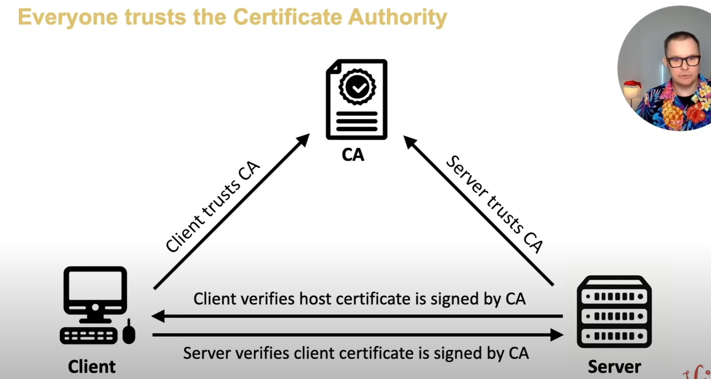

From Alabaster, we know the user is `monitor` and the target server is `ssh-server-vm.santaworkshopgeeseislands.org`. We also have the [Request SSH Certificate function app](https://northpole-ssh-certs-fa.azurewebsites.net/api/create-cert?code=candy-cane-twirl) served from 
their Azure environment. 

Let's create an SSH key pair using `ssh-keygen`:

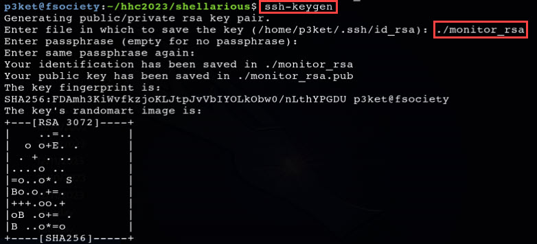

Copy-paste the public key in the function app. This will sign the key using the CA (this is app's functionality) and ultimately will allow SSH.

 
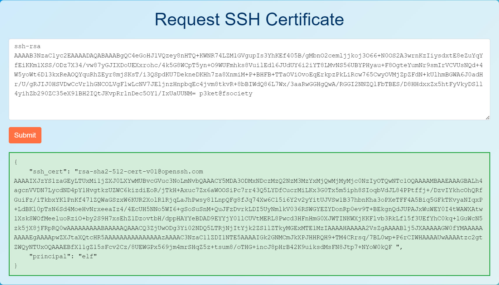

Now save the cert returned from the app. Its validity can also be verified using `ssh-keygen`. This confirms what we would expect - it is an SSH user certificate,
it's signed by principal `elf` and allows PTY access.

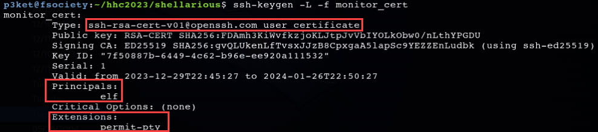

At this point, we can SSH in, providing the private key and the certificate. This command really freaks you out the first time you run it. TWO?!?! `-i` parameters. 😂

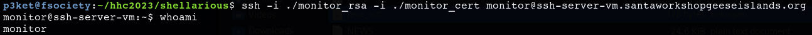

Also, Satellite Tracker app is an interesting find that's served when first logged in.

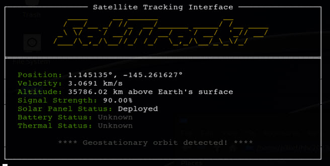

For now we have low permission access as the `monitor` account but it looks like ultimately we need to escalate to `alabaster` to find out what kind of cookie cache he's implementing.

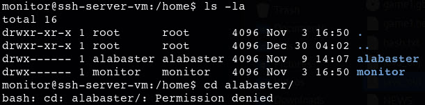

Look around the system to find some interesting information related to the SSH app. In the `/etc/ssh/auth_principals`, the certificate's principals are stored. In addition to the KringleCon talk,
ChatGPT can be a good source to get more information about these principals. We know that `monitor` account was signed by `elf` principal so we can assume that `admin` is likely used for `alabaster`
since he's the admin of this server.

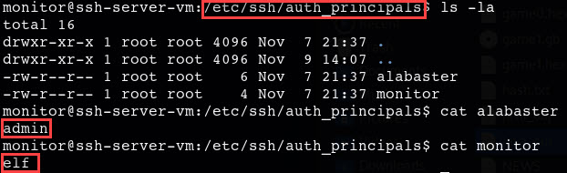

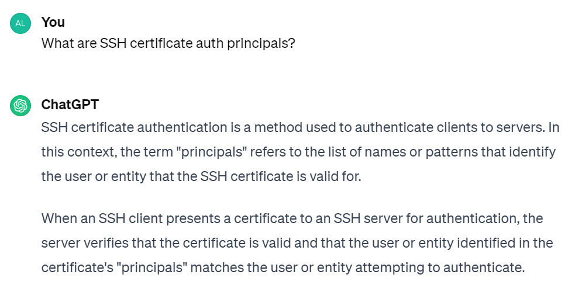

Let's get `admin` principal to provide us the certificate. This can be done by that Azure REST API elfs mentioned because this machine is in their Azure environment.
Specifically, Alabaster mentioned the [get-source-control](https://learn.microsoft.com/en-us/rest/api/appservice/web-apps/get-source-control?view=rest-appservice-2022-03-01) Azure REST API, which works
on `https://management.azure.com` resource. This domain requires an authorization token but since the VM is joined to the Azure environment, it should be possible to get this token using Azure Managed Identity.
This can be found by looking through Azure documentation or simply asking ChatGPT.

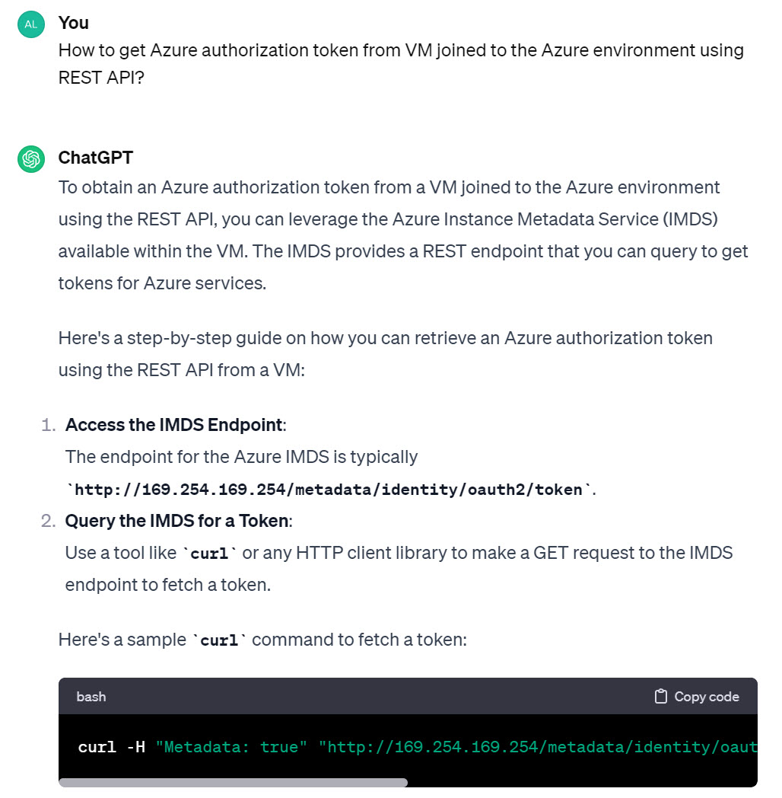

The IMDS is [Azure Instance Metadata Service](https://learn.microsoft.com/en-us/azure/virtual-machines/instance-metadata-service?tabs=linux) and it does provide us the authorization token, just like ChatGPT suggested.

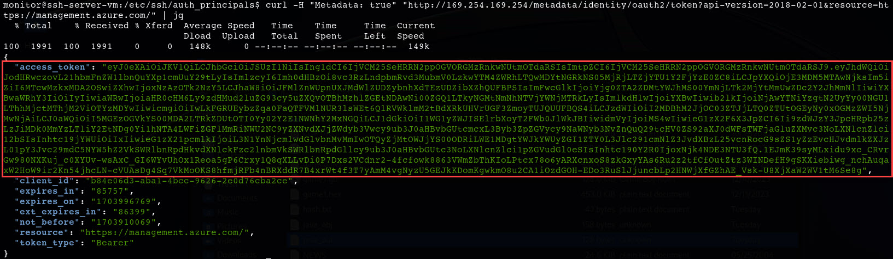

This access token can now be used within the [get-source-control](https://learn.microsoft.com/en-us/rest/api/appservice/web-apps/get-source-control?view=rest-appservice-2022-03-01) Azure REST API call to get
the source control configuration of the function app. For convenience, you can store this large token in a file for `curl`, just don't forget to properly format it:

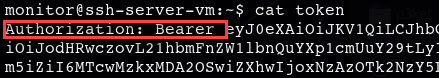

To build the URL, we need `subscriptionId`, `resourceGroupName` and app's `name` - we have this information from all the recon we did at [Azure 101 objective](../objectives/o5.md). 😉
Now make the REST API request and learn where source code is stored:

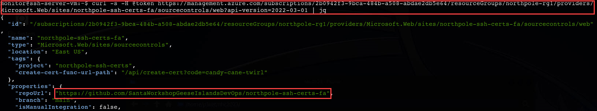

At the [GitHub repo](https://github.com/SantaWorkshopGeeseIslandsDevOps/northpole-ssh-certs-fa), take a look at function app's source code. The interesting part here is as input from client 
is being processed (JSON form), there's `ssh_pub_key` that you would expect and `pricipal` which is apparently available 😁 but looks like if it's not provided, it's just set to `DEFAULT_PRINCIPAL`.

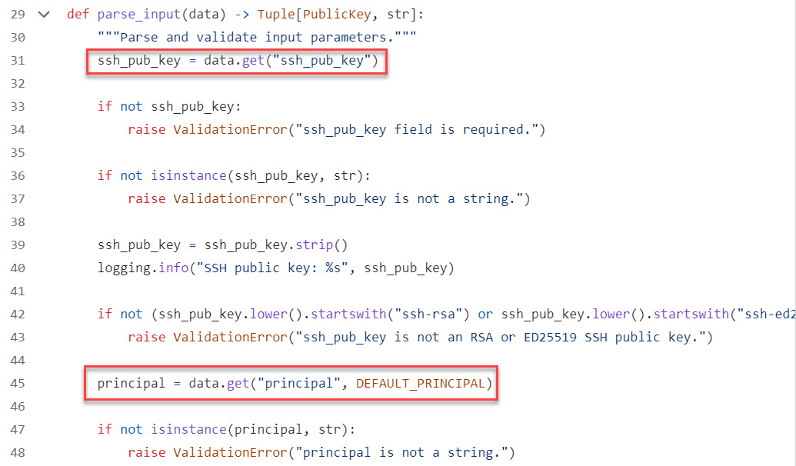

Well, let's set it explicitly then to not use the default. Generate a new key-pair using `ssh-keygen` just like we did for `monitor` and use [Burp Suite proxy](https://portswigger.net/burp/communitydownload) to manipulate the request before sending it. 
<i>Note: If you need a little intro to Burp, you can find it [here](https://portswigger.net/burp/documentation/desktop/getting-started).</i> 

Intercept the request, add the privileged principal (`admin`) and send it:

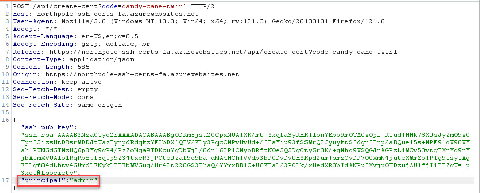

Just as expected, this provides the admin-signed certificate:

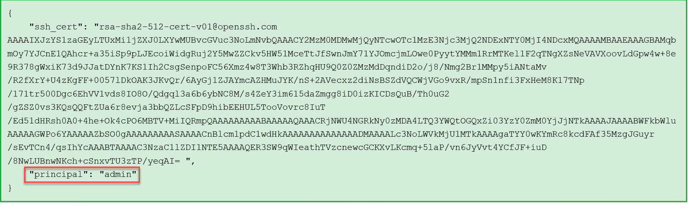

Copy it over and save as `admin_cert` just like we did for `monitor`'s principal.
Now all that's left is login as `alabaster` (remember he's the user with `admin` principal), and read his to-do note.

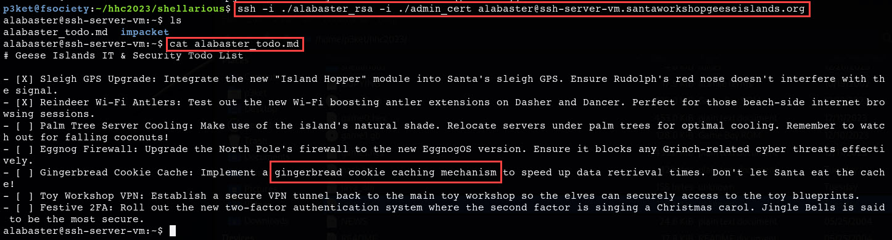

I mean which one of us did *NOT* have these kind of items on to-do lists?!?!

!!! success "Answer"
    gingerbread    

    
## Response
!!! quote "Alabaster Snowball @ Rainraster Cliffs"
    Oh my! I was so focused on the SSH configuration I completely missed the vulnerability in the Azure Function App. 
    Why would ChatNPT generate code with such a glaring vulnerability? It's almost like it wanted my system to be unsafe. Could ChatNPT be evil? 
    Thanks for the help, I'll go and update the application code immediately! 
    While we're on the topic of certificates, did you know Active Directory (AD) uses them as well? Apparently the service used to manage them can have misconfigurations too. 
    You might be wondering about that SatTrackr tool I've installed on the monitor account? 
    Here's the thing, on my nightly stargazing adventures I started noticing the same satellite above Geese Islands. 
    I wrote that satellite tracker tool to collect some additional data and sure enough, it's in a geostationary orbit above us. 
    No idea what that means yet, but I'm keeping a close eye on that thing! 
    
Alabaster is asking all the right questions. So what is this geostationary orbit all about?!?! Interesting! For now, I think it makes sense to go for the kill on their Azure environment - Active Directory auditing next...