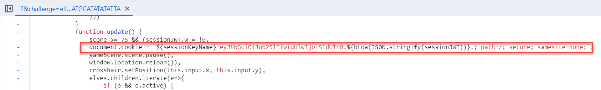
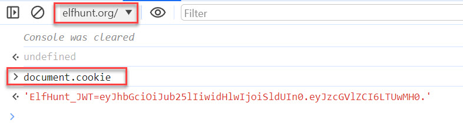
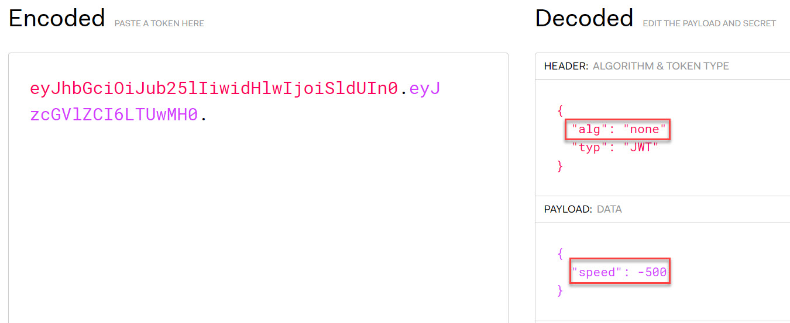
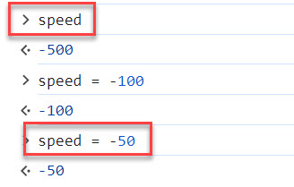
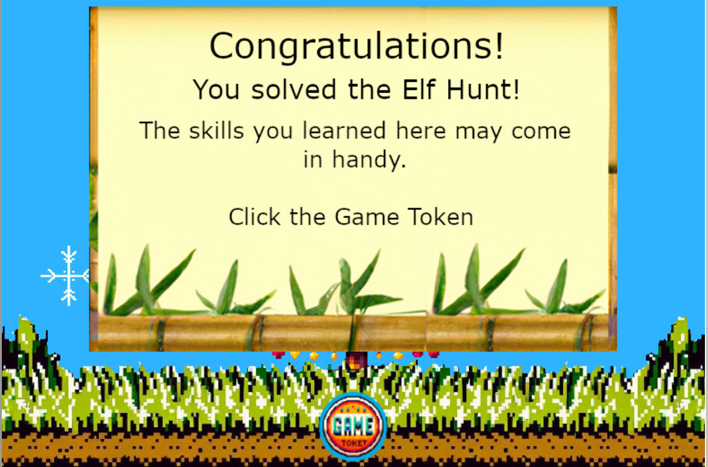

# Elf Hunt

**Difficulty**: :fontawesome-solid-star::fontawesome-solid-star::fontawesome-solid-star::fontawesome-regular-star::fontawesome-regular-star: 
**Direct link**: [Elf Hunt terminal](https://elfhunt.org/?&challenge=elfhunt&username=rack3t&id=8ebae00c-d044-4a09-a236-00865f26c79d&area=pi-rainrastercliffs&location=30,18&tokens=&dna=ATATATTAATATATATATATATATATATATATCGATATGCATATATATATATGCATATATATATATATATATATATTAGCATATATATATATATGCATATATATATATGCATATATATTA)

## Objective

!!! question "Request"
    Piney Sappington needs a lesson in JSON web tokens. Hack Elf Hunt and score 75 points.

??? quote "Piney Sappington @ Rainraster Cliffs"
    Hey there, friend! Piney Sappington here. 
    You look like someone who's good with puzzles and games. 
    I could really use your help with this Elf Hunt game I'm stuck on. 
    I think it has something to do with manipulating JWTs, but I'm a bit lost. 
    If you help me out, I might share some juicy secrets I've discovered. 
    Let's just say things around here haven't been exactly... normal. 
    So, what do ya say? Are you in? 
    Oh, brilliant! I just know we'll crack this game together. 
    I can't wait to see what we uncover, and remember, mum's the word! 
    Thanks a bunch! Keep your eyes open and your ears to the ground. 

## Hints
??? tip "JWT Secrets Revealed"
    <i>From: Piney Sappington 
    Terminal: Elf Hunt</i> 
    Unlock the mysteries of JWTs with insights from [PortSwigger's JWT Guide](https://portswigger.net/web-security/jwt).

## Solution
To solve this challenge, obviously it is a good idea to read [PortSwigger's JWT Guide](https://portswigger.net/web-security/jwt), it describes some of the possible attacks on JWT tokens.
Read it? Good, now let's play the game! It is an elf hunting game and the problem is elfs are flying very fast so it's hart to catch them.
OK we know there should be some kind of JWT token for the game so let's look for it in the game's JS source code using Chrome Dev Tools. 
It is being set as a cookie:

JWT's full value can be printed on the Dev Tools JS console - be sure to switch to the elfhunt.org/ context (this is the game site):

Load up the token into [JWT.io](https://jwt.io/) convenient decoder and learn that it is not signed (alg=none) and the only data there is `speed` which is set to `-500`.

Simply enough, we now know that there's `speed` variable and it's stored as a JWT token in cookies.
Again, using the same JS console, check the speed variable and sure enough, it can be conveniently accessed.
You can see the current value of `-500`. Now just change it to `-100` or even `-50` for much slower elfs.

The JS variable change takes immediate effect. Now the game is a piece of cake and 75 elfs can be easily hunted down!

!!! success "Answer"
    speed to -50 #FTW
    
    
Oh and what is this - Captain's Journal?!?

    
## Response
!!! quote "Piney Sappington  @ Rainraster Cliffs"
    Well done! You've brilliantly won Elf Hunt! I couldn't be more thrilled. Keep up the fine work, my friend! 
    What have you found there? The Captain's Journal? Yeah, he comes around a lot. You can find his comms office over at Brass Buoy Port on Steampunk Island.
    
Captain's journal found and we know that his comms office over at Brass Buoy Port on Steampunk Island. The road seems to lead there...