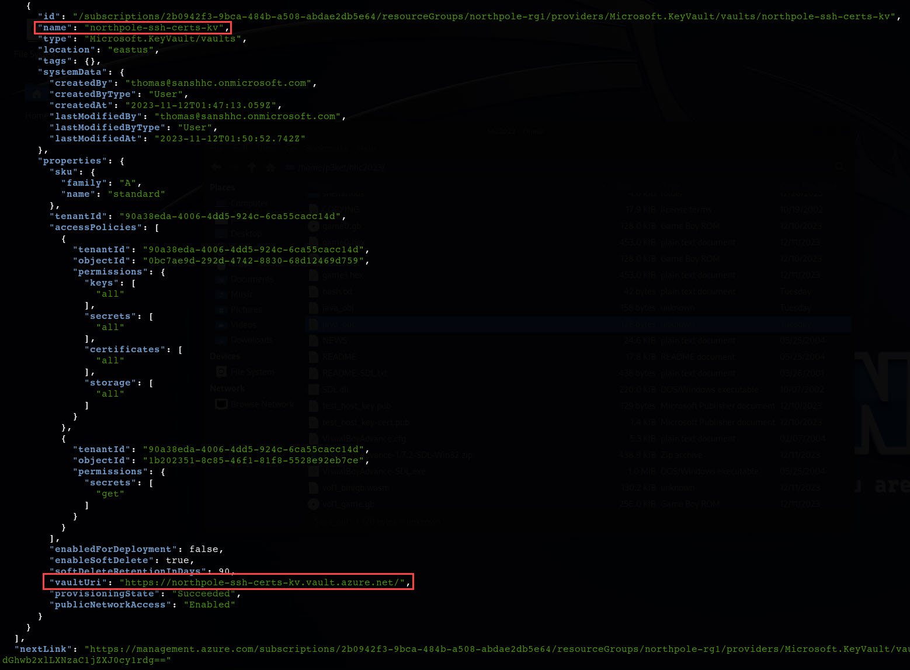

# Active Directory

**Difficulty**: :fontawesome-solid-star::fontawesome-solid-star::fontawesome-solid-star::fontawesome-solid-star::fontawesome-regular-star: 

## Objective

!!! question "Request"
    Go to Steampunk Island and help Ribb Bonbowford audit the Azure AD environment. What's the name of the secret file in the inaccessible folder on the <i>FileShare</i>?

??? quote "Goose of Steampunk Island @ Coggoggle Marina"
    cluck cluck

??? quote "Ribb Ronbowford @ Coggoggle Marina"
    Hello, I'm Ribb Bonbowford. Nice to meet you! 
    Oh golly! It looks like Alabaster deployed some vulnerable Azure Function App Code he got from ChatNPT. 
    Don't get me wrong, I'm all for testing new technologies. The problem is that Alabaster didn't review the generated code and used the Geese Islands Azure production environment for his testing. 
    I'm worried because our Active Directory server is hosted there and Wombley Cube's research department uses one of its fileshares to store their sensitive files. 
    I'd love for you to help with auditing our Azure and Active Directory configuration and ensure there's no way to access the research department's data. 
    Since you have access to Alabaster's SSH account that means you're already in the Azure environment. Knowing Alabaster, there might even be some useful tools in place already. 

## Hints
??? tip "Misconfiguration ADventures"
    <i>From: Alabaster Snowball 
    Objective: Active Directory</i> 
    Certificates are everywhere. Did you know Active Directory (AD) uses certificates as well? Apparently the service used to manage them can have misconfigurations too.

??? tip "Useful Tools"
    <i>From: Ribb Bonbowford 
    Objective: Active Directory</i> 
    It looks like Alabaster's SSH account has a couple of tools installed which might prove useful.

## Solution
To get started with Active Directory audit, login as `alabaster` using private key and SSH cert created during [Certificate SSHenanigans challenge](../objectives/o6.md) (same Azure environment) and look around for these 
"useful tools" Ribb mentioned. The useful tools have got to be [Impacket](https://github.com/fortra/impacket), which is a collection of Python classes for working with network protocols. They are handy for
things like file shares and authentication attacks. 

Almost all Impacket tools require the knowledge of target server or DC and for the most interesting things, valid credentials. At this point we don't have this information since even `alabaster` was logged
in using only the key + cert. We need to continue to enumerate Azure environment to find more information. Let's again [get an auth token](https://learn.microsoft.com/en-us/entra/identity/managed-identities-azure-resources/how-to-use-vm-token#get-a-token-using-http).
Properly output the authorization token into a file and confirm with a simple subscription request that everything is working correctly. Confirmed!

Now enumerate the [Azure environment using REST API](https://learn.microsoft.com/en-us/rest/api/azure/?view=rest-keyvault-keys-7.4) to look for something useful like values for Impacket.
Let's [list all the resources in a subscription](https://learn.microsoft.com/en-us/rest/api/resources/resources/list?view=rest-resources-2021-04-01). This shows us that there are 2 resources of
type "Microsoft.KeyVault" - this should be interesting enough to dig a bit deeper. 😊

More detailed information about KeyVaults [can be retrieved like so](https://learn.microsoft.com/en-us/rest/api/resources/resources/list-by-resource-group?view=rest-resources-2021-04-01). The most interesting 
information here is vault URLs which are used for accessing secrets (as well as keys, certificates, and storage) within these vaults and they will be handy. Note how KeyVault URLs are at a different domains.

If you try to retrieve keys (or any other vault item) from the vaults, you will see the following error. This is because our OAuth access token audience is set for `https://management.azure.com/` and not `https://vault.azure.net`.

So, let's fix that - notice the Vault resource being requested (different OAuth audience):

Now we can try to [get secrets](https://learn.microsoft.com/en-us/rest/api/keyvault/secrets/get-secrets/get-secrets?view=rest-keyvault-secrets-7.4&tabs=HTTP). The important piece in value is the ID.

Using this ID, request this secret value. Bingo! This appears to be a PowerShell script for adding a user to the domain containing sensitive values.

Parse out the values and we have username, AD domain, password, and DC IP. These are the exact values we can take to Impacket.

Start up impacket and list users is a good next step - besides `elfy`, there's also `alabaster` and `wombleycube` (this should be useful later):

Looking around shares is another good enumeration step. This confirms that as user `elfy`, we do not have access to the `super_secret_research` folder which should contain the file we're looking for:

Taking into account "Misconfiguration ADventures" hint from Alabaster, we know that there might be a potential misconfiguration with AD certificates.
Impacket's [certipy](https://github.com/ly4k/Certipy) should be good for finding these. Some general information about the CA can be gathered with its `find` command:

And a specific vulnerability found within one of the certificate templates:

With `certipy`, it is possible to abuse this vulnerability and request the certificate. As `elfy`, you can actually request authentication certificate for `womblecube`. 
This will store the pfx certificate locally.

Now authenticate using `certipy` and the newly-requested certificate via Kerberos.
The `auth` command will use either the PKINIT Kerberos extension or Schannel protocol for authentication with the provided certificate. 
Kerberos can be used to retrieve a TGT and the NT hash for the target user, whereas Schannel will open a connection to LDAPS and drop into an interactive shell with limited LDAP commands.

Excellent, NTLM hash obtained! Now all that's left is pass-the-hash as `wombleycube` and look through the `super_secret_research` folder - #FTW:

Interesting instructions for opening the Satellite Ground Station (SGS). 😉

!!! success "Answer"
    InstructionsForEnteringSatelliteGroundStation.txt    

    
## Response
!!! quote "Ribb Ronbowford @ Coggoggle Marina"
    Wow, nice work. I'm impressed! 
    This is all starting to feel like more than just a coincidence though. Everything Alabaster's been setting up lately with the help of ChatNPT contains all these vulnerabilities. It almost feels deliberate, if you ask me. 
    Now obviously an LLM AI like ChatNPT cannot have deliberate motivations itself. It's just a machine. But I wonder who could have built it and who is controlling it? 
    On top of that, we apparently have a satellite ground station on Geese Islands. I wonder where that thing would even be located. 
    Well, I guess it's probably somewhere on Space Island, but I've not been there yet. 
    I'm not a big fan of jungles, you see. I have this tendency to get lost in them. 
    Anyway, if you feel like investigating, that'd be where I'd go look. 
    Good luck and I'd try and steer clear of ChatNPT if I were you. 

What's this about satellite ground station on Geese Islands and it being somewhere in the jungles of Space Island. Thanks for the advice Ribb...