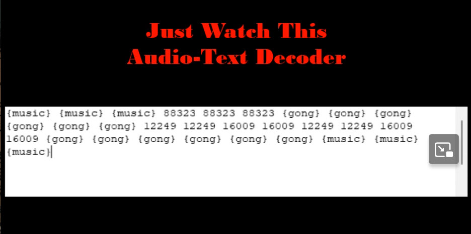

# The Captain's Comms

**Difficulty**: :fontawesome-solid-star::fontawesome-solid-star::fontawesome-solid-star::fontawesome-solid-star::fontawesome-solid-star: 
**Direct link**: [The Captain's Comms terminal](https://captainscomms.com/?&challenge=capcom&username=rack3t&id=4f47c6fe-266e-43b7-97d2-f51b2421e9db&area=spi-brassbouyport&location=31,31&tokens=&dna=ATATATTAATATATATATATATATATATATATCGATATGCATATATATATATGCATATATATATATATATATATATTAGCATATATATATATATGCATATATATATATGCATATATATTA)

## Objective

!!! question "Request"
    Speak with Chimney Scissorsticks on Steampunk Island about the interesting things the captain is hearing on his new Software Defined Radio. You'll need to assume the <b>GeeseIslandsSuperChiefCommunicationsOfficer</b> role.

??? quote "Chimney Scissorsticks @ Brass Bouy Port"
    Ahoy there, I'm Chimney Scissorsticks! 
    You may have noticed some mischief-makers planning to stir up trouble ashore. 
    They've made many radio broadcasts which the captain has been monitoring with his new software defined radio (SDR). 
    The new SDR uses some fancy JWT technology to control access. 
    The captain has a knack for shortening words, some sorta abbreviation trick. 
    Not familiar with JWT values? No worries; just think of it as a clue-solving game. 
    I've seen that the Captain likes to carry his journal with him wherever he goes. 
    If only I could find the planned "go-date", "go-time", and radio frequency they plan to use. 
    Remember, the captain's abbreviations are your guiding light through this mystery! 
    Once we find a JWT value, these villains won't stand a chance. 
    The closer we are, the sooner we'll be thwarting their pesky plans! 
    We need to recreate an administrative JWT value to successfully transmit a message. 
    Good luck, matey! I've no doubts about your cleverness in cracking this conundrum! 
    

## Hints

??? tip "Comms Abbreviations"
    <i>From: Chimney Scissorsticks 
    Terminal: The Captain's Comms</i> 
    I hear the Captain likes to abbreviate words in his filenames; shortening some words to just 1,2,3, or 4 letters.

??? tip "Comms Web Interception Proxies"
    <i>From: Chimney Scissorsticks 
    Terminal: The Captain's Comms</i> 
    Web Interception proxies like [Burp](https://portswigger.net/burp) and [Zap](https://www.zaproxy.org/) make web sites fun!
        
??? tip "Comms Journal"
    <i>From: Chimney Scissorsticks 
    Terminal: The Captain's Comms</i> 
    I've seen the Captain with [his Journal](https://elfhunt.org/static/images/captainsJournal.png) visiting Pixel Island! 
    { width="700" }
    
??? tip "Comms JWT Intro"
    <i>From: Chimney Scissorsticks 
    Terminal: The Captain's Comms</i> 
    A great introduction to JSON Web Tokens is available from [Auth0](https://jwt.io/introduction).

??? tip "Comms Private Key"
    <i>From: Chimney Scissorsticks 
    Terminal: The Captain's Comms</i> 
    Find a private key, update an existing JWT!

## Solution
Ok let's solve The Captain's Comms... 
{ width="600"} 

Jump into the terminal and start putting pieces of the puzzle together. 
This is Captain's battlestation:

First, the background. We have the newly installed 'Just Watch This' Software Defined Radio system and are looking for the miscreants 'go-time' date and time for the attack so we could send a misleading transmission for 
4 hours prior, and this will make sure islands' authorities are locked & loaded for response. 
There are different ROLEs that are required for AUTHORIZATION to different items in Captain's Comms.

{ width="600" }

Let's look at the Owner's Card - from this we can gather that we should look for `rMonitor.tok` file containing the `radioMonitor` token which is somewhere in the default `/jwtDefault` directory.
The proper use of this AUTHORIZATION token will allow viewing signals but not decode them. To decode, we would need `radioDecoder` role token.
Sounds like `radioMonitor` is the initial role we should focus on obtaining. Cool, onto finding more about getting to this file.

{ width="600" }

Quickly check our current role. Copy the `justWatchThisRole` cookie value for `https://captainscomms.com` site (using Dev Tools) and decode the value using [JWT.io](https://jwt.io/).
Good to know - our current role is `radioUser`. Also, keep in mind that the message is signed by `RS256` (asymmetric algorithm) so you can't simply modify its contents, you would need the 
key to re-sign the payload.

Ok now let's refer to the Owner's Manual Volume 1. This confirms that we are on the lowest permissions role (`radioUser`) as well as we need to look for `radioMonitor` mentioned on the Owner's Card.

{ width="700" }

Let's try to get the `radioMonitor` role token based on all this information. From the Owner's Card, location should be `https://captainscomms.com/jwtDefault/rMonitor.tok`.
On first access to this location, error "Invalid authorization token provided" occurs. Ok, let's observe normal traffic using Burp while interacting with Captain's Comms. 
The request shows that we are actually authenticating with the token via Authorization header on each request. The rest of Captain's Comms requests likely require this header and that's why there was an error.
This is a typical request to the website:

Re-send the request for `https://captainscomms.com/jwtDefault/rMonitor.tok` with our current Authorization header and value:

The token is returned and it can be confirmed. We can now access the `radioMonitor` required for Captain's SDR.

You can either use Burp to intercept the request to the SDR and replace Authorization header or simply copy-paste the new token value into `justWatchThis` cookie value.
The second way is more convenient.

SDR is now accessible but not not very useful without the `radioDecoder` role. 

{ width="500"}

{ width="500" }

Let's target obtaining `radioDecoder` token now.
This token is not far away and after some tinkering, it can be found the same way as `radioMonitor`, by simply accessing `https://captainscomms.com/jwtDefault/rDecoder.tok`
with the `radioMonitor` token in the Authorization header. Got it and confirmed:

{ width="400" }

Again, copy-paste the token into `justWatchThis` cookie and access the SDR - all 3 transmissions can now be decoded! 
Transmission 1 tells you that Captain's private key is in a folder called `TH3CAPSPR1V4T3F0LD3R`. 🤦‍♂️

{ width="500" }

Transmission 2 gives us some kind of encoded message - we can investigate this further later.

{ width="500" }

Transmission 3 provides the frequency `10426 Hz`.

{ width="500" }

OK now we need to focus on obtaining the final JWT Radio Administrator privileges needed for the Captain's Transmitter because it's inaccessible with current privileges.

{ width="400" }

Reading through Captain's To-Do List, he seems to have used their less-than-convincing ChatNPT to store JWT private and public keys. We also have that journal from Chimney Scissorsticks (Comms Journal hint).
Captain's Journal mentions another role `GeeseIslandsSuperChiefCommunicationsOfficer` which is likely the final JWT Radio Administrator role we need.

{ width="600" }

Now let's review Captain's ChatNPT Initial To-Do List since it was crossed off from Captain's To-Do List.
This is interesting because we know exactly where this "same directory" is, so looking for `capsPubKey.key` file in `keys` folder should be no problem.

{ width="600" }

Make the request to `https://captainscomms.com/jwtDefault/keys/capsPubKey.key` with `radioMonitor` or `radioDecoder` token and Captain's public key is retrieved.

Fix up the formatting a bit (no empty spaces) and `capsPubKey.key` is good to go:

{ width="500" }

Going back to Owner's Manual Volume II - it stresses the need to protect KEYs in FOLDERs.
This feels like another hint, we need to go after finding Captain's private key, especially now that we know the folder name.
{ width="700" }

At this point we should be able to find Captain's private key. We know all his keys are in `keys` folder and specifically he mentioned that
we would never be able to find the private key folder but we did find it to be `TH3CAPSPR1V4T3F0LD3R` via Transmission 1.
Based on Chimney Scissorsticks' hint that went something like "I hear the Captain likes to abbreviate words in his filenames", combine this with confirmed known public
key name, we can make an educated guess that private key is called something like `capsPrivKey.key`. 
Let's make the Burp request (again using our `radioDecoder` token) to `https://captainscomms.com/jwtDefault/keys/TH3CAPSPR1V4T3F0LD3R/capsPrivKey.key`.

Private key secured! Just a bit of formatting to remove empty spaces, and `capsPrivKey.key` is ready to be used.

{ width="500" }

Now we need to create a JWT token that would give us `GeeseIslandsSuperChiefCommunicationsOfficer` role and sign it using Captain's private key.
Let's start with `radioDecoder` token, Base64 decode it, modify the value and sign the JWT.
All this can be easily done on [JWT.io](https://jwt.io/) - modify the role, paste public and private keys, and confirm signature is verified since both keys are present.

Again, change the `justWatchThis` cookie to the new admin value (JWT token from JWT.io) and access Captain's Transmitter.

{ width="500" }

We know the frequency from Transmission 3 and now just need to decode message in Transmission 2 for date and time.
Let's refer to Just Watch This Appendix A - it points to the [Lincolnshire Poacher Number Station](https://www.numbers-stations.com/english/e03-the-lincolnshire-poacher/). 

{ width="700" }

Based on Lincolnshire Poacher Number Station format, we can strip metadata and determine that actual message is "12249 12249 16009 16009 12249 12249 16009 16009".
Now we need to decode it - we can use [DCODE](https://www.dcode.fr/) to try to find the most fitting cipher. 
After trying out a few different ciphers, I found that to [decipher it](https://www.dcode.fr/systeme-octal), DCODE's Octal converter can be used:

{ width="500" }

Now the final step is to send the misleading transmission. Since decoded date and time is 12/24 16:00, we need to send it for 4 hours earlier, so 12:00.

{ width="500" }

!!! success "Answer"
    Frequency: 10426 HZ Go-Date: 1224 Go-Time: 1200
    

## Response
!!! quote "Chimney Scissorsticks @ Brass Bouy Port"
    Brilliant work! You've outsmarted those scoundrels with finesse!
    

Got Em!!!